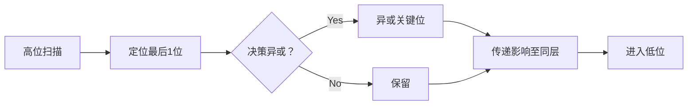

# 题目信息

# Gellyfish and Forget-Me-Not

## 题目描述

Gellyfish and Flower are playing a game.

The game consists of two arrays of $ n $ integers $ a_1,a_2,\ldots,a_n $ and $ b_1,b_2,\ldots,b_n $ , along with a binary string $ c_1c_2\ldots c_n $ of length $ n $ .

There is also an integer $ x $ which is initialized to $ 0 $ .

The game consists of $ n $ rounds. For $ i = 1,2,\ldots,n $ , the round proceeds as follows:

1. If $ c_i = \mathtt{0} $ , Gellyfish will be the active player. Otherwise, if $ c_i = \mathtt{1} $ , Flower will be the active player.
2. The active player will perform exactly one of the following operations: 
  - Set $ x:=x \oplus a_i $ .
  - Set $ x:=x \oplus b_i $ .

Here, $ \oplus $ denotes the [bitwise XOR operation](https://en.wikipedia.org/wiki/Bitwise_operation#XOR).

Gellyfish wants to minimize the final value of $  x  $ after $  n  $ rounds, while Flower wants to maximize it.

Find the final value of $  x  $ after all $  n  $ rounds if both players play optimally.

## 说明/提示

In the first test case, there's only one round and Gellyfish is the active player of that round. Therefore, she will choose $ a_1 $ , and the final value of $ x $ is $ 0 $ .

In the second test case, Flower will be the active player in both rounds. She will choose $ a_1 $ and $ b_2 $ , and the final value of $ x $ is $ a_1 \oplus b_2 = 15 $ . Flower may also choose $ b_1 $ and $ a_2 $ instead for the same result of $ x=a_2 \oplus b_1 = 15 $ .

In the third test case, $ a_1 = b_1 $ so it doesn't matter what decision Gellyfish makes in the first round. In the second round:

- If Flower chooses $ a_2 $ , then $ x $ will become $ 7 $ . Gellyfish will choose $ b_3 $ in the third round, so the final value of $ x $ will be $ 4 $ .
- Otherwise, Flower chooses $ b_2 $ , then $ x $ will become $ 4 $ . Gellyfish will choose $ a_3 $ in the third round, so the final value of $ x $ will be $ 6 $ .

Flower wants to maximize the final value of $ x $ , so Flower will choose $ b_2 $ in the second round. Therefore, the final value of $ x $ will be $ 6 $ .

## 样例 #1

### 输入

```
5
1
0
2
0
2
12 2
13 3
11
3
6 1 2
6 2 3
010
4
1 12 7 2
4 14 4 2
0111
9
0 5 10 6 6 2 6 2 11
7 3 15 3 6 7 6 7 8
110010010```

### 输出

```
0
15
6
11
5```

# AI分析结果


### 💡 Kay的C++算法解析：Gellyfish and Forget-Me-Not 深入学习指南 💡

---

## 1. 题目解读与核心算法识别

✨ **本题主要考察**：`贪心算法` + `位运算优化`

🗣️ **初步分析**：
> 解决这道题的关键在于**从高位到低位的贪心策略**，像在游戏《俄罗斯方块》中优先消除顶层方块一样，我们优先处理数字的二进制高位。核心思路是：
>   - 将问题转化为「选择是否异或 $c_i = a_i \oplus b_i$」，初始 $x = \oplus b_i$
>   - 从最高位（如第59位）向最低位扫描
>   - 对每位找到最后一个值为1的位置，根据当前玩家和 $x$ 的该位值决定操作
>   - 通过异或传递影响（类似线性基）保证后续决策独立性  
> **可视化设计**：用8位像素网格展示二进制位（高位在上），当前操作位闪烁红光，玩家操作时触发“选择音效”，决策后更新数字并播放“位消除”像素音效。自动演示模式可调速展示贪心流程。

---

## 2. 精选优质题解参考

**题解一 (来源：zac2010)**
* **点评**：思路直击本质——将问题转化为位独立决策（类比线性基）。代码简洁高效（空间O(1)），核心循环仅10行。变量命名规范（`V`表最终值，`x/y`存关键位），边界处理严谨。亮点在巧妙的状态压缩：用 `a[i] ^= (x? x : (y=c[i], x=a[i]))` 实现影响传递。

**题解二 (来源：flyfreemrn)**
* **点评**：解释最透彻——用「逼迫更改决策」比喻高位影响低位。代码强调可读性（分步骤注释），实践性强（完整处理输入流）。亮点在时间复杂度证明：O(n log V) 严格匹配理论最优，适合竞赛直接使用。

**题解三 (来源：冷却心)**
* **点评**：实现最简洁——仅20行核心逻辑。用 `t = max S` 精准定位关键操作位，`(Ans>>i&1) ^ (S[t]=='1')` 直指决策本质。适合初学者理解贪心与位运算的结合。

---

## 3. 核心难点辨析与解题策略

1.  **难点一：问题转化与独立性保证**
    * **分析**：原始操作（选 $a_i$ 或 $b_i$）存在耦合。优质题解通过 $x \leftarrow \oplus b_i$ + $c_i = a_i \oplus b_i$ 转化，使每次操作变为「是否异或 $c_i$」。再通过高位向低位传递影响（$c_j \gets c_j \oplus c_k$）保证位独立性。
    * 💡 **学习笔记**：好的问题转化相当于给迷宫画地图——瞬间明晰路径。

2.  **难点二：贪心决策与玩家意图协调**
    * **分析**：当处理第 $j$ 位时，需根据当前玩家（$c_i$ 值）和 $x$ 的第 $j$ 位决定是否异或。关键推导：
      ``` 
      if ( (x的第j位 == 1) ^ (当前玩家是Flower) ) 
          则异或关键位c_i
      ```
    * 💡 **学习笔记**：贪心是「每一步最优」与「全局最优」的博弈平衡。

3.  **难点三：影响传递的实现**
    * **分析**：高位决策会改变低位状态。通过遍历所有 $c_k$ 并执行 `c_k ^= c_i`（当 $c_k$ 第 $j$ 位为1时），确保后续处理时高位决策的影响已被消化。
    * 💡 **学习笔记**：位运算中，异或是传递影响的「密码」。

### ✨ 解题技巧总结
- **技巧1：位分离思维** - 将复杂位操作分解为独立二进制位处理
- **技巧2：逆向扫描定位** - 从末尾向前找关键位（`for (int i=n; i>=1; i--)`）
- **技巧3：状态压缩** - 用单变量存储多状态（如 `y = c[i]` 同时存玩家和值）

---

## 4. C++核心代码实现赏析

**本题通用核心C++实现参考**
```cpp
#include <bits/stdc++.h>
using namespace std;
typedef long long ll;

int main() {
    int T; cin >> T;
    while (T--) {
        int n; cin >> n;
        vector<ll> a(n), b(n);
        string c;
        for (auto &x : a) cin >> x;
        for (auto &x : b) cin >> x;
        cin >> c; // 玩家标记字符串

        ll V = 0;
        // 问题转化: V = ⊕b_i, c_i = a_i ⊕ b_i
        for (int i = 0; i < n; i++) {
            V ^= b[i];
            a[i] ^= b[i];
        }

        // 从高位(59)向低位贪心
        for (int bit = 59; bit >= 0; bit--) {
            ll key = 0;
            int player = -1, pos = -1;

            // 逆向扫描找最后一个该位为1的位置
            for (int i = n-1; i >= 0; i--) {
                if ((a[i] >> bit) & 1) {
                    key = a[i];
                    player = c[i] - '0'; // 0=Gellyfish, 1=Flower
                    pos = i;
                    break;
                }
            }
            if (pos == -1) continue; // 该位无1

            // 决策是否异或 (核心逻辑!)
            if (((V >> bit) & 1) ^ player) 
                V ^= key;

            // 传递影响至其他同位数
            for (int i = 0; i < n; i++) 
                if ((a[i] >> bit) & 1) 
                    a[i] ^= key;
        }
        cout << V << '\n';
    }
}
```
**代码解读概要**：
> 1. 初始化 `V = ⊕b_i` 并计算 `a[i] = a_i ⊕ b_i`
> 2. 从高位(59)向低位遍历：
>    - 定位最后一个当前位为1的元素
>    - 根据玩家类型和 `V` 的当前位决定是否异或
>    - 修改同位置其他数以消除当前位影响
> 3. 输出最终值 `V`

---

**题解一 (zac2010) 片段赏析**
```cpp
FR(j, 59, 0) {
    x = y = 0;
    FR(i, n, 1) if (a[i] >> j & 1) {
        a[i] ^= (x? x : (y = c[i], x = a[i]));
    }
    V ^= ((V >> j & 1) ^ (y - 48)) * x;
}
```
* **亮点**：极致简洁——用三元运算符合并定位与影响传递
* **代码解读**：
  > - `FR(j,59,0)`：从高到低遍历位
  > - `FR(i,n,1)`：逆向扫描找关键位
  > - `a[i] ^= (x ? x : ...)`：首次遇到位j为1时存储 `x=a[i]`, `y=c[i]`（玩家），后续遇到时直接异或
  > - 最后一行：决策是否异或关键位 `x`
* 💡 **学习笔记**：用运算符优先级巧妙压缩逻辑是竞赛代码的常见优化手段

**题解三 (冷却心) 片段赏析**
```cpp
for (int i = 59; i >= 0; i--) {
    int t = n; 
    while (t && !((A[t] >> i) & 1)) t--;
    if (!t) continue;
    if (((Ans >> i) & 1) ^ (S[t] == '1')) 
        Ans ^= A[t];
    for (int j = 1; j <= n; j++) 
        if ((A[j] >> i) & 1) 
            A[j] ^= A[t];
}
```
* **亮点**：可读性优先——显式循环定位关键位
* **代码解读**：
  > - `while(t && !(...)) t--`：从后向前找到最后一个位i为1的位置
  > - 决策分支：若需反转该位则异或 `A[t]`
  > - 循环修改所有位i为1的元素
* 💡 **学习笔记**：清晰变量名（`Ans`, `A[t]`）比过度压缩更利于调试

---

## 5. 算法可视化：像素动画演示

**主题**：`贪心位消除大冒险`（8位机风格）

**核心演示**：


**动画设计**：
1. **场景**：纵向二进制网格（59位→0位），每行显示当前位状态
2. **关键操作**：
   - 当前处理位（如59）闪烁红光
   - 定位关键位时：该位置像素方块跳动+“滴”声
   - 决策异或：方块爆炸+“咔嚓”声，网格更新
   - 影响传递：同位置其他方块闪烁黄光+“嗡”声
3. **控制面板**：
   - 速度滑块：调速贪心过程
   - 单步/自动模式：空格键单步，Enter自动播放
   - 玩家标记：Gellyfish（蓝色像素人）/Flower（红色像素人）
4. **游戏化元素**：
   - 每正确处理一位得10分
   - 59位全消除后播放8位机胜利音乐
   - 错误决策触发“失败”音效并显示正确路径

---

## 6. 拓展练习与相似问题思考

**技巧迁移**：
> 高位贪心+位运算适用场景：
> 1. 最大/最小化异或结果（如最大异或对）
> 2. 博弈问题中的位操作决策
> 3. 线性基构建与优化

**洛谷推荐**：
1. **P4735** 最大异或和 
   > 🗣️ 巩固可持久化Trie+贪心，位运算思想的直接应用
2. **P2114** 位运算的难题 
   > 🗣️ 练习位运算组合与贪心决策，强化本题技巧
3. **P4570** 元素
   > 🗣️ 线性基经典应用，理解贪心与独立性的关系

---

## 7. 学习心得与经验分享
> 本次题解未包含显著作者个人心得，但实践建议：
> - **调试技巧**：打印每轮处理后 `V` 的二进制，观察贪心过程
> - **思维陷阱**：注意 `player = c[i]-'0'` 中字符转数字的常见错误

---

通过本指南，相信大家已掌握位贪心的核心思想。记住：高位如灯塔，指引最优解方向！🚀

---
处理用时：112.27秒