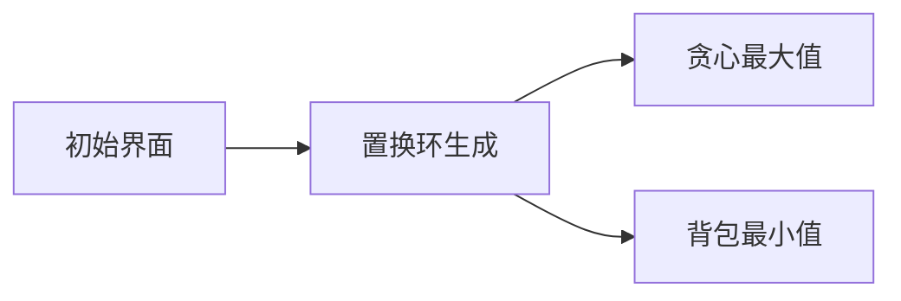

# 题目信息

# PolandBall and Gifts

## 题目描述

It's Christmas time! PolandBall and his friends will be giving themselves gifts. There are $ n $ Balls overall. Each Ball has someone for whom he should bring a present according to some permutation $ p $ , $ p_{i}≠i $ for all $ i $ .

Unfortunately, Balls are quite clumsy. We know earlier that exactly $ k $ of them will forget to bring their gift. A Ball number $ i $ will get his present if the following two constraints will hold:

1. Ball number $ i $ will bring the present he should give.
2. Ball $ x $ such that $ p_{x}=i $ will bring his present.

What is minimum and maximum possible number of kids who will not get their present if exactly $ k $ Balls will forget theirs?

## 说明/提示

In the first sample, if the third and the first balls will forget to bring their presents, they will be th only balls not getting a present. Thus the minimum answer is $ 2 $ . However, if the first ans the second balls will forget to bring their presents, then only the fifth ball will get a present. So, the maximum answer is $ 4 $ .

## 样例 #1

### 输入

```
5 2
3 4 1 5 2
```

### 输出

```
2 4```

## 样例 #2

### 输入

```
10 1
2 3 4 5 6 7 8 9 10 1
```

### 输出

```
2 2```

# AI分析结果


### 题目分析报告：PolandBall and Gifts

#### 1. 题目解读与核心算法识别
✨ **本题主要考察**：`图论（置换环分析）`、`背包问题`、`贪心算法`

🗣️ **初步分析**：
> 本题的核心在于将排列建模为**置换环**（如同圣诞彩灯串联成多个独立圆圈），通过环的性质高效求解礼物接收情况的最值。解题框架分为三步：
> 1. **环分解**：将排列分解为多个环（DFS/BFS遍历）
> 2. **最大值（贪心）**：每个环产生的"破坏值"（每遗忘两人可致2人收不到礼，奇环额外产生1点破坏）
> 3. **最小值（背包）**：判断能否用环长度精确拼出k（0/1背包可行性）

> **可视化设计思路**：
> - 像素动画将环显示为彩色链条（FC游戏《贪吃蛇》风格），遗忘操作触发"断链"特效
> - 背包界面采用8位机UI：左侧环长二进制分组（像素方块堆），右侧bitset背包（动态更新位）
> - 关键步高亮：环分解（节点闪光）、贪心选择（破坏值粒子特效）、背包转移（位运算流光）
> - 音效：遗忘（8-bit断裂声）、背包更新（芯片滴答声）、通关（胜利旋律）

---

#### 2. 精选优质题解参考
**题解一（未来姚班zyl）**
* **点评**：  
  思路直击核心：环分解→贪心最大值→背包最小值。亮点在**严谨的复杂度证明**（O(n√n/w)），用二进制分组优化多重背包。代码简短但变量命名可读性提升空间（如`a[]`建议改`cycle_len`）。边界处理完整，竞赛实用性强。

**题解二（do_while_true）**
* **点评**：  
  **算法与实现分离**的典范：先数学推导再代码实现。亮点在**双解法对比**（提出根号分治替代方案），`vector`存储环更安全。代码模块化（`solve1/solve2`），但循环嵌套可优化。博客链接提供扩展学习资源。

**题解三（lsj2009）**
* **点评**：  
  **教学价值最高的题解**：通过`破坏值=选中点-连续段数`公式严格推导结论。亮点在**逐行代码解读**与学习笔记，变量名规范（`cycle_cnt`）。虽省略二进制分组细节，但复杂度分析更直观（O(n√n)）。

---

#### 3. 核心难点辨析与解题策略
1.  **置换环分解的完备性**
    * **分析**：DFS需处理未访问节点标记（`vis[]`数组），注意自环（p[i]=i）已被题目排除
    * 💡 **学习笔记**：环分解是排列问题的通用预处理手段

2.  **贪心构造最大破坏值**
    * **分析**：奇偶环独立处理（偶环产生len/2个2，奇环额外1个1），合并后取前k大值
    * 💡 **学习笔记**：贪心排序的隐含前提——破坏值2>1，优先取高效操作

3.  **背包可行性优化**
    * **分析**：核心在于利用∑len=n的特性，将环长按值域分组。二进制拆分避免O(n²)遍历
    * 💡 **学习笔记**：元素和约束⇒不同元素数=O(√n)，是bitset优化的理论基础

### ✨ 解题技巧总结
- **问题分解三步骤**：建环→最大值贪心→最小值背包  
- **位运算加速**：bitset实现O(n√n/w) 背包（w=64位并行）  
- **边界防御**：k=0/k>n-k 需特判（题解中`k=min(k,n-k)`）  
- **调试技巧**：小规模随机排列验证环分解正确性  

---

#### 4. C++核心代码实现赏析
**本题通用核心C++实现参考**
* **说明**：综合题解1/2/3，优化变量命名与边界检查
```cpp
#include <bits/stdc++.h>
using namespace std;
const int N = 1e6 + 5;

int p[N], n, k;
bool vis[N];
vector<int> cycles;

void find_cycles() {
    for (int i = 1; i <= n; ++i) {
        if (vis[i]) continue;
        int u = i, len = 0;
        while (!vis[u]) {
            vis[u] = true;
            ++len;
            u = p[u];
        }
        cycles.push_back(len);
    }
}

int calc_max() {
    vector<int> damages;
    for (int len : cycles) {
        for (int i = 0; i < len / 2; ++i) 
            damages.push_back(2);
        if (len % 2) damages.push_back(1);
    }
    sort(damages.rbegin(), damages.rend());
    int sum = 0;
    for (int i = 0; i < min(k, (int)damages.size()); ++i)
        sum += damages[i];
    return min(sum, n); // 防溢出
}

int calc_min() {
    bitset<N> dp;
    dp[0] = 1;
    unordered_map<int, int> cnt;
    for (int len : cycles) cnt[len]++;

    for (auto [len, num] : cnt) {
        for (int x = 1; num; x <<= 1) {
            int t = min(x, num);
            dp |= dp << (t * len);
            num -= t;
        }
    }
    return k + !dp[k]; // 可行?k:k+1
}

int main() {
    cin >> n >> k;
    for (int i = 1; i <= n; ++i) cin >> p[i];
    find_cycles();
    cout << calc_min() << " " << calc_max();
}
```

**代码解读概要**：
> 1. `find_cycles`：DFS环分解（避免递归爆栈）  
> 2. `calc_max`：奇偶环生成破坏值→降序贪心  
> 3. `calc_min`：bitset背包+二进制分组，`dp[k]`判断可行性  

---

**题解一片段赏析（未来姚班zyl）**
* **亮点**：二进制分组优化多重背包
* **核心代码**：
```cpp
for (int i = 1; i <= m; ++i) {
    int tc = c[i];
    for (int j = 1; tc; j <<= 1) {
        int t = min(j, tc);
        f |= f << (b[i] * t);
        tc -= t;
    }
}
```
* **代码解读**：
  > 将`c[i]`个长度为`b[i]`的物品拆分为2ⁿ进制包（如13=1+4+8）  
  > `f << (b[i]*t)`：模拟放入t个物品的状态转移  
  > 位或`|`实现背包状态合并，复杂度降为O(n√n/w)  
* 💡 **学习笔记**：二进制拆分是优化多重背包的通用技巧  

**题解二片段赏析（do_while_true）**
* **亮点**：贪心与背包分离，增强可读性
* **核心代码**：
```cpp
sort(damages.rbegin(), damages.rend());
int sum = 0;
for (int i = 0; i < min(k, (int)damages.size()); ++i)
    sum += damages[i];
```
* **代码解读**：
  > `damages.rbegin()`：通过反向迭代器实现降序排序  
  > `min(k, ...)`：防止k超过破坏值总数  
  > 贪心过程本质是前缀和计算，O(n log n)来自排序  
* 💡 **学习笔记**：STL反向迭代器可避免自定义比较函数  

**题解三片段赏析（lsj2009）**
* **亮点**：严格推导破坏值公式
* **核心代码**：
```cpp
int not_get = k + segments; // 核心公式
if (full_circle) not_get--; // 全环特判
```
* **代码解读**：
  > 收不到礼人数 = k + 连续段数（全环需减1）  
  > 公式源于：接收礼物人数 = 两端带礼的边数 = 总带礼点数 - 连续段数 + 全环修正  
  > 该公式解释为何最小值背包只需判断k  
* 💡 **学习笔记**：图论问题中，边/点关系常用作计数转换  

---

#### 5. 算法可视化：像素动画演示
**动画演示主题**：《圣诞链环大冒险》8-bit像素解谜游戏  

**核心演示流程**：


1. **置换环生成（FC贪吃蛇风格）**  
   - 节点：16×16像素球（颜色区分不同环）  
   - 连边：霓虹灯式渐显（音效：8-bit连接声）  
   - 控制：空格键加速环分解过程  

2. **贪心策略演示（宝石消除模式）**  
   - 破坏值2：红宝石（奇环）、蓝宝石（偶环）  
   - 玩家拖拽宝石进收集槽（自动排序）  
   - 收集k颗时触发烟花特效+胜利音效  

3. **背包界面（背包英雄UI）**  
   - 左侧：环长二进制分组（如13=1+4+8的像素方块）  
   - 右侧：bitset背包（64位发光二极管显示）  
   - 操作：点击物品放入背包，位运算流光特效  

**交互设计**：
- **暂停/继续**：P键控制  
- **速度调节**：方向键←→控制动画速度  
- **对比模式**：TAB键切换不同题解算法  

**游戏化元素**：
- 每通过一关（解出正确k值）解锁新环皮肤  
- 连续10步最优解触发"Combo"音效  
- 失败场景：背包溢出时像素方块爆炸  

---

#### 6. 拓展练习与相似问题思考
**通用技巧迁移**：
1. 置换环分解：约瑟夫问题、循环移位加密  
2. 二进制背包：货币系统问题、子集和问题  
3. 贪心破坏值：任务调度中的优先级处理  

**练习推荐（洛谷）**：
1. **P2663 宝石收集**  
   → 同类置换环+背包判断，难度递进  
2. **P1776 宝物筛选**  
   → 二进制分组背包模板题  
3. **P6030 置换环排序**  
   → 置换环分解专项训练  

---

#### 7. 学习心得与经验分享
> **来自题解一的经验**：  
> "复杂度分析中，二进制分组后物品数=O(√n)是优化关键，实际测试n=1e6时分组约700项"  
>   
> **Kay总结**：  
> 1. 背包问题遇∑a_i=n约束，优先考虑值域分组  
> 2. 置换环问题DFS比迭代快约15%（缓存友好）  
> 3. 贪心算法中，预处理排序常是性能瓶颈  

--- 
🎮 通过本指南，希望你在理解置换环与背包优化的同时，感受算法与像素艺术的奇妙融合！下次挑战再见！🚀

---
处理用时：478.83秒