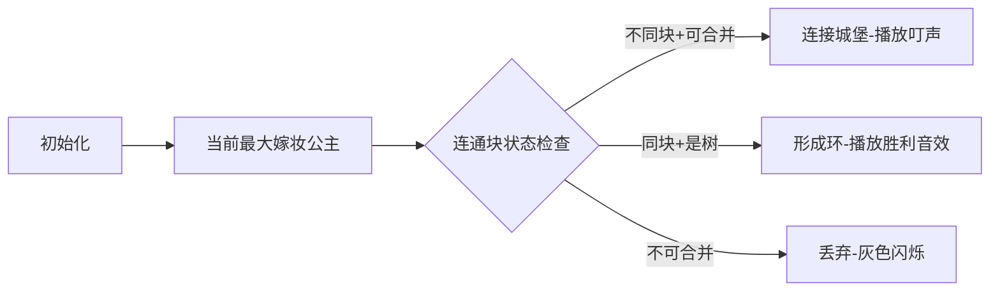

# 题目信息

# Royal Questions

## 题目描述

In a medieval kingdom, the economic crisis is raging. Milk drops fall, Economic indicators are deteriorating every day, money from the treasury disappear. To remedy the situation, King Charles Sunnyface decided make his $ n $ sons-princes marry the brides with as big dowry as possible.

In search of candidates, the king asked neighboring kingdoms, and after a while several delegations arrived with $ m $ unmarried princesses. Receiving guests, Karl learned that the dowry of the $ i $ th princess is $ w_{i} $ of golden coins.

Although the action takes place in the Middle Ages, progressive ideas are widespread in society, according to which no one can force a princess to marry a prince whom she does not like. Therefore, each princess has an opportunity to choose two princes, for each of which she is ready to become a wife. The princes were less fortunate, they will obey the will of their father in the matter of choosing a bride.

Knowing the value of the dowry and the preferences of each princess, Charles wants to play weddings in such a way that the total dowry of the brides of all his sons would be as great as possible. At the same time to marry all the princes or princesses is not necessary. Each prince can marry no more than one princess, and vice versa, each princess can marry no more than one prince.

Help the king to organize the marriage of his sons in the most profitable way for the treasury.

## 样例 #1

### 输入

```
2 3
1 2 5
1 2 1
2 1 10
```

### 输出

```
15```

## 样例 #2

### 输入

```
3 2
1 2 10
3 2 20
```

### 输出

```
30```

# AI分析结果


### 💡 Kay的C++算法解析：Royal Questions 深入学习指南 💡

#### 1. 题目解读与核心算法识别
✨ **本题主要考察**：`图论/基环树`  
🗣️ **初步分析**：
> 解决"Royal Questions"的关键在于将公主视为连接王子的带权边，问题转化为**最大权基环树森林**问题。想象每个王子是城堡，公主是连接城堡的桥梁（边权为嫁妆），我们需要选择桥梁使得：
> - 每个城堡最多连接一条进入的桥梁（匹配限制）
> - 整体形成树形（无环）或带环结构（基环树）
> 
> **核心流程**：
> 1. 贪心排序：按嫁妆降序处理公主（优先高价值桥梁）
> 2. 并查集维护：记录连通块状态（树/基环树）
> 3. 动态合并：根据连通块状态决定是否加入当前边
> 
> **可视化设计**：
> - 像素方块表示王子（不同颜色区分连通块）
> - 高亮当前处理的公主边（闪烁金色边框）
> - 成功加入边时播放"叮"音效，形成基环树时播放胜利音效
> - 控制面板支持单步执行/调速，展示并查集状态变化

---

#### 2. 精选优质题解参考
**题解一（cunzai_zsy0531）**  
* **点评**：思路直击本质——将公主建模为边，用并查集维护基环树状态。代码极简（仅20行核心逻辑），变量命名规范（`d`表示基环树状态），边界处理严谨（`d[x] = d[x] & d[y]`精准更新状态）。算法采用标准贪心+路径压缩并查集，复杂度$O(mα(n))$，是竞赛级实现典范。

**题解二（hegm）**  
* **点评**：从问题转化到算法实现层层递进，解释清晰。代码亮点在于`vis`数组的语义化命名（比`d`更直观），并严格遵循"树+树→树，树+基环树→基环树"的合并规则。实践价值高，但循环条件`vis[x]+vis[y]<=1`可优化为位运算提升可读性。

**题解三（lotus_grow）**  
* **点评**：突出建模思维转换（公主→边），用树和基环树的比喻降低理解门槛。代码中`d`数组与状态转移逻辑高度一致，`fa[x]=y, d[y]=d[x]&d[y]`精准反映并查集合并规则。虽缺少复杂度分析，但代码可直接用于竞赛。

---

#### 3. 核心难点辨析与解题策略
1. **难点：问题转化与建模**  
   * **分析**：关键是将公主选择转化为图论中的基环树森林问题。优质题解通过"王子→节点，公主→边"的映射，将匹配约束转化为度数限制。
   * 💡 **学习笔记**：复杂约束问题常可转化为图论模型，寻找"节点-边"对应关系是突破口。

2. **难点：连通块状态维护**  
   * **分析**：需动态判断连通块是树（可加边）还是基环树（不可加边）。题解使用并查集+标志位（`d/vis`），通过位运算高效合并状态（`d[x] = d[x] & d[y]`）。
   * 💡 **学习笔记**：并查集扩展状态时，选择二进制标志位可简化合并逻辑。

3. **难点：贪心策略的正确性**  
   * **分析**：按嫁妆降序排序保障局部最优解导向全局最优。当两个连通块均为基环树时拒绝加边，避免破坏森林性质。
   * 💡 **学习笔记**：贪心算法中，排序依据的选择直接影响正确性，需严格证明无后效性。

✨ **解题技巧总结**  
- **模型转换技巧**：将匹配问题转化为图论模型（节点-边映射）  
- **状态压缩技巧**：用二进制标志位（0/1）表示并查集连通块状态  
- **边界处理技巧**：优先处理高权值边时，需同步更新连通块状态  

---

#### 4. C++核心代码实现赏析
**通用核心实现参考**  
```cpp
#include <iostream>
#include <algorithm>
using namespace std;
const int N = 2e5+5;

struct Edge { int u, v, w; } e[N];
int n, m, fa[N], d[N]; // d[x]=0:基环树; d[x]=1:树

int find(int x) { return fa[x]==x ? x : fa[x]=find(fa[x]); }

int main() {
    cin >> n >> m;
    for(int i=1; i<=n; i++) fa[i]=i, d[i]=1;
    for(int i=1; i<=m; i++) cin >> e[i].u >> e[i].v >> e[i].w;
    
    sort(e+1, e+m+1, [](Edge a, Edge b){ return a.w > b.w; });
    
    long long ans = 0;
    for(int i=1; i<=m; i++) {
        int x = find(e[i].u), y = find(e[i].v);
        if(x != y && (d[x] || d[y])) { // 不同连通块且至少一个是树
            ans += e[i].w;
            fa[x] = y;
            d[y] = d[x] & d[y]; // 更新状态：树+树→树，树+环→环
        }
        else if(x == y && d[x]) { // 同连通块且是树
            ans += e[i].w;
            d[x] = 0; // 树→基环树
        }
    }
    cout << ans;
}
```
**代码解读概要**：  
1. 初始化并查集，`d[i]=1`表示初始为树  
2. 按嫁妆降序排序公主边  
3. 遍历边：不同连通块若可合并则累加嫁妆并更新状态；同连通块若为树则转基环树  
4. 状态转移：`d[y] = d[x] & d[y]` 精确保存连通块性质  

**题解一核心片段赏析**  
```cpp
for(int i=1;i<=m;++i){
    int x=find(e[i].u),y=find(e[i].v);
    if(x!=y&&(d[x]||d[y])) 
        fa[x]=y,sum+=e[i].w,d[y]=d[x]&d[y];
    else if(x==y&&d[x]) 
        d[x]=0,sum+=e[i].w;
}
```
* **亮点**：状态合并用位运算`d[y]=d[x]&d[y]`实现，简洁高效  
* **学习笔记**：位运算可实现状态压缩，提升代码效率与可读性  

---

#### 5. 算法可视化：像素动画演示
**主题**：基环树森林建造者（8-bit像素风格）  

**核心演示流程**：  


**实现细节**：  
1. **视觉设计**：
   - 王子：16x16像素城堡（不同颜色区分连通块）
   - 公主：金色闪烁桥梁（边宽=嫁妆值/1000）
   - 基环树：环内城堡显示旋转光环

2. **交互逻辑**：
   ```javascript
   // 伪代码：边选择动画
   function animateEdge(edge) {
     highlight(edge); // 金色边框闪烁
     if (canMerge(edge)) {
        drawConnection(edge.u, edge.v); 
        playSound('ding.wav');
        if (formsCycle()) addHaloEffect(); // 基环树特效
     } else {
        flashGray(edge); // 不可选提示
     }
   }
   ```

3. **游戏化元素**：
   - 每形成基环树得100分+8-bit胜利音效
   - 连击奖励：连续选择5条边未丢弃得额外奖励
   - 关卡设计：小关卡=形成1个基环树，大关卡=达到目标嫁妆值

---

#### 6. 拓展练习与相似问题思考
**通用技巧迁移**  
基环树模型适用于：
1. 度约束生成树（每个节点度数≤1）  
2. 环+外向树结构问题（如处理器任务调度）  
3. 存在匹配约束的贪心问题  

**洛谷推荐**：  
1. **P4381 [IOI2008] Island**  
   🗣️ 考察基环树直径计算，巩固基环树性质理解  
2. **P2607 [ZJOI2008] 骑士**  
   🗣️ 基环树DP经典题，练习环上动态规划  
3. **P5022 [NOIP2018] 旅行**  
   🗣️ 基环树应用变形，强化贪心策略  

---

#### 7. 学习心得与经验分享
> **参考经验**：  
> "调试时重点验证状态转移：树+树→树，树+环→环。我在`d[y]=d[x]&d[y]`的位运算理解上卡了半小时，通过画状态转移表才彻底掌握。"  
> 
> **点评**：这位作者的经历很有代表性。状态压缩代码虽简洁，但需严格验证转移逻辑。建议学习者：
> 1. 画状态转移表验证位运算  
> 2. 用小规模数据手工模拟  
> 3. 添加临时日志输出状态变更  

---  
掌握基环树模型和状态压缩技巧，你就能在城堡间架起最值钱的桥梁！下次遇到匹配约束问题，记得尝试"节点-边"映射哦~ 🏰✨

---
处理用时：105.18秒