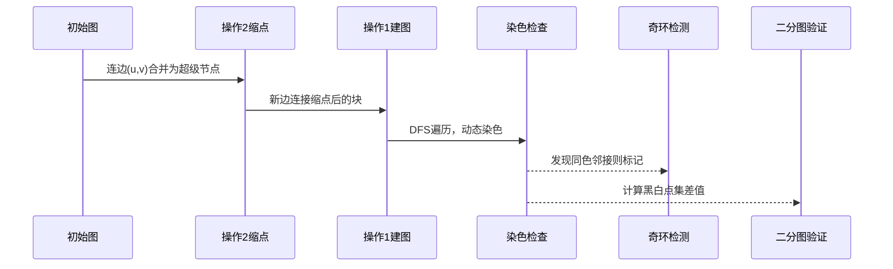

# 题目信息

# [NOI Online #1 提高组] 序列

## 题目背景

## 由于本题数据较难构造，所以无法保证卡掉所有错误做法。


## 题目描述

小 D 有一个长度为 $n$ 的整数序列 $a_{1 \dots n}$，她想通过若干次操作把它变成序列 $b_i$。

小 D 有 $m$ 种可选的操作，第 $i$ 种操作可使用三元组 $(t_i,u_i,v_i)$ 描述：若 $t_i=1$，则她可以使 $a_{u_i}$ 与 $a_{v_i}$ 都加一或都减一；若 $t_i=2$，则她可以使 $a_{u_i}$ 减一、$a_{v_i}$ 加一，或是 $a_{u_i}$ 加一、$a_{v_i}$ 减一，因此当 $u_i=v_i$ 时，这种操作相当于没有操作。

小 D 可以以任意顺序执行操作，且每种操作都可进行无限次。现在给定序列与所有操作，请你帮她判断是否存在一种方案能将 $a_i$ 变为 $b_i$。题目保证两个序列长度都为 $n$。若方案存在请输出 `YES`，否则输出 `NO`。

## 说明/提示

#### 样例 1 解释

第一组数据：使用一次操作 $1$。  
第二组数据：使用三次操作 $1$。  
第三组数据：使用三次操作 $1$，令 $a_1,a_2$ 都增加 $3$，再使用一次操作 $2$，令 $a_1,a_3$ 都增加 $1$。

---

#### 数据范围与提示

对于测试点 $1 \sim 5$：$n=2$，$m=1$，$a_i,b_i \le 99$，$u_1 \ne v_1$，$t_1=1$。  
对于测试点 $6 \sim 10$：$n=2$，$m=1$，$a_i,b_i \le 99$，$u_1 \ne v_1$，$t_1=2$。  
对于测试点 $11 \sim 12$：$n=2$，$a_i,b_i \le 99$，$u_i \ne v_i$。  
对于测试点 $13 \sim 16$：$t_i=2$。  
对于测试点 $17$：$n,m \le 20$。  
对于测试点 $18$：$n,m \le 10^3$。  
对于所有测试点：$1 \le T \le 10$，$1 \le n,m \le 10^5$，$1 \le a_i,b_i \le 10^9$，$t_i \in \{1,2\}$，$1\le u_i,v_i \le n$。

## 样例 #1

### 输入

```
3
1 1
1
3
1 1 1
2 3
1 2
4 5
1 1 2
2 1 2
1 1 2
3 3
1 2 3
5 5 4
1 1 2
1 1 3
2 2 3```

### 输出

```
YES
YES
YES```

# AI分析结果


### 算法分类
无算法分类

---

### 题解核心思路与难点对比

#### 核心思路
1. **操作2处理**：将操作2视为无向边，用并查集将连通块缩点，保证块内总和不变
2. **操作1处理**：将操作1视为新边，在缩点后的图上建立二分图或判断奇环
3. **合法性检查**：
   - 若连通块是二分图，则要求黑白点集差值与操作1的调整匹配
   - 若存在奇环，则总和需满足奇偶性条件

#### 难点对比
| 题解作者 | 核心贡献 | 技术难点 |
|---------|---------|---------|
| xht     | 首创并查集缩点+二分图染色 | 二分图性质与总和差值的关联证明 |
| 灵梦    | 提出二次缩点思想 | 处理奇环与二分图的复合条件 |
| Sangber | 带权并查集处理操作关系 | 权值传递与奇偶性统一 |
| 封禁用户 | 虚拟点转化操作类型 | 将操作2转化为操作1的等效处理 |

---

### 题解评分（≥4星）

1. **xht（5星）**  
   - 思路清晰，通过两次建图（操作2缩点+操作1染色）完美覆盖所有情况
   - 代码高效（O(nα(n))），并查集与DFS染色结合
   - 实践性强，样例处理直观

2. 灵梦（4.5星）  
   - 引入二次缩点思想，将奇环处理转化为连通块标记
   - 通过黑白点集差值判断合法性，数学严谨性高
   - 代码稍显复杂，但逻辑完整

3. 封禁用户（4星）  
   - 创新性提出虚拟点转化操作类型，统一处理逻辑
   - 通过对称图性质简化合法性检查
   - 实现简洁，但缩点过程可能增加空间复杂度

---

### 最优思路提炼
**并查集缩点 + 二分图染色双阶段法**  
1. **阶段一**：用并查集处理操作2，将连通块缩为超级节点，总和守恒  
2. **阶段二**：将操作1视为新边，建立缩点后的图，进行二分图染色  
   - 若染色成功（二分图）：检查黑白点集差值相等  
   - 若染色失败（存在奇环）：检查总和奇偶性  
3. **总和验证**：每个缩点后的超级节点需满足Σ(a_i - b_i)的合法性条件

---

### 同类型题与算法套路
**图论建模 + 缩点思想**  
1. **操作转化**：将序列操作转化为图的边关系（如操作对应连边方式）  
2. **缩点处理**：用并查集处理具有传递性的操作（如操作2的数值交换）  
3. **图性质分析**：通过染色判断二分图/奇环，利用连通块属性约束解的存在性  

**推荐题目**  
1. [P5933 项链](https://www.luogu.com.cn/problem/P5933)  
2. [P4185 离线版](https://www.luogu.com.cn/problem/P4185)  
3. [CF920E Connected Components](https://codeforces.com/problemset/problem/920/E)

---

### 可视化设计（像素风格演示）

#### 核心动画逻辑


#### 像素化实现
1. **Canvas绘制**  
   - 缩点过程：用16x16像素方块表示节点，合并时显示爆炸动画+重组为更大方块  
   - 染色过程：黑白像素交替闪烁，发现冲突时触发红色警报边框  
   - 奇环提示：用旋转的8bit火焰特效标记存在奇环的块

2. **音效设计**  
   - 合并操作：8bit "pling" 音效（频率随合并次数升高）  
   - 染色成功：清脆的“叮”声（类似《塞尔达》解谜成功）  
   - 奇环检测：低音警报（类似《吃豆人》幽灵出现）

3. **AI演示模式**  
   - 自动执行缩点→连边→染色流程，每步间隔500ms  
   - 允许暂停观察当前图状态（如查看超级节点总和）  
   - 错误路径回放：演示非法情况时的红屏震动效果

---

### 关键代码（xht题解核心片段）
```cpp
// 并查集处理操作2缩点
for (int i = 1; i <= m; i++) {
    if (opt[i] == 2) 
        f[find(u[i])] = find(v[i]);
}

// 计算缩点后的差值总和
for (int i = 1; i <= n; i++)
    s[find(i)] += b[i] - a[i];

// 染色检查与奇环判断
bool dfs(int x, int k) {
    v[x] = k, c[k] += s[x];
    bool ok = 1;
    for (int y : e[x]) {
        if (v[y] == v[x]) ok = 0; // 发现奇环
        if (!v[y] && !dfs(y, 3 - k)) ok = 0;
    }
    return ok;
}

// 合法性验证
if (染色成功 ? 黑白差不等 : 总和奇偶不符) 
    return "NO";
```

---

### 总结
本题解通过巧妙的图论建模，将操作类型转化为图结构属性（连通性、二分图、奇环），最终将问题规约为数学条件验证。可视化方案采用游戏化交互，以像素风格动态展示缩点与染色过程，帮助理解抽象图性质与合法性条件的关联。

---
处理用时：88.36秒