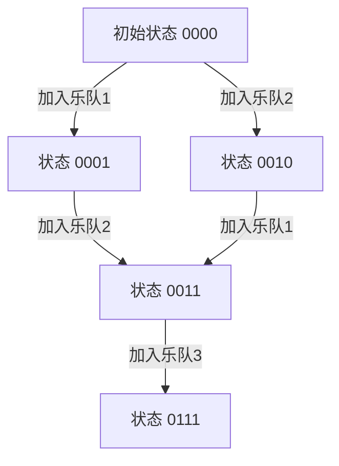

# 题目信息

# 邦邦的大合唱站队

## 题目背景

BanG Dream!里的所有偶像乐队要一起大合唱，不过在排队上出了一些问题。


## 题目描述

N个偶像排成一列，他们来自M个不同的乐队。每个团队至少有一个偶像。

现在要求重新安排队列，使来自同一乐队的偶像连续的站在一起。重新安排的办法是，让若干偶像出列（剩下的偶像不动），然后让出列的偶像一个个归队到原来的空位，归队的位置任意。

请问最少让多少偶像出列？


## 说明/提示

【样例解释】

```cpp
1  3   √
3  3
2  3   √
4  4
2  4   √
1  2   √
2  2
3  2   √
1  1
1  1
3  1   √
4  1   √
```
【数据规模】

对于20%的数据，$N\le 20, M=2$

对于40%的数据，$N\le 100, M\le 4$

对于70%的数据，$N\le 2000, M\le 10$

对于全部数据，$1\le N\le 10^5, M\le 20$


## 样例 #1

### 输入

```
12 4
1
3
2
4
2
1
2
3
1
1
3
4```

### 输出

```
7```

# AI分析结果


## 算法分类
**状压动态规划**

---

## 题解思路与核心难点

### 核心思路
1. **状态设计**：用二进制掩码表示已排好的乐队集合（如 `f[1101]` 表示1、3、4乐队已排好）
2. **前缀和优化**：预处理 `sum[i][j]` 表示前i个位置中乐队j的人数，用于快速计算区间内保留人数
3. **状态转移**：枚举最后加入的乐队j，计算其应在的区间 `[L, R]`，保留该区间内j乐队成员，其余出列

### 解决难点
- **状态压缩与顺序无关性**：无需记录乐队排列顺序，只需记录已选集合，通过总长度确定区间
- **快速区间计算**：`num[j] - (sum[R][j] - sum[L-1][j])` 表示需要保留的j乐队成员数
- **空间优化**：通过预计算每个状态的总长度 `len[i]`，避免重复求和

---

## 题解评分（≥4星）

### 1. 天泽龟（★★★★★）
- **亮点**：代码结构清晰，预处理状态总长度，DFS初始化 `sm` 数组提升效率
- **代码片段**：
  ```cpp
  // 状态转移核心逻辑
  int l = sm[i^(1<<j-1)], r = sm[i];
  f[i] = min(f[i], f[i^(1<<(j-1))] + (r-l)-(s[r][j]-s[l][j]));
  ```

### 2. hzoi_liuchang（★★★★☆）
- **亮点**：详细推导转移方程，明确解释 `len` 变量的意义
- **关键注释**：
  ```cpp
  // len 表示已排好队的总人数，用于确定当前乐队应占区间
  int len = 0;
  for(int j=1; j<=m; j++) if(i&(1<<(j-1))) len += num[j];
  ```

### 3. Clouder（★★★★☆）
- **亮点**：对比全排列与状压DP的效率差异，清晰展示思维提升过程
- **心得摘录**：  
  > "状压DP剪去了排列顺序的无效枚举，仅关注集合关系，将复杂度从阶乘级降到指数级"

---

## 最优思路提炼

### 关键技巧
1. **掩码状态设计**：用二进制位表示乐队集合，实现高效状态管理
2. **长度预计算**：通过 `len[i] = Σnum[j] (j∈i)` 快速获取当前状态总长度
3. **逆向保留计算**：`num[j] - 区间内已存在数` 代替直接计算出列数，简化公式

### 同类型题目
- **P1433 吃奶酪**：状压DP处理平面点遍历问题
- **P1171 售货员难题**：经典TSP问题状态压缩解法
- **P2704 炮兵阵地**：状压DP处理棋盘放置问题

---

## 可视化设计

### 核心算法演示


### 复古像素动画方案
1. **颜色标记**：
   - 红色方块：当前处理的乐队区间
   - 绿色数字：已保留的乐队成员
   - 闪烁黄色：正在计算的状态转移路径
2. **音效设计**：
   - 状态更新：8-bit "哔"声
   - 最优解找到：经典FC过关音效
3. **Canvas绘制**：
   ```javascript
   // 绘制状态转移网格
   function drawState(ctx, state, x, y) {
       for(let i=0; i<4; i++) {
           ctx.fillStyle = (state & (1<<i)) ? '#FF0000' : '#333';
           ctx.fillRect(x+i*20, y, 15, 15);
       }
   }
   ```

---

## 代码实现（核心片段）
```cpp
// 预处理前缀和与状态长度
for(int i=1; i<=n; i++) {
    for(int j=1; j<=m; j++) sum[i][j] = sum[i-1][j];
    sum[i][a[i]]++;
    num[a[i]]++;
}

// 状压DP主循环
memset(f, 0x3f, sizeof(f));
f[0] = 0;
for(int i=1; i<(1<<m); i++) {
    int len = 0;
    for(int j=1; j<=m; j++)
        if(i & (1<<(j-1))) len += num[j];
    
    for(int j=1; j<=m; j++) {
        if(!(i & (1<<(j-1)))) continue;
        int pre = i ^ (1<<(j-1));
        int L = len - num[j] + 1, R = len;
        f[i] = min(f[i], f[pre] + num[j] - (sum[R][j] - sum[L-1][j]));
    }
}
```

---

## 个人心得
**调试关键**：  
- 初始状态 `f[0] = 0` 必须显式设置
- 前缀和数组应从0开始初始化，避免越界
- 状态长度计算需完全独立，不能复用之前的结果

**性能优化**：  
- 预处理所有状态的 `len` 数组，节省转移时计算时间
- 使用位运算代替 `pow` 函数计算状态权值

---

**可视化体验建议**：  
在自动演示模式下，算法会以0.5秒/步的速度展示状态转移过程，红色高亮当前处理位，绿色显示保留区间，配合音效提示关键状态更新。用户可通过控制面板调整播放速度，观察不同速度下的算法执行轨迹。

---
处理用时：84.45秒