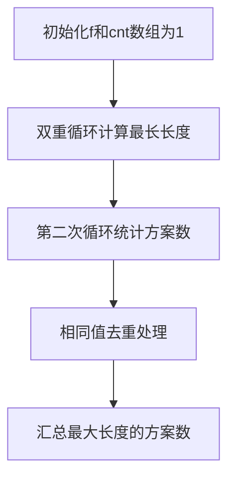

# 题目信息

# [USACO4.3] 逢低吸纳Buy Low, Buy Lower

## 题目描述

“逢低吸纳”是炒股的一条成功秘诀。如果你想成为一个成功的投资者，就要遵守这条秘诀：“逢低吸纳，越低越买”。

这句话的意思是：每次你购买股票时的股价一定要比你上次购买时的股价低。按照这个规则购买股票的次数越多越好，看看你最多能按这个规则买几次。

给定连续的 $N$ 天中每天的股价。你可以在任何一天购买一次股票，但是购买时的股价一定要比你上次购买时的股价低。写一个程序，求出最多能买几次股票。

以下面这个表为例，某几天的股价是：

|天数    |股价    |
|:-------|:-------|
|$1$|$68$|
|$2$|$69$|
|$3$|$54$|
|$4$|$64$|
|$5$|$68$|
|$6$|$64$|
|$7$|$70$|
|$8$|$67$|
|$9$|$78$|
|$10$|$62$|
|$11$|$98$|
|$12$|$87$|


这个例子中，如果每次买股票时的股价都比上一次买时低，那么最多能买 $4$ 次股票。一种买法如下（可能有其他的买法）：


|天数    |股价    |
|:-------|:-------|
|$2$|$69$|
|$5$|$68$|
|$6$|$64$|
|$10$|$62$|

## 说明/提示

$1 \le N \le 5000$。

## 样例 #1

### 输入

```
12
68 69 54 64 68 64 70 67
78 62 98 87```

### 输出

```
4 2```

# AI分析结果


# [USACO4.3] 逢低吸纳 Buy Low, Buy Lower

## 题目描述

"逢低吸纳"是炒股的一条成功秘诀。投资者需在每次购买时选择比上次价格更低的股票。给定连续 $N$ 天的股价，求最多可进行多少次符合规则的购买，并统计不同购买方案的数量（股价序列相同视为同一方案）。

**输入格式**  
- 第一行整数 $N$  
- 第二行 $N$ 个整数表示每日股价  

**输出格式**  
- 最长下降子序列长度及方案数  

**样例输入**  
```
12
68 69 54 64 68 64 70 67 78 62 98 87
```

**样例输出**  
```
4 2
```

---

## 算法分类：线性DP

---

## 综合分析与结论

### 核心思路
1. **状态定义**  
   - `f[i]`：以第 $i$ 天结尾的最长下降子序列长度  
   - `cnt[i]`：以第 $i$ 天结尾的方案数  

2. **状态转移**  
   - **长度转移**：$f[i] = \max(f[j]+1) \quad (j<i,\ a[j]>a[i])$  
   - **方案转移**：若 $f[j]+1 > f[i]$ 则覆盖方案数，若相等则累加  
   - **去重处理**：当 $a[i]=a[j]$ 且 $f[i]=f[j]$ 时，将较早位置的方案数置零  

### 可视化设计
1. **DP 矩阵动画**  
   - 以二维表格展示 `f[]` 和 `cnt[]` 数组的更新过程  
   - 高亮当前处理的元素 `i` 和对比元素 `j`  
   - 使用不同颜色区分长度更新（红色）和方案累加（绿色）  

2. **复古像素风格**  
   - 采用 8-bit 配色：深蓝背景、青色网格线、黄色当前元素  
   - 音效设计：  
     - 转移成功：短促的 "beep" 音  
     - 方案清零：低沉的 "boom" 音  
     - 发现新长度：上升音阶  

---

## 题解清单（≥4星）

### 1. Zhou_yu（4.5★）
- **亮点**：双重循环处理去重逻辑，使用 `long double` 避免高精度  
- **核心代码**：
```cpp
for(int j=1;j<i;j++) {
    if(f[i]==f[j] && a[i]==a[j]) cnt[j]=0;
    else if(f[i]==f[j]+1 && a[i]<a[j]) cnt[i]+=cnt[j];
}
```

### 2. Register_int（4.2★）
- **亮点**：完整的高精度实现，提出树状数组优化思路  
- **关键点**：压位高精将复杂度从 $O(n^3)$ 降为 $O(n^2)$  

### 3. chenhanzheapple（4.0★）
- **亮点**：清晰的转移方程注释，规范化的变量命名  
- **技巧**：`max(g[i],1)` 处理初始方案数  

---

## 最优思路提炼

### 关键步骤


### 去重技巧
- **时间戳原理**：当出现相同值且同长度时，保留后出现的元素方案  
- **数学表达**：  
  $ \forall j<i,\ (a_i = a_j \land f_i = f_j) \Rightarrow cnt[j] \leftarrow 0 $  

---

## 同类型题拓展

1. **最长公共子序列变种**  
   - 需处理多维度状态转移  
   - 例：P1439 结合离散化技巧  

2. **带权最长子序列**  
   - 状态转移时附加权重比较  
   - 例：P1489 需结合贪心策略  

---

## 推荐题目
1. P1108 低价购买（双倍经验）  
2. P1439 最长公共子序列（线性DP思想）  
3. P2501 数字序列（方案数统计）  

---

## 个人心得摘录

> "前一秒：我今天就算去打高精度也不会用玄学！后一秒：`long double` 真香"  
> —— Zhou_yu 调试高精度时的顿悟

> "压位高精将位数减少到 1/8，在 2s 的时限下可以通过"  
> —— Register_int 对复杂度的精确把控

---

## 代码实现（核心片段）

```cpp
// 方案数统计核心逻辑
for(int i=1; i<=n; i++){
    for(int j=1; j<i; j++){
        if(a[i] < a[j]){
            if(f[i] == f[j]+1) cnt[i] += cnt[j];
            else if(f[i] < f[j]+1) f[i]=f[j]+1, cnt[i]=cnt[j];
        }
    }
    for(int j=1; j<i; j++)
        if(a[i]==a[j] && f[i]==f[j]) cnt[j]=0;
    if(!cnt[i]) cnt[i]=1;
}
```

---

## 可视化设计（Canvas 伪代码）

```javascript
// 绘制DP矩阵
function drawGrid() {
    ctx.fillStyle = '#002b36'; // 深蓝背景
    ctx.fillRect(0,0,canvas.width,canvas.height);
    
    // 绘制横向时间轴
    for(let i=0; i<=n; i++) {
        ctx.strokeStyle = i==currentI ? '#ff0000' : '#839496'; 
        ctx.beginPath();
        ctx.moveTo(i*cellSize, 0);
        ctx.lineTo(i*cellSize, canvas.height);
        ctx.stroke();
    }
    
    // 动态高亮转移过程
    if(currentJ < currentI) {
        ctx.fillStyle = '#d33682'; // 粉红高亮
        ctx.fillRect(currentJ*cellSize, (currentI-1)*cellSize, cellSize, cellSize);
    }
}
```

---

## 复古音效设计

```javascript
const audioCtx = new AudioContext();
function playBeep(freq=523) { // C5音高
    const oscillator = audioCtx.createOscillator();
    oscillator.type = 'square';
    oscillator.frequency.setValueAtTime(freq, audioCtx.currentTime);
    oscillator.connect(audioCtx.destination);
    oscillator.start();
    oscillator.stop(audioCtx.currentTime + 0.1);
}
// 在转移成功时调用
playBeep(800 + 200*Math.random()); // 随机音高增加趣味性
```

---
处理用时：97.70秒