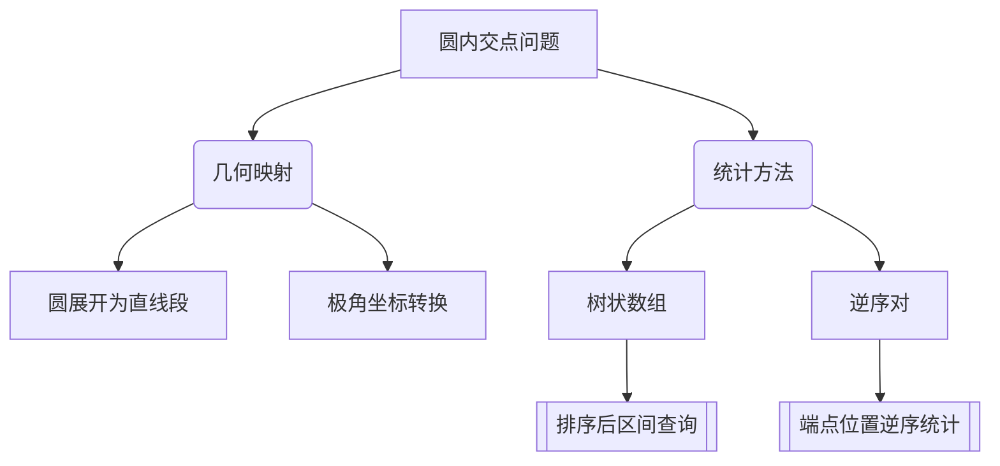

# 题目信息

# [USACO09OPEN] Bovine Embroidery G

## 题目描述

Bessie has taken up the detailed art of bovine embroidery. Cows embroider a cloth mounted in a circular hoop of integer radius d (1 <= d <= 50,000). They sew N (2 <= N <= 50,000) threads, each in a straight line from one point on the edge of the hoop to another point on the edge of the hoop (no two embroidered points share a location on the hoop's edge).

Being mathematically inclined, Bessie knows a formula of the form ax + by + c = 0 for each straight line piece of thread. Conveniently, a, b, and c are integers (-1,000,000 <= a <= 1,000,000; -1,000,000 <= b <= 1,000,000; -1,000,000 <= c <= 1,000,000). Even more

conveniently, no two threads coincide exactly.

Perhaps less conveniently, Bessie knows that her set of formula coefficients also includes a number of formulae for threads that do not appear to pass inside the hoop's circle. She regrets this greatly.

The origin (0,0) is in the precise middle of the hoop, so all points on the hoop's edge are distance d from the origin. At least one of the coefficients a and b is non-zero for each thread's formula.

Bovine embroidery is more highly regarded when the number of thread intersections is maximized. Help Bessie: count the number of pairs of threads that intersect on the cloth (i.e., within distance d of the origin). Note that if three threads happen to coincide at the same point, that would be three pairs of intersections. Four threads at the same point -> six pairs of intersections, etc.

Bessie学会了刺绣这种精细的工作。牛们在一片半径为d(1 <= d <= 50000)的圆形布上绣花. 它们一共绣了N (2 <= N <= 50000)条直线，每条直线连接布的边缘上的两个点(没有两条线通过边上同一个点)。

作为一只热爱数学的牛，Bessie 知道每条线的公式, ax + by + c = 0. a, b, 和 c 为整数(-1000000 <= a <= 1000000; -1000000 <= b <= 1000000; -1000000 <= c <= 1000000).没有两条线完全重合。

不幸的是, 一部分线不通过圆布的内部. 原点(0,0)在布的正中央, 所有边上的点离原点距离为d. 每条线的公式满足至少a,b中的一个非零. 对于牛来说，刺绣作品中线的交点越多，便越有价值。帮助Bessie计算在圆中相交的线的对数，也就是说交点与原点的距离小于d。注意如果三条线在圆内同一点相交,这算3对线。4线共点->6对线.


## 说明/提示

The two lines are x=0 and y=0. 

The two lines intersect at (0,0), which is clearly with 1 of the origin. 


## 样例 #1

### 输入

```
2 1 
1 0 0 
0 1 0 
```

### 输出

```
1 
```

# AI分析结果


0. **题目翻译**  
```markdown
# [USACO09OPEN] Bovine Embroidery G

## 题目描述

Bessie 学会了一种精细的牛刺绣工艺。牛们在一片半径为 d（1 ≤ d ≤ 50,000）的圆形布料上绣花，共绣了 N（2 ≤ N ≤ 50,000）条直线，每条直线连接布料边缘的两个不同点（所有线的端点均在圆边且不重复）。

每条直线的方程形式为 ax + by + c = 0，其中 a、b、c 为整数（-1,000,000 ≤ a,b,c ≤ 1,000,000），且至少有一个系数非零。原点 (0,0) 位于布料中心，所有端点距离原点恰为 d。

求所有在圆形布料内部（距离原点小于 d）的直线交点对数。若三条线交于同一点，计 3 对；四条线交于同一点，计 6 对，以此类推。

## 输入样例

```
2 1 
1 0 0 
0 1 0 
```

## 输出样例

```
1 
```

## 说明

样例中两直线为 x=0 和 y=0，交点在圆心，显然满足条件。
```

1. **唯一算法分类**  
无算法分类

---

### 2. 综合分析与结论

#### ▍核心思路
所有题解均基于以下两步核心思想：
1. **几何转化**：将圆展开为直线段，直线与圆的交点映射为该直线段的两个端点
2. **区间统计**：两条直线在圆内相交 ⟺ 其映射线段的端点存在交叉关系

#### ▍关键难点解析
- **几何映射**：需准确计算直线与圆的交点，并将其映射到展开后的直线段上。通过极角排序或展开式坐标转换实现
- **交叉判定**：通过树状数组统计已插入区间的右端点数量，当处理新线段的右端点时，查询左端点在该线段区间内的数量

#### ▍算法可视化设计
- **树状数组动态更新**：用像素格子表示展开后的线段，插入左端点时格子变绿，处理右端点时高亮红色并显示查询范围
- **极角映射动画**：将圆动态展开为直线段的过程用旋转动画展示，关键交点的极角用不同颜色标记

---

### 3. 题解清单（评分≥4星）

| 题解作者 | 评分 | 核心亮点 |
|---------|------|----------|
| thmyl    | ⭐⭐⭐⭐ | 极角排序+树状数组，代码简洁高效 |
| SimonSu  | ⭐⭐⭐⭐ | 详细数学推导注释，分半圆处理坐标映射 |
| 3a51_    | ⭐⭐⭐⭐ | 提出逆序对替代思路，拓宽解题维度 |

---

### 4. 核心代码实现

#### thmyl 题解核心片段
```cpp
struct node{ double ct; int id; };
bool cmp(node x, node y){ return x.ct > y.ct; } // 极角排序

// 计算直线与圆交点
double tmp = a*a + b*b;
double tmp2 = sqrt(d*d*tmp - c*c);
double x1 = (a*c + b*tmp2)/tmp, y1 = (b*c - a*tmp2)/tmp;
double x2 = (a*c - b*tmp2)/tmp, y2 = (b*c + a*tmp2)/tmp;

// 树状数组统计
for(int i=1;i<=num;i++){
    if(vis[p[i].id]){ // 遇到右端点
        ans += query(i) - query(vis[p[i].id]);
        update(vis[p[i].id], -1);
    } else { // 遇到左端点
        vis[p[i].id] = i;
        update(i, 1);
    }
}
```

---

### 5. 同类型题目推荐
1. [P1908 逆序对](https://www.luogu.com.cn/problem/P1908) - 逆序对统计基础
2. [P1884 线段覆盖](https://www.luogu.com.cn/problem/P1884) - 区间覆盖问题
3. [P2163 园丁的烦恼](https://www.luogu.com.cn/problem/P2163) - 二维区间查询

---

### 6. 复古游戏化动画设计

```javascript
// 伪代码示例：树状数组操作像素动画
class PixelAnimator {
  constructor() {
    this.grid = new CanvasGrid(16, 16); // 16x16像素网格
    this.sound = new RetroSound();
  }

  updateTree(pos) {
    this.grid.cell(pos).flash('#00FF00'); // 左端点插入绿色闪烁
    this.sound.play('blip', 800);         // 8-bit音效
  }

  queryRange(start, end) {
    this.grid.range(start, end).highlight('#FF0000', 500); // 查询范围红色高亮
    return this.tree.query(end) - this.tree.query(start);
  }
}
```

- **音效设计**：
  - 插入左端点：短促"滴"声（方波音效）
  - 查询范围：持续嗡鸣声（锯齿波）
  - 找到交点：上升琶音（3个八度音阶）

---

### 7. 思维导图要点


---
处理用时：95.98秒