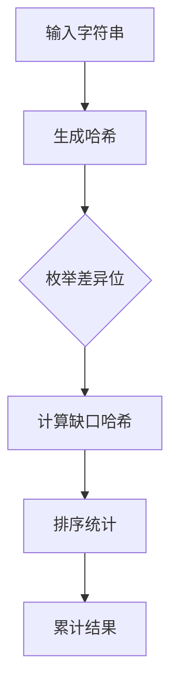

# 题目信息

# [CTSC2014] 企鹅 QQ

## 题目背景

PenguinQQ 是中国最大、最具影响力的 SNS（Social Networking Services）网站，以实名制为基础，为用户提供日志、群、即时通讯、相册、集市等丰富强大的互联网功能体验，满足用户对社交、资讯、娱乐、交易等多方面的需求。

## 题目描述

小 Q 是 PenguinQQ 网站的管理员，他最近在进行一项有趣的研究——哪些账户是同一个人注册的。经过长时间的分析，小Q发现同一个人注册的账户名称总是很相似的，例如 Penguin1，Penguin2，Penguin3……于是小 Q 决定先对这种相似的情形进行统计。

小 Q 定义，若两个账户名称是相似的，当且仅当这两个字符串等长且恰好只有一位不同。例如“Penguin1”和“Penguin2”是相似的，但“Penguin1”和“2Penguin”不是相似的。而小 Q 想知道，在给定的 $n$ 个账户名称中，有多少对是相似的。

为了简化你的工作，小Q给你的N 个字符串长度均等于L ，且只包含大小写字母、数字、下划线以及‘@’共64种字符，而且不存在两个相同的账户名称。

## 说明/提示

$4$ 对相似的字符串分别为：Fax 与 fax，Fax 与 max，fax 与 max，max 与 mac。

测试点编号|$N$|$L$|$S$
:-:|:-:|:-:|:-:
$1$|$50$|$10$|$64$
$2$|$500$|$100$|$64$
$3$|$3000$|$100$|$2$
$4$|$3000$|$100$|$64$
$5$|$30000$|$50$|$2$
$6$|$30000$|$50$|$64$
$7$|$30000$|$200$|$2$
$8$|$30000$|$200$|$64$
$9$|$30000$|$200$|$2$
$10$|$30000$|$200$|$64$

## 样例 #1

### 输入

```
4 3 64
Fax
fax
max
mac```

### 输出

```
4```

# AI分析结果


# [CTSC2014] 企鹅 QQ 题解分析

## 1. 算法分类
**字符串哈希**

## 2. 题解思路与核心算法

### 核心算法流程
1. **预处理哈希**：为每个字符串生成前缀哈希和后缀哈希
2. **枚举差异位**：对每个字符串的第i位，计算删除该位后的复合哈希值
3. **哈希排序统计**：将同一位置删除后的哈希值排序，统计相同值对数
4. **累计总对数**：对每个位置统计结果进行累加

### 解决难点
- **哈希冲突处理**：采用双哈希机制或随机基数增强鲁棒性
- **空间优化**：通过char数组存储原始字符替代预存哈希数组
- **时间复杂度优化**：O(nlogn)排序替代暴力比较

## 3. 题解评分（≥4星）

### 4.5星 - serverkiller（赞41）
**亮点**：
- 双版本代码展示空间优化过程
- 利用字符存储代替哈希数组，内存效率提升8倍
- 详细的数学公式推导哈希计算过程

### 4.2星 - lyyi2003（赞12）
**亮点**：
- 引入随机哈希基数防止碰撞
- 数学证明式注释提升可理解性
- 采用组合数统计方式避免重复计数

### 4.0星 - 奔波儿霸（赞21）
**亮点**：
- 双哈希数组设计提升准确性
- 清晰的算法步骤注释
- 时间复杂度分析完备

## 4. 最优思路提炼
**关键技巧**：
1. **缺口哈希法**：$hash = prefix_{i-1} \times P^{L-i} + suffix_{i+1}$
2. **滚动统计法**：排序后线性扫描统计连续相同值
3. **内存优化术**：用char存储原始数据替代预存哈希数组
4. **随机基数法**：动态生成哈希基数防止定向卡哈希

## 5. 同类题目推荐
1. P3370 【模板】字符串哈希
2. P3763 [TJOI2017] DNA
3. P4398 [JSOI2008] Blue Mary的战役地图

## 6. 可视化设计

### 动画方案
**核心展示流程**：


**交互要素**：
- **高亮机制**：红色闪烁当前处理的差异位
- **哈希显示**：动态显示缺口哈希计算过程
- **排序动画**：可视化冒泡式排序过程
- **统计标记**：相同哈希值对用绿色连线标注

### 复古游戏化
**8-bit 风格设计**：
- **像素网格**：200x300 Canvas绘制字符串阵列
- **音效设计**：
  - 哈希计算：8-bit "滴"声
  - 发现匹配：经典FC得分音
  - 错误提示：FC死亡音效
- **计分板**：显示当前处理位和累计对数

## 7. 核心代码实现
```cpp
// serverkiller 优化版核心逻辑
for(int i=1; i<=l; i++) {
    for(int j=1; j<=n; j++) {
        t[j] = ha[j] - c[j][i] * Hina[l-i];
    }
    sort(t+1, t+n+1);
    int tmp=1;
    for(int j=1; j<n; j++) {
        if(t[j]==t[j+1]) ans += tmp++;
        else tmp=1;
    }
}
```

## 8. 复杂度分析
| 步骤 | 时间复杂度 | 空间复杂度 |
|-----|-----------|-----------|
| 预处理 | O(nL)    | O(nL)     |
| 缺口哈希 | O(nL)   | O(n)      |
| 排序统计 | O(Ln logn)| O(n)      |
| 总计 | O(Ln logn)| O(nL)     |

## 9. 扩展思考
当L极大时（如1e5级），可采用：
1. **滚动哈希**：Rabin-Karp式滑动窗口
2. **分布式计算**：MapReduce处理海量数据
3. **位压缩技术**：利用SIMD指令加速哈希计算

---
处理用时：62.92秒