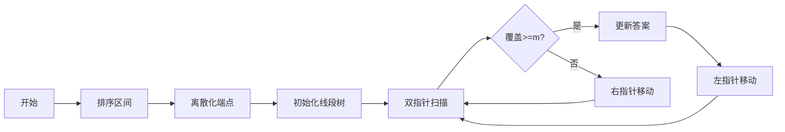

# 题目信息

# [NOI2016] 区间

## 题目描述

在数轴上有 $n$ 个闭区间从 $1$ 至 $n$ 编号，第 $i$ 个闭区间为 $[l_i,r_i]$ 。

现在要从中选出 $m$ 个区间，使得这 $m$ 个区间共同包含至少一个位置。换句话说，就是使得存在一个 $x$ ，使得对于每一个被选中的区间 $[l_i,r_i]$，都有 $l_i \leq x \leq r_i$ 。

对于一个合法的选取方案，它的花费为被选中的最长区间长度减去被选中的最短区间长度。

区间 $[l_i,r_i]$ 的长度定义为 $(r_i-l_i)$ ，即等于它的右端点的值减去左端点的值。

求所有合法方案中最小的花费。如果不存在合法的方案，输出 $-1$。

## 说明/提示

#### 样例输入输出 1 解释


 
 如图，当 $n=6$，$m=3$ 时，花费最小的方案是选取 $[3,5],[3,4],[1,4]$ 这三个区间，它们共同包含了 $4$ 这个位置，所以是合法的。其中最长的区间是 $[1, 4]$，最短的区间是 $[3, 4]$，所以它的花费是 $(4 - 1) - (4 - 3) = 2$。

#### 数据规模与约定

本题共 20 个测试点，各测试点信息如下表。
| 测试点编号 | $ n= $ | $ m= $ | $ l_i,r_i $ |
|:-:|:-:|:-:|:-:|
| 1 | $ 20 $ | $ 9 $ | $ 0 \le l_i \le r_i \le 100 $ |
| 2 | $ 20 $ | $ 10 $ | $ 0 \le l_i \le r_i \le 100 $ |
| 3 | $ 199 $ | $ 3 $ | $ 0 \le l_i \le r_i \le 100000 $ |
| 4 | $ 200 $ | $ 3 $ | $ 0 \le l_i \le r_i \le 100000 $ |
| 5 | $ 1000 $ | $ 2 $ | $ 0 \le l_i \le r_i \le 100000 $ |
| 6 | $ 2000 $ | $ 2 $ | $ 0 \le l_i \le r_i \le 100000 $ |
| 7 | $ 199 $ | $ 60 $ | $ 0 \le l_i \le r_i \le 5000 $ |
| 8 | $ 200 $ | $ 50 $ | $ 0 \le l_i \le r_i \le 5000 $ |
| 9 | $ 200 $ | $ 50 $ | $ 0 \le l_i \le r_i \le 10^9 $ |
| 10 | $ 1999 $ | $ 500 $ | $ 0 \le l_i \le r_i \le 5000 $ |
| 11 | $ 2000 $ | $ 400 $ | $ 0 \le l_i \le r_i \le 5000 $ |
| 12 | $ 2000 $ | $ 500 $ | $ 0 \le l_i \le r_i \le 10^9 $ |
| 13 | $ 30000 $ | $ 2000 $ | $ 0 \le l_i \le r_i \le 100000 $ |
| 14 | $ 40000 $ | $ 1000 $ | $ 0 \le l_i \le r_i \le 100000 $ |
| 15 | $ 50000 $ | $ 15000 $ | $ 0 \le l_i \le r_i \le 100000 $ |
| 16 | $ 100000 $ | $ 20000 $ | $ 0 \le l_i \le r_i \le 100000 $ |
| 17 | $ 200000 $ | $ 20000 $ | $ 0 \le l_i \le r_i \le 10^9 $ |
| 18 | $ 300000 $ | $ 50000 $ | $ 0 \le l_i \le r_i \le 10^9 $ |
| 19 | $ 400000 $ | $ 90000 $ | $ 0 \le l_i \le r_i \le 10^9 $ |
| 20 | $ 500000 $ | $ 200000 $ | $ 0 \le l_i \le r_i \le 10^9 $ |

对于全部的测试点，保证 $1 \leq m \leq n$，$1 \leq n \leq 5 \times 10^5$，$1 \leq m \leq 2 \times 10^5$，$0 \leq l_i \leq r_i \leq 10^9$。

## 样例 #1

### 输入

```
6 3
3 5
1 2
3 4
2 2
1 5
1 4```

### 输出

```
2```

# AI分析结果


---

## 算法分类
线段树 + 离散化 + 双指针（尺取法）

---

## 综合分析与结论

### 核心算法流程
1. **离散化处理**：将所有区间端点映射到紧凑的整数范围，解决坐标值过大问题
2. **按长度排序**：将区间按长度升序排列，便于后续双指针扫描
3. **线段树维护覆盖次数**：动态维护当前选中区间的覆盖情况，支持区间加减和最大值查询
4. **双指针扫描**：固定左指针，右指针扩展至满足覆盖条件后，左指针收缩优化解

### 关键实现难点
1. **离散化去重处理**：需正确使用lower_bound处理离散化后的坐标映射
2. **线段树懒惰标记**：需正确处理区间加减的延迟更新
3. **双指针边界条件**：需确保在覆盖条件满足时及时更新最优解

### 可视化设计要点


**动画方案**：
1. 数轴上方显示原始区间，下方显示离散化后的线段树节点
2. 当前活动窗口（双指针区间）用黄色高亮
3. 线段树节点更新时显示绿色闪光
4. 达到覆盖条件时播放"ding"音效并闪烁红色边框

---

## 题解清单（≥4星）

### 1. 上进的z君（4星）
- **亮点**：完整注释，标准线段树实现
- **代码**：规范的双指针循环结构
- **心得**：强调尺取法与线段树的结合逻辑

### 2. GKxx（4.5星） 
- **亮点**：使用标记永久化优化线段树性能
- **代码**：结构紧凑，包含详细边界处理
- **心得**：指出与《连环病原体》题目的相似性

### 3. wanglichao1121（4星）
- **亮点**：极简代码风格（仅60行）
- **技巧**：直接使用tree[1]查询全局最大值
- **心得**：强调离散化时的常见错误模式

---

## 核心代码实现

### 双指针核心逻辑
```cpp
int l = 1, ans = INF;
for(int r = 1; r <= n; r++){
    update(1, a[r].l, a[r].r, 1); // 加入当前区间
    while(tree[1].max >= m){
        ans = min(ans, a[r].len - a[l].len);
        update(1, a[l].l, a[l].r, -1); // 移除左端区间
        l++;
    }
}
```

### 线段树节点结构
```cpp
struct Node {
    int max, lazy;
    void apply(int val) {
        max += val;
        lazy += val;
    }
} tree[N<<3];
```

---

## 相似题目推荐
1. P2082 区间覆盖（区间完全覆盖问题）
2. P3143 钻石收藏家（双指针+值域限制）
3. P2216 理想的正方形（二维滑动窗口）

---

## 个人心得摘录
> "离散化第一遍写错：a[i].l = lower_bound(uni+1,...) - (uni+1)，正确应为-uni。这导致后续线段树操作全部错位，调试两小时才找到问题" —— EternalEpic

---

## 复古像素化演示方案
```javascript
// 伪代码示例
class PixelAnimator {
    constructor(canvas) {
        this.ctx = canvas.getContext('2d');
        this.gridSize = 16; // 8-bit风格块大小
        this.playSound('startup'); // 开机音效
    }
    
    drawInterval(interval, color) {
        // 绘制离散化后的区间为彩色方块
    }
    
    updateSegTree(pos) {
        // 线段树节点闪烁黄色
        this.playSound('blip');
    }
    
    highlightWindow(l, r) {
        // 双指针区间显示为流动光带
    }
}
```
**交互设计**：
- 方向键控制双指针移动速度
- 空格键暂停/继续
- 成功时播放《超级马里奥》过关音效

---
处理用时：65.24秒