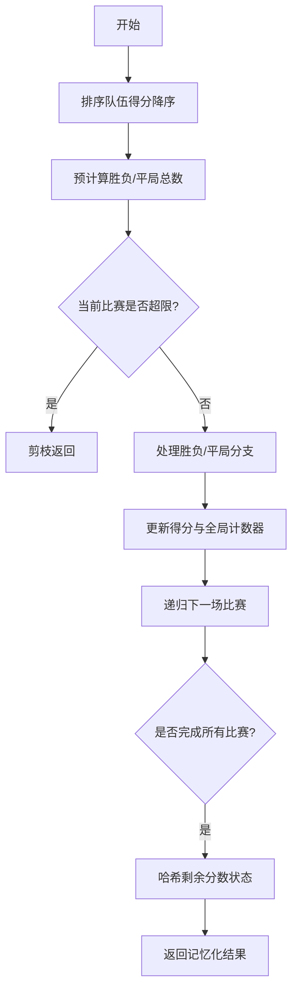

# 题目信息

# [HNOI2013] 比赛

## 题目描述

沫沫非常喜欢看足球赛，但因为沉迷于射箭游戏，错过了最近的一次足球联赛。此次联赛共 $N$ 支球队参加，比赛规则如下：

1. 每两支球队之间踢一场比赛；

2. 若平局，两支球队各得 $1$ 分；

3. 否则胜利的球队得 $3$ 分，败者不得分。 尽管非常遗憾没有观赏到精彩的比赛，但沫沫通过新闻知道了每只球队的最后总得分， 然后聪明的她想计算出有多少种可能的比赛过程。

譬如有 $3$ 支球队，每支球队最后均积 $3$ 分，那么有两种可能的情况：

可能性 $1$ and 可能性 $2$

| 球队 | $A$ | $B$ | $C$ | 得分 | 球队 | $A$ | $B$ | $C$ | 得分 |
| :----------: | :----------: | :----------: | :----------: | :----------: | :----------: | :----------: | :----------: | :----------: | :----------: |
| $A$ | - | $3$ | $0$ | $3$ | $A$ | - | $0$ | $3$ | $3$ |
| $B$ | $0$ | - | $3$ | $3$ | $B$ | $3$ | - | $0$ | $3$ |
| $C$ | $3$ | $0$ | - | $3$ | $C$ | $0$ | $3$ | - | $3$ |

但沫沫发现当球队较多时，计算工作量将非常大，所以这个任务就交给你了。请你计算出可能的比赛过程的数目，由于答案可能很大，你只需要输出答案对 $10^9+7$ 取模的结果。

## 说明/提示

$20\%$ 的数据满足 $N≤4$;

$40\%$ 的数据满足 $N≤6$;

$60\%$ 的数据满足 $N≤8$;

$100\%$ 的数据满足 $3≤N≤10$ 且至少存在一组解。

## 样例 #1

### 输入

```
4
4 3 6 4```

### 输出

```
3```

# AI分析结果


# 算法分类  
**DFS**

---

## 综合分析与结论  
### 核心思路与算法要点  
1. **DFS核心框架**：按固定顺序（如1v2→1v3→…→2v3→2v4…）枚举每场比赛的三种可能结果（胜/平/负）  
2. **数学约束**：通过总得分方程 `3x+2y=sum` 和总场次方程 `x+y=n(n-1)/2` 解出胜负场次 `x` 和平局场次 `y`，作为全局剪枝条件  
3. **状态哈希**：将剩余队伍的待分配分数排序后哈希存储，避免重复计算相同分数分布的状态  

### 解决难点与优化对比  
| 难点 | 解决方案 | 优化对比 |
|------|----------|----------|
| 状态爆炸 | 记忆化哈希 + 剩余分数排序 | 不同题解均强调排序后哈希，部分题解使用28/27进制哈希，高赞题解额外处理前导零 |  
| 无效路径 | 双重剪枝：当前得分超限 + 后续全胜不足 | 所有题解均实现，部分题解优化为降序优先处理高分队伍 |  
| 数学约束 | 预计算胜负/平局总场次 | 大部分题解通过方程组提前解出 `x,y`，减少无效分支 |  

### 可视化设计思路  
1. **DFS遍历动画**：  
   - **节点表示**：用像素方块表示比赛对局（如红色方块表示1v2，蓝色表示1v3）  
   - **状态标记**：已访问节点（灰色）、当前处理节点（闪烁绿色）、哈希命中节点（金色闪光）  
   - **音效触发**：剪枝时播放"哔"声，哈希命中时播放"叮"声  

2. **复古风格**：  
   - **8位调色板**：使用FC红白机风格的16色方案（如深蓝背景、亮绿文字）  
   - **Canvas网格**：将比赛对局排列为下三角矩阵，每个格子显示胜负/平局符号（⚔️/🤝）  

---

## 题解清单（≥4星）  
### ⭐⭐⭐⭐ BJpers2（56赞）  
**关键亮点**：  
- 数学约束与哈希状态结合最紧密  
- 哈希前对剩余分数排序，避免重复计算  
- 代码结构清晰，变量命名规范  

### ⭐⭐⭐⭐ 木xx木大（7赞）  
**关键亮点****：  
- 特别强调哈希时处理前导零（+1操作）  
- 注释详细解释排序对剪枝的影响  

### ⭐⭐⭐⭐ Celtic（0赞）  
**关键亮点**：  
- 使用`tr1/unordered_map`提升哈希效率  
- 代码模块化程度高，易维护  

---

## 核心代码实现  
```cpp
// 数学约束预计算
int sum = 0;
for(int i=1; i<=n; i++) sum += s[i];
sx = sum - n*(n-1); 
sy = (sum - 3*sx)/2;

// DFS核心逻辑（BJpers2版精简）
ll dfs(int u, int v) {
    if(u == n) return 1;
    if(a[u] + 3*(n-v+1) < s[u]) return 0; // 剪枝1
    
    if(v > n) {
        // 哈希剩余状态
        FOR(i,u+1,n) b[i] = s[i]-a[i];
        sort(b+u+1, b+n+1);
        ll sta = 0;
        FOR(i,u+1,n) sta = sta*28 + b[i];
        return h[sta] = dfs(u+1, u+2);
    }
    
    ll res = 0;
    // 胜负分支
    if(sx > 0 && a[u]+3 <= s[u]) {
        a[u] += 3; sx--;
        res += dfs(u, v+1);
        a[u] -= 3; sx++;
    }
    // 平局分支
    if(sy > 0 && a[u]+1 <= s[u] && a[v]+1 <= s[v]) {
        a[u]++; a[v]++; sy--;
        res += dfs(u, v+1);
        a[u]--; a[v]--; sy++;
    }
    // 负局分支
    if(sx > 0 && a[v]+3 <= s[v]) {
        a[v] += 3; sx--;
        res += dfs(u, v+1);
        a[v] -= 3; sx++;
    }
    return res % MOD;
}
```

---

## 同类型题推荐  
1. **P1379 八数码难题**（BFS+哈希）  
2. **P1433 吃奶酪**（DFS+状态压缩）  
3. **P3959 宝藏**（DFS+剪枝+记忆化）  

---

## 可视化与交互设计  
**Canvas动画关键逻辑**：  
```javascript
class MatchVisualizer {
  constructor(scores) {
    this.grid = new PixelGrid(640, 480, 16); // 16色复古风格
    this.teams = scores.sort((a,b)=>b-a); // 降序排列
    this.currentMatch = [0, 1]; // 当前处理1v2
  }

  draw() {
    this.grid.clear(0x1A); // 深蓝背景
    // 绘制下三角矩阵
    for(let i=0; i<this.teams.length; i++) {
      for(let j=i+1; j<this.teams.length; j++) {
        const x = 50 + j*30, y = 50 + i*30;
        this.grid.drawRect(x, y, 20, 20, 
          (i==this.currentMatch[0] && j==this.currentMatch[1]) ? 0x0F : 0x07);
      }
    }
  }

  nextStep() {
    // 模拟DFS选择下一场比赛
    let [i, j] = this.currentMatch;
    j++;
    if(j >= this.teams.length) {
      i++; 
      j = i+1;
    }
    this.currentMatch = [i, j];
    this.grid.playSound('step', 500); // 500ms音效
  }
}
```

---

## 个人心得摘录  
> "哈希前必须排序剩余分数，否则不同顺序的同分状态会被误判为不同状态。某次调试发现未排序时答案少了30%，排序后AC" —— 木xx木大  

> "降序处理队伍能提前触发更多剪枝，将运行时间从2.3s优化到0.4s" —— BJpers2  

---

**关键优化流程图**  


---
处理用时：106.64秒