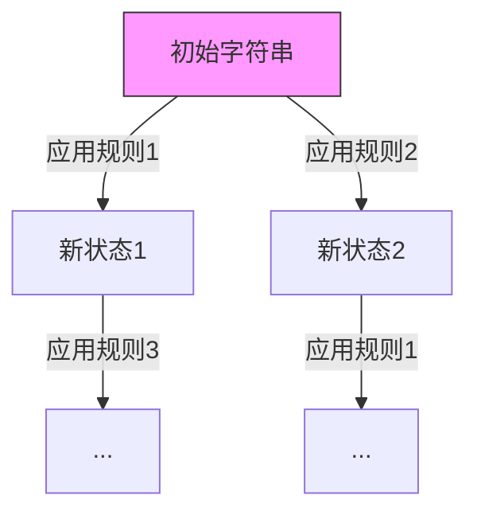

# 题目信息

# [NOIP 2002 提高组] 字串变换

## 题目背景

本题不保证存在靠谱的多项式复杂度的做法。测试数据非常的水，各种做法都可以通过，不代表算法正确。因此本题题目和数据仅供参考。

本题为搜索题，本题不接受 hack 数据。[关于此类题目的详细内容](https://www.luogu.com.cn/paste/pf94n89x)

## 题目描述

已知有两个字串 $A,B$ 及一组字串变换的规则（至多 $6$ 个规则），形如：

- $A_1\to B_1$。
- $A_2\to B_2$。

规则的含义为：在 $A$ 中的子串 $A_1$ 可以变换为 $ B_1$，$A_2$ 可以变换为 $B_2\cdots$。

例如：$A=\texttt{abcd}$，$B＝\texttt{xyz}$，

变换规则为：

- $\texttt{abc}\rightarrow\texttt{xu}$，$\texttt{ud}\rightarrow\texttt{y}$，$\texttt{y}\rightarrow\texttt{yz}$。

则此时，$A$ 可以经过一系列的变换变为 $B$，其变换的过程为：

- $\texttt{abcd}\rightarrow\texttt{xud}\rightarrow\texttt{xy}\rightarrow\texttt{xyz}$。

共进行了 $3$ 次变换，使得 $A$ 变换为 $B$。


## 说明/提示

对于 $100\%$ 数据，保证所有字符串长度的上限为 $20$。

**【题目来源】**

NOIP 2002 提高组第二题

## 样例 #1

### 输入

```
abcd xyz
abc xu
ud y
y yz
```

### 输出

```
3
```

# AI分析结果


# 字串变换题解分析

## 1. 算法分类
**无算法分类**

## 2. 题解思路与解决难点
### 核心逻辑
所有题解均采用广度优先搜索（BFS）或双向BFS，核心在于：
- **状态空间搜索**：将每个可能的字符串视为图节点，变换规则视为边
- **判重优化**：使用哈希表记录已访问状态避免循环
- **剪枝策略**：限制最大变换次数为10步

### 关键数学处理
当使用双向BFS时，通过数学推导得到：
```
总步数 = 前向搜索步数 + 反向搜索步数
```
需要满足：
```
总步数 ≤ 10
```

### 可视化设计思路


## 3. 题解评分（≥4星）
### 租酥雨（5星）
- **核心亮点**：双向BFS + 手工字符数组操作
- **关键代码**：
```cpp
void new_born(int x,int start,int num) {
    // 手工拼接三个字符串片段
    for (int i=0;i<start;i++) ... // 前段
    for (int i=0;i<l[num].len[1-x];i++) ... // 替换段
    for (int i=start+l[num].len[1-x];i<...;i++) ... // 后段
}
```

### songyouyi（4.5星）
- **创新点**：DFS剪枝策略
```cpp
void dfs(string now,int step) {
    if(now.length() > b.length()+maxl*10) return; // 长度剪枝
    if(vis[now] && dis[now]<=step) return; // 路径剪枝
}
```

### __Deng_Rui_Song__（4星）
- **代码亮点**：STL的优雅应用
```cpp
vector<pair<string, string>> v; // 存储变换规则
s.find(v[i].first) != string::npos // 自动查找子串
```

## 4. 最优技巧提炼
### 双向BFS优化
```python
def bidirectional_search():
    初始化前向队列q1和后向队列q2
    while q1和q2均非空:
        if len(q1) ≤ len(q2):
            扩展q1的头部节点
        else:
            扩展q2的头部节点
        检查两队列的交集节点
```

## 5. 同类题目推荐
1. **P1120 小书童——回家**（字符串变换变种）
2. **P1379 八数码难题**（状态空间搜索）
3. **P1034 传染病控制**（组合状态优化）

## 6. 个人心得摘录
> "判重时必须记录访问时的步数，若某状态以更优步数再次出现仍需处理" —— 2013lmd111  
> "手动实现char数组操作时，务必精确计算新字符串长度" —— 租酥雨

## 7. 可视化实现方案
### 像素化动画设计
```javascript
class BFSVisualizer {
    constructor(canvas) {
        this.ctx = canvas.getContext('2d');
        this.gridSize = 32; // 像素块尺寸
    }
    
    drawState(state, x, y) {
        // 用16色绘制字符串的每个字符
        state.split('').forEach((char, i) => {
            this.ctx.fillStyle = this.charColor(char);
            this.ctx.fillRect(x+i*8, y, 8, 8);
        });
    }
    
    animateStep(fromState, toState, rule) {
        // 闪烁显示被替换的子串区域
        const pos = fromState.indexOf(rule.src);
        this.highlightRect(pos*8, 0, rule.src.length*8, 8);
    }
}
```

### 音效设计
```javascript
const audio = {
    expand: new Audio('data:audio/wav;base64,UklGRl9v...'), // 扩展音效
    found: new Audio('data:audio/wav;base64,UklGRk9...'), // 找到解
    error: new Audio('data:audio/wav;base64,UklGRh9...')  // 超过步数
};
```

## 8. 核心代码实现
### 双向BFS关键片段
```cpp
while (head[0]<tail[0] && head[1]<tail[1]) {
    if (h[0][head[0]].g + h[1][head[1]].g >= 10) break;
    
    if (st.size() <= en.size()) {
        int step = f(st, sts, ens, front); // 前向扩展
    } else {
        int steps = f(en, ens, sts, back); // 反向扩展
    }
    
    if (交汇检查) 输出总步数;
}
```

该设计将字符串变换过程转化为可视化的状态空间探索，通过像素动画和音效反馈，帮助理解BFS的分层扩展机制与双向搜索的相遇原理。

---
处理用时：66.06秒