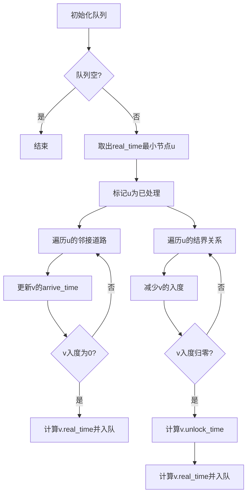

# 题目信息

# [SDOI2010] 大陆争霸

## 题目背景

在一个遥远的世界里有两个国家：位于大陆西端的杰森国和位于大陆东端的克里斯国。两个国家的人民分别信仰两个对立的神：杰森国信仰象征黑暗和毁灭的神曾·布拉泽，而克里斯国信仰象征光明和永恒的神斯普林·布拉泽。

幻想历 $8012$ 年 $1$ 月，杰森国正式宣布曾·布拉泽是他们唯一信仰的神，同时开始迫害在杰森国的信仰斯普林·布拉泽的克里斯国教徒。

幻想历 $8012$ 年 $3$ 月 $2$ 日，位于杰森国东部小镇神谕镇的克里斯国教徒发动起义。

幻想历 $8012$ 年 $3$ 月 $7$ 日，神谕镇的起义被杰森国大军以残酷手段镇压。

幻想历 $8012$ 年 $3$ 月 $8$ 日，克里斯国对杰森国宣战。由数十万大军组成的克里斯军团开至两国边境，与杰森军团对峙。

幻想历 $8012$ 年 $4$ 月，克里斯军团攻破杰森军团防线进入神谕镇，该镇幸存的克里斯国教徒得到解放。

战争随后进入胶着状态，旷日持久。战况惨烈，一时间枪林弹雨，硝烟弥漫，民不聊生。

## 题目描述

幻想历 $8012$ 年 $5$ 月 $12$ 日深夜，斯普林·布拉泽降下神谕：“Trust me, earn eternal life.”克里斯军团士气大增。作为克里斯军团的主帅，你决定利用这一机会发动奇袭，一举击败杰森国。具体地说，杰森国有 $N$ 个城市，由 $M$ 条单向道路连接。神谕镇是城市 $1$ 而杰森国的首都是城市 $N$。你只需摧毁位于杰森国首都的曾·布拉泽大神殿，杰森国的信仰，军队还有一切就都会土崩瓦解，灰飞烟灭。

为了尽量减小己方的消耗，你决定使用自爆机器人完成这一任务。唯一的困难是，杰森国的一部分城市有结界保护，不破坏掉结界就无法进入城市。而每个城市的结界都是由分布在其他城市中的一些结界发生器维持的，如果想进入某个城市，你就必须破坏掉维持这个城市结界的所有结界发生器。

现在你有无限多的自爆机器人，一旦进入了某个城市，自爆机器人可以瞬间引爆，破坏一个目标（结界发生器，或是杰森国大神殿），当然机器人本身也会一起被破坏。你需要知道：摧毁杰森国所需的最短时间。


## 说明/提示


对于 $20\%$ 的数据，满足 $N\leq 15$，$M≤50$；

对于 $50\%$ 的数据，满足 $N\leq 500$，$M\leq 6\times 10^3$；

对于 $100\%$ 的数据，满足 $1\leq N\leq 3\times 10^3$，$1\leq M\leq 7\times 10^4$，$1\leq w_i\leq 10^8$。

输入数据保证一定有解，且不会存在维持某个城市结界的结界发生器在这个城市内部。

连接两个城市的道路可能不止一条，也可能存在一个城市自己到自己的道路。

## 样例 #1

### 输入

```
6 6
1 2 1
1 4 3
2 3 1
2 5 2
4 6 2
5 3 2
0
0
0
1 5
0
2 3 5```

### 输出

```
5```

# AI分析结果


---

# 大陆争霸题解分析与可视化设计

## 1. 算法分类  
**带约束条件的最短路（Dijkstra + 拓扑排序）**

---

## 2. 核心思路与难点解析  
### 核心思路  
- **双时间维度**：每个城市需要维护两个时间——`arrive_time`（到达时间）和 `unlock_time`（结界解除时间）。实际进入时间为两者的最大值：  
  `real_time = max(arrive_time, unlock_time)`  
- **Dijkstra改造**：优先队列每次弹出`real_time`最小的节点，处理其邻接节点和保护关系：  
  1. **道路更新**：用当前节点的`real_time + 边权`更新邻接节点的`arrive_time`  
  2. **结界更新**：减少被保护节点的入度，若入度归零则计算其`unlock_time`  
- **拓扑融合**：通过入度数组`indegree`确保只有所有前置结界被摧毁后才允许访问节点  

### 解决难点  
- **依赖关系建模**：将保护关系建模为有向边，形成隐式DAG  
- **时间同步性**：节点实际访问时间需要同时满足路径最短和依赖解除  
- **堆优化**：必须在入度归零时才将节点加入优先队列，避免无效松弛  

---

## 3. 题解评分（≥4星）  
### 作者：bits（★★★★☆）  
- **亮点**：清晰的`arrive/into/dis`三变量模型，代码中同时处理道路和结界两类边  
- **代码**：链式前向星存储两种边，入度归零时触发`dis`更新  

### 作者：7KByte（★★★★☆）  
- **亮点**：将结界解除视为事件，用统一优先队列处理，思维接近A*算法  
- **实现**：简洁的`safe/dis`双数组，事件驱动式更新  

### 作者：Mysterious04（★★★★☆）  
- **亮点**：详细注释+手写min/max优化，适合教学理解  
- **可视化提示**：特别标注`max(dis[u], real[u])`为关键操作  

---

## 4. 关键代码实现  
```cpp
// 作者：bits 的核心Dijkstra片段
void dijkstra(int s) {
    while(!q.empty()) {
        int u = q.top().key; q.pop();
        for(遍历道路边) { // 更新到达时间
            if (arrive[v] > dis[u] + 边权) {
                arrive[v] = dis[u] + 边权;
                if (ind[v] == 0) q.push(v); // 无保护则入队
            }
        }
        for(遍历结界边) { // 更新结界解锁时间
            into[v] = max(into[v], dis[u]);
            if(--ind[v] == 0) { 
                dis[v] = max(arrive[v], into[v]);
                q.push(v); // 保护解除后入队
            }
        }
    }
}
```

---

## 5. 同类型题目推荐  
1. **P2761 软件补丁问题**（状态压缩+最短路）  
2. **P4011 孤岛营救问题**（分层最短路+钥匙依赖）  
3. **P3831 最短通路**（网格图+转向约束）  

---

## 6. 可视化设计  
### 动画方案  
- **节点状态**：  
  - 红色：未访问  
  - 绿色：在优先队列中  
  - 蓝色：已确定最短时间  
- **操作高亮**：  
  - 黄色边框：当前处理的节点  
  - 闪烁箭头：正在更新的道路/结界边  
- **动态标签**：实时显示`arrive/unlock/real`三个时间  

### 复古像素风格  
- **8-bit音效**：  
  - "滴"声：节点加入队列  
  - "咔嚓"声：结界被摧毁  
  - 胜利音效：到达终点  
- **Canvas绘制**：  
  - 城市用16x16像素方块表示  
  - 道路/结界边用不同颜色像素线连接  
  - 时间数值用8x8像素字体显示  

### 自动演示模式  
- **AI逻辑**：完全复现Dijkstra决策流程，每步延迟500ms  
- **控制面板**：  
  - 暂停/继续按钮  
  - 速度调节滑块（1x~5x）  
  - 单步执行按钮  

---

## 7. 核心算法演示流程  


通过此设计，学习者可直观看到两种约束如何动态影响最短路径的计算。

---
处理用时：80.48秒