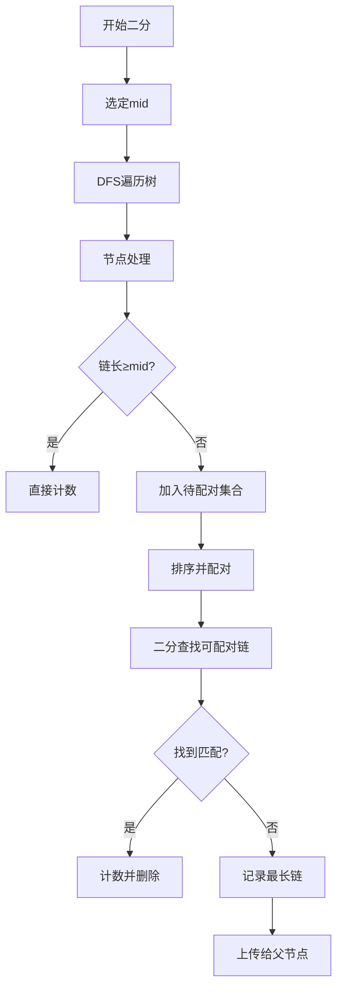

# 题目信息

# [NOIP 2018 提高组] 赛道修建

## 题目描述

C 城将要举办一系列的赛车比赛。在比赛前，需要在城内修建 $m$ 条赛道。 

C 城一共有 $n$ 个路口，这些路口编号为 $1,2,…,n$，有 $n-1$ 条适合于修建赛道的双向通行的道路，每条道路连接着两个路口。其中，第 $i$ 条道路连接的两个路口编号为 $a_i$ 和 $b_i$，该道路的长度为 $l_i$。借助这 $n-1$ 条道路，从任何一个路口出发都能到达其他所有的路口。 

一条赛道是一组互不相同的道路 $e_1,e_2,…,e_k$，满足可以从某个路口出发，依次经过 道路 $e_1,e_2,…,e_k$（每条道路经过一次，不允许调头）到达另一个路口。一条赛道的长度等于经过的各道路的长度之和。为保证安全，要求每条道路至多被一条赛道经过。 

目前赛道修建的方案尚未确定。你的任务是设计一种赛道修建的方案，使得修建的 $m$ 条赛道中长度最小的赛道长度最大（即 $m$ 条赛道中最短赛道的长度尽可能大）

## 说明/提示

【输入输出样例 1 说明】 

所有路口及适合于修建赛道的道路如下图所示：      


道路旁括号内的数字表示道路的编号，非括号内的数字表示道路长度。 需要修建 $1$ 条赛道。可以修建经过第 $3,1,2,6$ 条道路的赛道（从路口 $4$ 到路口 $7$）， 则该赛道的长度为 $9 + 10 + 5 + 7 = 31$，为所有方案中的最大值。

【输入输出样例 2 说明】

 所有路口及适合于修建赛道的道路如下图所示：   
  


需要修建 $3$ 条赛道。可以修建如下 $3$ 条赛道： 
1. 经过第 $1,6 $条道路的赛道（从路口 $1$ 到路口$ 7$），长度为 $6 + 9 = 15$； 
2. 经过第$ 5,2,3,8$ 条道路的赛道（从路口$ 6$ 到路口 $9$），长度为 $4 + 3 + 5 + 4 = 16$；
3. 经过第 $7,4$ 条道路的赛道（从路口 $8$ 到路口$ 5$），长度为 $7 + 10 = 17$。 长度最小的赛道长度为 $15$，为所有方案中的最大值。 

### 数据规模与约定

所有测试数据的范围和特点如下表所示 :

| 测试点编号 | $n$ | $m$ | $a_i=1$ | $b_i=a_i+1$ | 分支不超过 $3$ |
|:-:|:-:|:-:|:-:|:-:|:-:|
| $1$ | $\le 5$ | $=1$ | 否 | 否 | 是 |
| $2$ | $\le 10$ | $\le n-1$ | 否 | 是 | 是 |
| $3$ | $\le 15$ | $\le n-1$ | 是 | 否 | 否 |
| $4$ | $\le 10^3$ | $=1$ | 否 | 否 | 是 |
| $5$ | $\le 3\times 10^4$ | $=1$ | 是 | 否 | 否 |
| $6$ | $\le 3\times 10^4$ | $=1$ | 否 | 否 | 否 |
| $7$ | $\le 3\times 10^4$ | $\le n-1$ | 是 | 否 | 否 |
| $8$ | $\le 5\times 10^4$ | $\le n-1$ | 是 | 否 | 否 |
| $9$ | $\le 10^3$ | $\le n-1$ | 否 | 是 | 是 |
| $10$ | $\le 3\times 10^4$ | $\le n-1$ | 否 | 是 | 是 |
| $11$ | $\le 5\times 10^4$ | $\le n-1$ | 否 | 是 | 是 |
| $12$ | $\le 50$ | $\le n-1$ | 否 | 否 | 是 |
| $13$ | $\le 50$ | $\le n-1$ | 否 | 否 | 是 |
| $14$ | $\le 200$ | $\le n-1$ | 否 | 否 | 是 |
| $15$ | $\le 200$ | $\le n-1$ | 否 | 否 | 是 |
| $16$ | $\le 10^3$ | $\le n-1$ | 否 | 否 | 是 |
| $17$ | $\le 10^3$ | $\le n-1$ | 否 | 否 | 否 |
| $18$ | $\le 3\times 10^4$ | $\le n-1$ | 否 | 否 | 否 |
| $19$ | $\le 3\times 10^4$ | $\le n-1$ | 否 | 否 | 否 |
| $20$ | $\le 5\times 10^4$ | $\le n-1$ | 否 | 否 | 否 |

其中，「分支不超过 $3$」的含义为：每个路口至多有 $3$ 条道路与其相连。

对于所有的数据，$2 \le n \le 5\times 10^4, \ 1 \le m \le n − 1,\ 1 \le a_i,b_i \le n,\  1 \le l_i \le 10^4$。

## 样例 #1

### 输入

```
7 1 
1 2 10 
1 3 5 
2 4 9 
2 5 8 
3 6 6 
3 7 7```

### 输出

```
31```

## 样例 #2

### 输入

```
9 3 
1 2 6 
2 3 3 
3 4 5 
4 5 10 
6 2 4 
7 2 9 
8 4 7 
9 4 4```

### 输出

```
15```

# AI分析结果


## 算法分类
树形贪心 / 二分答案

---

## 题解思路与解决难点

### 核心思路
1. **二分答案**：通过二分确定赛道长度的最小值，转化为判断是否存在至少m条满足条件的赛道
2. **树形贪心**：自底向上处理每个节点：
   - 收集子节点上传的路径长度（链长 = 子链长 + 当前边权）
   - 将满足条件的链直接计数（长度≥mid）
   - 剩余链排序后两两配对，优先用最小链匹配最小可行链
   - 未配对的链中取最大值上传给父节点

### 解决难点
1. **配对策略优化**：需确保配对后剩余链能最大化后续配对机会
   ```python
   # 伪代码示例
   sorted_chains = sorted(remaining_chains)
   while not empty:
       x = smallest_chain
       find y ≥ (mid - x) using binary_search
       if found: 
           count +=1 
           remove x and y
       else: 
           keep x as candidate
   ```
2. **上传策略**：未配对的链只能选择一条最长链上传，保证父节点能获得最优解
3. **复杂度控制**：使用排序+二分查找将时间复杂度控制在O(n log n)

---

## 题解评分（≥4星）

### 1. CodyTheWolf（★★★★★）
- **亮点**：用队列存储子节点链，二分查找优化配对过程，标记数组防止重复使用
- **代码示例**：
  ```cpp
  for(int i=tail;i>=1&&que[i]>=lim;i--) // 处理可直接计数的链
  while(查找可配对链){
      int mid = lower_bound(...); // 二分查找
      tag标记配对状态
  }
  ```

### 2. XG_Zepto（★★★★☆）
- **亮点**：详细分析菊花图与分支限制情况，提出半链概念，代码结构清晰
- **关键代码**：
  ```cpp
  Dfs(v,u,x); // 后序遍历
  if(f[v]+l >= mid) 直接计数
  else 加入可配对集合
  ```

### 3. RedreamMer（★★★★☆）
- **亮点**：使用multiset自动排序，通过迭代器高效处理配对
- **代码片段**：
  ```cpp
  multiset<int> son;
  while(!son.empty()){
      auto it = son.lower_bound(lim - *son.begin());
      if(it != son.end()) 配对计数
  }
  ```

---

## 最优思路提炼
1. **二分边界**：以树的直径作为初始上界
2. **链的贪心处理**：
   - 立即处理可直接计数的链（≥mid）
   - 剩余链排序后从小开始配对，用二分找最小可行匹配
3. **上传策略**：未匹配链取最大值上传，保证父节点最优解

---

## 同类型题推荐
1. P1094（纪念品分组）：类似的最小配对问题
2. P2680（运输计划）：树链处理+二分答案
3. P4381（Island）：基环树最长链问题

---

## 可视化设计

### 核心动画流程


### 像素风格实现
1. **颜色方案**：
   - 节点：绿色方块
   - 已配对链：闪烁黄色
   - 上传链：红色箭头
2. **音效设计**：
   - 配对成功：8-bit "ping"声
   - 上传链：低音"咚"
3. **Canvas演示**：
   ```javascript
   function drawNode(x, y, color){
       ctx.fillStyle = color;
       ctx.fillRect(x*50, y*50, 40, 40); // 像素化节点
   }
   ```

---

## 核心代码示例
```cpp
// 二分框架
int l=0, r=最大可能值, ans=0;
while(l <= r){
    int mid = (l+r)/2;
    if(check(mid)) ans=mid, l=mid+1;
    else r=mid-1;
}

// DFS核心逻辑
int dfs(int u, int fa){
    multiset<int> chains;
    for(auto v : tree[u]){
        int len = dfs(v, u) + edge_weight;
        if(len >= mid) cnt++;
        else chains.insert(len);
    }
    int max_chain = 0;
    while(!chains.empty()){
        auto it = chains.begin();
        int need = mid - *it;
        auto match = chains.lower_bound(need);
        if(match != chains.end()){
            cnt++;
            chains.erase(match);
        }else{
            max_chain = max(max_chain, *it);
        }
        chains.erase(it);
    }
    return max_chain;
}
```

---
处理用时：76.08秒