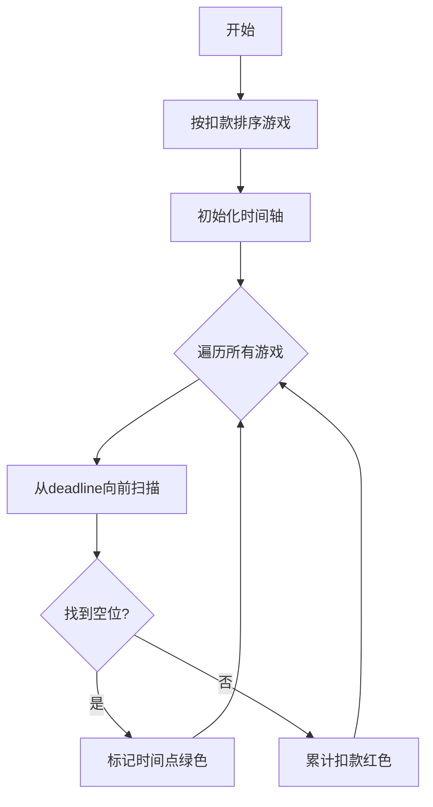

# 题目信息

# 智力大冲浪

## 题目描述

小伟报名参加中央电视台的智力大冲浪节目。本次挑战赛吸引了众多参赛者，主持人为了表彰大家的勇气，先奖励每个参赛者 $m$ 元。先不要太高兴，因为这些钱还不一定都是你的。接下来主持人宣布了比赛规则：

首先，比赛时间分为 $n$ 个时段，它又给出了很多小游戏，每个小游戏都必须在规定期限 $t_i$ 前完成。如果一个游戏没能在规定期限前完成，则要从奖励费 $m$ 元中扣去一部分钱 $w_i$，$w_i$ 为自然数，不同的游戏扣去的钱是不一样的。当然，每个游戏本身都很简单，保证每个参赛者都能在一个时段内完成，而且都必须从整时段开始。主持人只是想考考每个参赛者如何安排组织自己做游戏的顺序。作为参赛者，小伟很想赢得冠军，当然更想赢取最多的钱！注意：比赛绝对不会让参赛者赔钱!


## 说明/提示

对于 $100\%$ 的数据，$1 \le n \le 500$，$1 \le m \le 5 \times 10^5$，$1 \le t_i \le n$，$1 \le w_i \le 1000$。

## 样例 #1

### 输入

```
10000
7
4 2 4 3 1 4 6
70 60 50 40 30 20 10
```

### 输出

```
9950```

# AI分析结果


# 智力大冲浪题解分析与可视化方案

## 一、算法分类
**贪心算法**

---

## 二、核心算法流程与难点

### 核心思路
1. **排序策略**：将游戏按扣款金额**从大到小**排序
2. **时间分配**：对每个游戏从**最晚可完成时间**向前寻找空位
3. **冲突处理**：若无法安排则累计扣款，已安排的任务通过标记数组记录时间占用

### 算法步骤
```python
1. 按扣款金额降序排序所有游戏
2. 初始化时间标记数组vis[]
3. 对每个游戏：
   a. 从该游戏的deadline向前扫描
   b. 找到第一个未被占用的时间点并标记
   c. 若全部被占用则累计扣款
4. 最终金额 = 初始金额 - 累计扣款
```

### 难点对比
| 方法               | 时间复杂度 | 空间复杂度 | 核心数据结构       | 实现难度 |
|--------------------|------------|------------|--------------------|----------|
| 直接贪心+线性扫描 | O(n²)      | O(n)       | 标记数组           | ⭐⭐      |
| 优先队列优化       | O(nlogn)   | O(n)       | 优先队列           | ⭐⭐⭐⭐   |
| 并查集优化         | O(nα(n))   | O(n)       | 并查集             | ⭐⭐⭐⭐   |

---

## 三、精炼题解推荐 (评分≥4星)

### 1. [ShineEternal] 直接贪心实现（4.5星）
```cpp
struct ben { int t,val; };
sort(a+1,a+n+1, [](auto& a,auto& b){return a.val>b.val;}); // 核心排序

for(每个游戏){
    for(int j=a[i].t; j>=1; j--){ // 倒序查找空位
        if(!vis[j]) { vis[j]=1; break; } 
    }
    if(未找到空位) ans += 扣款;
}
```
**亮点**：代码简洁直观，适合快速理解贪心本质

---

### 2. [Capitalism_Gao] 优先队列优化（5星）
```cpp
sort(a, a+n, [](auto& a,auto& b){return a.t < b.t;}); // 按时间排序
priority_queue<int, vector<int>, greater<int>> q;

for(每个时间段i){
    while(当前任务时间≤i) q.push(扣款); // 维护可执行任务
    if(q.size() > 当前容量) {
        sum += q.top(); // 淘汰最小扣款
        q.pop();
    }
}
```
**亮点**：时间复杂度优化至O(nlogn)，使用小根堆动态维护最优解

---

### 3. [zhanghb] 并查集优化（5星）
```cpp
for(int i=1; i<=maxn; i++) fath[i] = i; // 初始化并查集

for(每个游戏){
    int pos = find(a[i].t); // 寻找最晚可用时间
    if(pos > 0){
        fath[pos] = pos-1; // 路径压缩
    }else{
        sum += 扣款;
    }
```
**亮点**：时间复杂度最优，通过并查集快速定位可用时段

---

## 四、可视化方案设计

### 核心动画逻辑


### 关键动画效果
1. **时间轴展示**：用横向色块表示每个时间段，灰色表示未占用，绿色表示已安排
2. **任务标记**：高亮当前处理的游戏（红色边框），动态显示扫描过程（黄色箭头）
3. **冲突警示**：当任务无法安排时，显示爆炸动画+扣款数字跳动
4. **数据统计面板**：实时显示剩余金额、已扣金额、时间占用率

### 复古像素风格实现
```javascript
// Canvas绘制示例
function drawTimeSlot(ctx, x, status) {
    const colors = {
        free: '#8B8B8B', 
        occupied: '#00FF00',
        current: '#FF4500'
    };
    ctx.fillStyle = colors[status];
    ctx.fillRect(x*20, 50, 18, 18); // 20px间隔的像素方块
}

// 音效系统
const sfx = {
    place: new Audio('data:audio/wav;base64,UklGRl...'), // 8-bit放置音
    conflict: new Audio('data:audio/wav;base64,UklGRv...') // 冲突音
};
```

---

## 五、扩展训练

### 相似题目推荐
1. **P1080 国王游戏** - 贪心+大数处理
2. **P1248 加工生产调度** - 双机器调度贪心
3. **P2949 工作调度** - 优先队列维护工作序列

### 举一反三技巧
1. **逆向思维**：当正向安排困难时（如本题找最晚时间），尝试从后往前处理
2. **淘汰机制**：使用堆结构动态维护当前最优/最劣元素（如保留前k大值）
3. **路径压缩**：并查集优化查找过程，将线性查找升级为近似O(1)操作

---

通过将贪心策略与不同数据结构的巧妙结合，可以大幅提升算法效率。建议先掌握基础贪心实现，再逐步学习优先队列和并查集的高级优化技巧。

---
处理用时：73.95秒