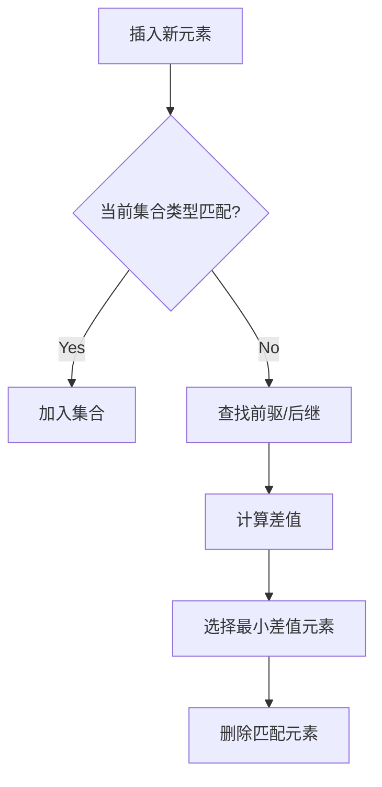

# 题目信息

# [HNOI2004] 宠物收养场

## 题目背景

题面修缮来自于 [LaDeX](https://www.luogu.com.cn/user/431658)。

## 题目描述

凡凡开了一间宠物收养场。收养场提供两种服务：收养被主人遗弃的宠物和让新的主人领养这些宠物。

每个领养者都希望领养到自己满意的宠物，凡凡根据领养者的要求通过他自己发明的一个特殊的公式，得出该领养者希望领养的宠物的特点值 $a$（$a$ 是一个正整数，$a<2^{31}$），而他也给每个处在收养场的宠物一个特点值。这样他就能够很方便的处理整个领养宠物的过程了，宠物收养场总是会有两种情况发生：被遗弃的宠物过多或者是想要收养宠物的人太多，而宠物太少。

被遗弃的宠物过多时，假若到来一个领养者，这个领养者希望领养的宠物的特点值为 $a$，那么它将会领养一只目前未被领养的宠物中特点值最接近 $a$ 的一只宠物。（任何两只宠物的特点值都不可能是相同的，任何两个领养者的希望领养宠物的特点值也不可能是一样的）如果有两只满足要求的宠物，即存在两只宠物他们的特点值分别为 $a-b$ 和 $a+b$，那么领养者将会领养特点值为 $a-b$ 的那只宠物。

收养宠物的人过多，假若到来一只被收养的宠物，那么哪个领养者能够领养它呢？能够领养它的领养者，是那个希望被领养宠物的特点值最接近该宠物特点值的领养者，如果该宠物的特点值为 $a$，存在两个领养者他们希望领养宠物的特点值分别为 $a-b$ 和 $a+b$，那么特点值为 $a-b$ 的那个领养者将成功领养该宠物。

一个领养者领养了一个特点值为 $a$ 的宠物，而它本身希望领养的宠物的特点值为 $b$，那么这个领养者的不满意程度为 $|a-b|$。

你得到了一年当中，领养者和被收养宠物到来收养所的情况，请你计算所有收养了宠物的领养者的不满意程度的总和。这一年初始时，收养所里面既没有宠物，也没有领养者。

## 说明/提示

样例解释：

注：$|3-2| + |2-4|=3$，
最后一个领养者没有宠物可以领养。

## 样例 #1

### 输入

```
5                  

0 2                      

0 4                         

1 3

1 2

1 5

```

### 输出

```
3
```

# AI分析结果


# [HNOI2004] 宠物收养场 题解分析

## 算法分类
**平衡树/有序集合**

---

## 题解思路与核心难点

### 核心逻辑
1. **动态维护有序集合**：每次操作需要快速找到当前集合中与给定值最接近的元素（前驱/后继）
2. **状态切换**：集合中同一时刻只存在宠物或领养者，通过变量记录当前状态
3. **差值计算**：比较前驱和后继与当前值的绝对差，选择差值最小的进行匹配

### 解决难点对比
| 方法         | 实现复杂度 | 时间复杂度 | 空间复杂度 | 可读性 |
|--------------|------------|------------|------------|--------|
| 平衡树       | 高         | O(n log n) | O(n)       | 较低   |
| STL set      | 低         | O(n log n) | O(n)       | 高     |
| 双Treap      | 中         | O(n log n) | O(n)       | 中     |

---

## 题解评分（≥4星）

### 1. DaCong（赞31）⭐⭐⭐⭐⭐
- **亮点**：利用STL set实现，代码极简（仅30行）
- **关键代码**：
```cpp
set<int> s;
void find(int x) {
    auto left = --s.lower_bound(x), right = s.lower_bound(x);
    if(x - *left <= *right - x) ans += x - *left, s.erase(left);
    else ans += *right - x, s.erase(right);
}
```

### 2. crpboy（赞18）⭐⭐⭐⭐
- **亮点**：简洁的set应用，利用位运算处理状态切换
```cpp
set<int> a[2]; // 0:宠物 1:领养者
int pre = *--a[opt^1].lower_bound(x);
int nxt = *a[opt^1].lower_bound(x);
```

### 3. chen_vvv（赞5）⭐⭐⭐
- **亮点**：完善处理边界条件，添加哨兵元素
```cpp
s1.insert(-INF); s1.insert(INF); // 边界处理
```

---

## 最优思路提炼
1. **单集合维护**：利用一个有序集合动态维护当前活跃的宠物/领养者
2. **哨兵技巧**：插入极大极小值避免边界判断
3. **状态标志位**：用整型变量记录当前集合类型（宠物/领养者）
4. **前驱后继查找**：使用lower_bound快速定位最近元素

---

## 同类型题目推荐
1. P3369 【模板】普通平衡树
2. P2234 [HNOI2002] 营业额统计
3. P2073 [NOI2004] 郁闷的出纳员

---

## 可视化设计

### 核心动画流程


### 像素化演示要点
1. **颜色标记**：
   - 红色：当前插入元素
   - 绿色：前驱元素
   - 蓝色：后继元素
2. **操作提示**：
   - 插入时显示元素位置跳动效果
   - 匹配成功后爆炸粒子特效
3. **8-bit音效设计**：
   - 插入：短促"哔"声
   - 匹配成功：上扬音阶
   - 删除：低沉"咚"声

---

## 核心代码实现（STL set版）
```cpp
#include <set>
#include <algorithm>
const int INF = 1e9, MOD = 1e6;
std::set<int> s = { -INF, INF }; // 哨兵
int ans, state = -1; // -1表示空集合

void process(int type, int x) {
    if (state == type || s.size() == 2) { // 插入逻辑
        s.insert(x);
        state = type;
        return;
    }
    
    auto pre = --s.lower_bound(x);
    auto nxt = s.lower_bound(x);
    
    int d1 = x - *pre, d2 = *nxt - x;
    if (d1 <= d2) {
        ans = (ans + d1) % MOD;
        s.erase(pre);
    } else {
        ans = (ans + d2) % MOD; 
        s.erase(nxt);
    }
}
```

---

## 总结
本题核心在于动态维护有序集合的最邻近查询，STL set凭借其简洁的API成为最优实现选择。通过哨兵技巧和状态标志位处理，可将代码量压缩至30行以内。可视化设计通过像素风格动画和音效反馈，能够直观展示匹配过程的动态变化。

---
处理用时：73.66秒