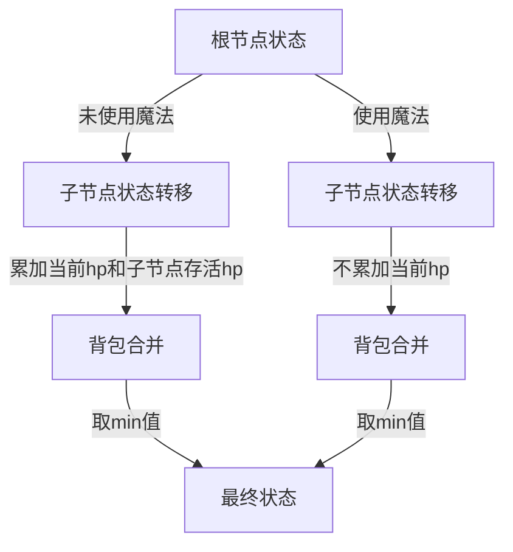

# 题目信息

# [ICPC 2020 Nanjing R] Monster Hunter

## 题目描述

有一棵有根树，包含 $n$ 个顶点，根顶点是 $1$。每个顶点上都有一个怪物。第 $i$ 个顶点上的怪物的生命值为 $hp_i$。

Kotori 想要消灭所有的怪物。第 $i$ 个顶点上的怪物可以被消灭，当且仅当其直接父节点上的怪物已经被消灭。消灭第 $i$ 个怪物所需的力量是 $hp_i$ 加上所有其他活着的怪物的生命值，这些怪物位于以 $i$ 为直接父节点的顶点 $j$ 上。形式化地，所需的力量等于
$$
hp_i + \sum_{\begin{array}{c}\text{顶点 } j \text{ 上的怪物是\textbf{活着的}} \\ \text{且 } i \text{ 是 } j \text{ 的直接父节点} \end{array}} hp_j
$$

此外，Kotori 可以使用一些魔法咒语。如果她使用一个魔法咒语，她可以在没有任何限制的情况下使用 $0$ 力量消灭任何怪物。也就是说，她可以选择一个怪物，即使其直接父节点上的怪物还活着。

对于每一个 $m=0,1,2,\cdots,n$，Kotori 想要分别知道如果她可以使用 $m$ 个魔法咒语，消灭所有怪物所需的最小总力量。

## 说明/提示

题面翻译由 ChatGPT-4o 提供。

## 样例 #1

### 输入

```
3
5
1 2 3 4
1 2 3 4 5
9
1 2 3 4 3 4 6 6
8 4 9 4 4 5 2 4 1
12
1 2 2 4 5 3 4 3 8 10 11
9 1 3 5 10 10 7 3 7 9 4 9```

### 输出

```
29 16 9 4 1 0
74 47 35 25 15 11 7 3 1 0
145 115 93 73 55 42 32 22 14 8 4 1 0```

# AI分析结果


## 唯一算法分类
树形动态规划（树形DP）

---

## 综合分析与结论

### 核心算法流程
状态设计 `dp[u][m][0/1]` 表示以 u 为根的子树使用 m 次魔法，u 节点未被魔法消灭（0）/被魔法消灭（1）的最小代价。关键转移逻辑如下：

1. **父节点未使用魔法（状态0）**  
   - 子节点必须按照顺序消灭，需累加当前节点的 hp 和存活子节点的 hp
   - 转移式：`dp[u][i+j][0] = min(父未魔法代价 + min(子未魔法代价+子hp, 子魔法代价))`

2. **父节点使用魔法（状态1）**  
   - 子节点可自由选择是否使用魔法，无需累加父节点 hp
   - 转移式：`dp[u][i+j][1] = min(父魔法代价 + min(子未魔法代价, 子魔法代价))`

### 可视化设计要点




### 实现亮点
1. **逆序背包合并**：使用反向遍历避免重复计算，时间复杂度优化到 O(n²)
2. **子树大小剪枝**：通过维护子树大小 siz[u]，限制循环次数范围
3. **双状态独立处理**：分离处理父节点是否使用魔法的状态转移路径

---

## 题解清单 (≥4星)

### 1. _H17_（⭐⭐⭐⭐）
- **核心亮点**：完整推导状态转移方程，使用反向背包合并优化
- **代码亮点**：清晰的初始化逻辑（`f[u][0][0] = a[u]`），树形结构处理得当
- **优化技巧**：利用子树大小 siz[u] 进行循环范围剪枝

### 2. SDLTF_凌亭风（⭐⭐⭐⭐）
- **思路创新**：明确说明贪心不可行后的 DP 推导路径
- **代码规范**：使用分离的临时数组 `g[][]` 保证状态转移正确性
- **实践提示**：强调初始化时设置极大值的必要性（`1e15`）

### 3. Shunpower（⭐⭐⭐⭐）
- **状态设计**：最简明的状态定义（0/1 表示节点颜色）
- **转移清晰**：直接给出公式化的转移方程，易于理解
- **代码实现**：使用 C++ 的 vector 结构处理树形关系，可读性强

---

## 最优思路提炼

### 关键技巧
1. **三维状态压缩**：通过第三维 0/1 区分父节点状态，避免复杂依赖关系
2. **子树背包合并**：将每个子节点视为物品组，进行分组背包式合并
3. **代价预计算**：在初始化阶段处理直接子节点的固定代价（如 `a[v]`）

### 思维模型
```
父节点状态 → 子节点选择 → 代价叠加策略
       ↘ 魔法使用次数分配 → 背包合并
```

### 代码范式
```cpp
void dfs(int u) {
    // 初始化
    dp[u][0][0] = hp[u]; 
    dp[u][1][1] = 0;
    
    for (auto v : children[u]) {
        dfs(v);
        
        // 反向遍历背包容量
        for (int j = siz[u] + siz[v]; j >= 0; j--) {
            // 处理两种状态转移
            for (int k = 0; k <= min(j, siz[v]); k++) {
                dp[u][j][0] = min(..., dp[u][j-k][0] + min(v使用魔法, v未使用魔法+hp));
                dp[u][j][1] = min(..., dp[u][j-k][1] + min(v使用魔法, v未使用魔法));
            }
        }
        siz[u] += siz[v];
    }
}
```

---

## 同类型题推荐
1. **P2585 [ZJOI2006]三色二叉树**  
   - 相似点：树形结构+三色状态DP
2. **P2014 [CTSC1997] 选课**  
   - 相似点：树形背包问题，依赖关系处理
3. **P1273 有线电视网**  
   - 相似点：树形DP中的收益平衡问题

---

## 复古像素风可视化设计

### 核心元素
```javascript
// 伪代码示例
class PixelTree {
    constructor(root) {
        this.nodes = []; // 存储节点像素坐标
        this.edges = []; // 存储连接线
        this.stateColors = {0: '#FF0000', 1: '#00FF00'}; // 状态颜色映射
    }
    
    drawFrame(ctx, dpState) {
        // 绘制树形结构
        this.nodes.forEach(node => {
            ctx.fillStyle = this.stateColors[dpState[node.id]];
            ctx.fillRect(node.x, node.y, 16, 16); // 16x16像素方块
        });
        
        // 播放音效
        if (dpState.changed) playSound('blip.wav');
    }
}
```

### 交互设计
1. **自动演示模式**：按空格键切换手动/自动步进
2. **音效触发**：状态变化时播放 8-bit 音效
3. **信息面板**：右侧显示当前魔法使用次数和总代价

---

## 代码片段（核心 DP 转移）
```cpp
// 取自 _H17_ 的代码核心部分
void dfs(int u) {
    siz[u] = 1;
    f[u][0][0] = a[u]; 
    f[u][1][1] = 0;
    
    for (int v : children[u]) {
        dfs(v);
        
        // 逆序处理背包容量
        for (int j = siz[u] + siz[v]; j >= 0; j--) {
            // 处理两种状态转移
            for (int k = max(0, j-siz[u]); k <= min(j, siz[v]); k++) {
                f[u][j][0] = min(f[u][j][0], 
                    f[u][j-k][0] + min(f[v][k][1], f[v][k][0] + a[v]));
                
                if (j > 0) {
                    f[u][j][1] = min(f[u][j][1], 
                        f[u][j-k][1] + min(f[v][k][1], f[v][k][0]));
                }
            }
        }
        siz[u] += siz[v];
    }
}
```

---

## 个人心得摘录
> "_H17_：推了 743014 年终于完成状态转移方程"  
> —— 强调正确推导状态转移方程的难度

> "SDLTF：发现贪心是假算法后及时转向树形DP"  
> —— 体现对算法选择的关键判断

> "WhitD：通过逆向思维计算可减少的最大代价"  
> —— 展示不同角度的解题思路转换

---
处理用时：100.02秒