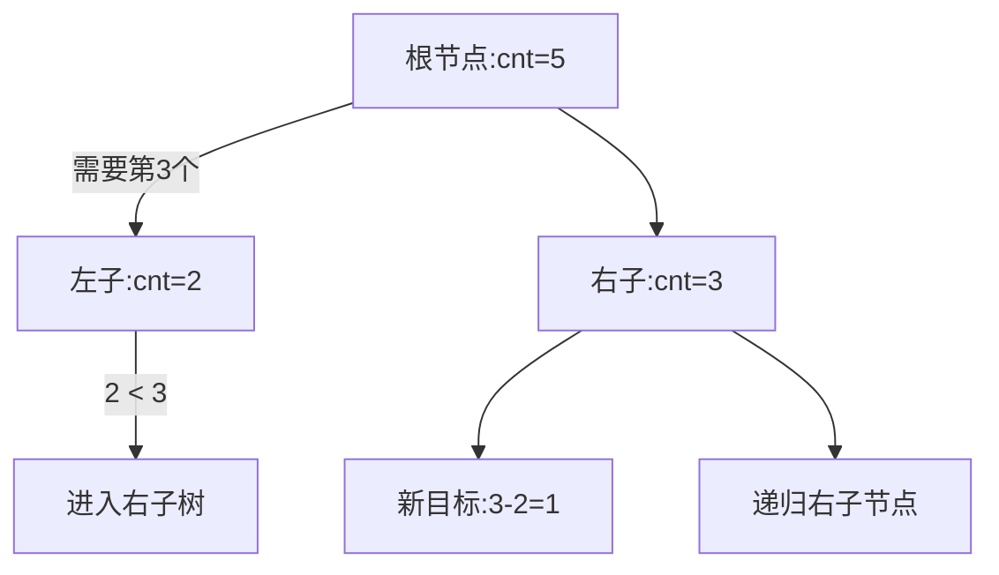

# 题目信息

# ycz的妹子

## 题目背景

ycz 有很多很多的妹子（ycz：瞎说）

## 题目描述

机房神犇 ycz 有 $n$ 个青梅竹马，她们分别住在 $1~n$ 号城市中。小时候的她们美丽可爱，但是由于女大十八变，有些妹子的颜值发生了变化，但是十分重感情的 ycz 神犇不忍心抛弃她们，于是记录下来了她们颜值变化的值，我们用 $C, x, y$ 表示第 $x$ 个城市的妹子的颜值下降了 $y$ 。长大之后的 ycz 非常有魅力，有许多妹子被 ycz 迷得神魂颠倒，我们用$I, x, y$ 表示第 $x$ 个城市有一个妹子喜欢上了 ycz ，她的颜值为 $y$ （ $y$ 有可能是负数，但是 ycz 来者不拒）。但在中途有一些妹子和 ycz 吵架了，于是就分手了，我们用 $D, x$ 表示**第 $x$ 个妹子**和 ycz 分手了。

最近神犇 ycz 要去全国各地找他的妹子们，为了方便计算，我们珂以把 ycz 的妹子所在的城市当作是一条直线，并且挨在一起。神犇 ycz 由于忙于和他的妹子们联系此时已经很累了，于是交给你一个这样的任务：他想知道他在某个时间去找他的所有妹子们珂以获得多大的愉悦度，这个愉悦度为他找的妹子的颜值数，你要做的就是求出这个愉悦度之和（注意长大后妹子们的颜值可能为负数/滑稽）。

注意：每个城市只允许有一个妹子，也就是说后来喜欢上 ycz 的妹子会赶走之前这个城市喜欢 ycz 的妹子~~（一城不容二女）~~。

UPD:

青梅竹马都是喜欢 ycz 的。

分手的第 $x$ 个妹子不是第 $x$ 城市的妹子，是指从前往后数第 $x$ 个有妹子的城市的妹子。

青梅竹马长大后就是妹子。

修改的值 $y$ 不为负数，但是颜值减去之后可能为负数。

## 说明/提示

**样例解释：**

妹子颜值变化如下，删除的就没写在下面了。

```
1 2 1 4 5
1 2 1 4 5 6
1 2 1 5 6
1 2 1 3 6
1 2 1 3 6 9
```

对于 30% 的数据，$1 \le n,m \le 10$

对于 70% 的数据，$1 \le n,m \le 1000$

对于 100% 的数据，$1 \le n,m \le 100000,|a_i|,|y| \le 10^9$


## 样例 #1

### 输入

```
5 10
1 2 3 4 5
Q
C 3 2
Q
I 6 6
Q
D 4
Q
C 5 2
I 7 9
Q```

### 输出

```
15
13
19
15
22```

# AI分析结果


# 算法分类：线段树/树状数组

## 题解核心思路与难点分析
### 核心算法流程
1. **线段树解法**：
   - 每个节点维护两个值：区间妹子数量(cnt)和颜值总和(sum)
   - 删除操作时，通过递归比较左右子树的妹子数量决定查找方向
   - 插入/修改操作通过路径递归更新节点值
   - 时间复杂度：O(m logN)

2. **树状数组+二分查找**：
   - 树状数组维护存在妹子的城市前缀和
   - 删除时通过二分查找定位第x个妹子位置
   - 时间复杂度：O(m logN)

### 解决难点对比
- **动态维护顺序**：D操作需要按存在顺序访问元素，线段树通过维护区间妹子数量实现高效查询
- **空间管理**：分块解法需要额外维护块状结构信息，线段树直接通过递归路径压缩空间
- **实时更新**：所有解法都需要在修改操作时同步维护总和和存在标记

## 高星题解推荐（≥4★）
1. **Wolfycz线段树解法（5★）**
   - 亮点：完整的线段树模板实现，维护cnt和sum的双重信息
   - 代码可读性：结构清晰，使用递归式线段树模板
   - 优化点：将城市编号扩展到5e5，完美处理后续插入

2. **清远学会分块解法（4★）**
   - 亮点：分块思想直观易懂，适合线段树薄弱者
   - 创新点：单独维护块内妹子数和总和数组
   - 适用场景：对时间复杂度不敏感的大数据量

3. **zl_just树状数组解法（5★）**
   - 亮点：结合树状数组与二分查找实现最优时间复杂度
   - 代码亮点：仅需80行代码实现所有功能
   - 优化技巧：使用位运算加速二分过程

## 最优思路提炼
**核心技巧**：
```python
# 线段树节点结构伪代码
class Node:
    cnt: int    # 区间妹子数量
    sum: int    # 区间颜值总和

# 删除操作递归逻辑
def delete(k, x):
    if left_cnt >= x:
        递归左子树
    else:
        x -= left_cnt
        递归右子树
    更新父节点cnt和sum
```

**关键优化**：
- 将城市范围预先扩展到最大可能值（5e5）
- 使用合并的线段树节点结构减少内存占用
- 插入操作时自动覆盖原有值，无需额外判断

## 相似题目推荐
1. P3369 【模板】普通平衡树（动态排名查询）
2. P3380 【模板】二逼平衡树（区间排名查询）
3. P2617 Dynamic Rankings（带修改区间第k大）

## 可视化设计
**动画方案**：
1. **线段树遍历过程**：
   - 使用分层布局展示线段树结构
   - 当前访问节点高亮为橙色
   - 路径节点用流动光效标记

2. **删除操作演示**：


**像素风格实现**：
```javascript
// Canvas绘制线段树节点示例
function drawNode(x, y, cnt, sum) {
    ctx.fillStyle = cnt > 0 ? '#FFD700' : '#696969';
    ctx.fillRect(x, y, 40, 40);
    ctx.fillStyle = '#000';
    ctx.fillText(`C:${cnt}`, x+2, y+12);
    ctx.fillText(`S:${sum}`, x+2, y+28);
}

// 音效触发逻辑
function playSound(type) {
    const sfx = {
        insert: '8bit_insert.wav',
        delete: '8bit_delete.wav',
        query: '8bit_coin.wav'
    };
    new Audio(sfx[type]).play();
}
```

## 核心代码实现
**线段树删除操作核心代码**：
```cpp
void Delete(int p,int l,int r,int x) {
    if(l==r) {
        tree[p].insert(0,0);
        return;
    }
    int mid=(l+r)>>1;
    if(x<=tree[ls].cnt) Delete(ls,l,mid,x);
    else Delete(rs,mid+1,r,x-tree[ls].cnt);
    tree[p]=tree[ls]+tree[rs];
}
```

**树状数组+二分查找实现**：
```cpp
int query_kth(int k) {
    int ans = 0, cnt = 0;
    for(int i=20; i>=0; i--) {
        ans += (1<<i);
        if(ans>MAXN || cnt+tree[ans]>=k) 
            ans -= (1<<i);
        else 
            cnt += tree[ans];
    }
    return ans+1;
}
```

## 总结与扩展
本题解展示了多种高效解法，其中线段树方法在时间和空间复杂度上达到最优平衡。通过维护双重信息（计数和总和），可以同时支持多种操作需求。对于类似需要动态维护顺序的问题，可优先考虑基于树状结构的解法。

---
处理用时：77.95秒