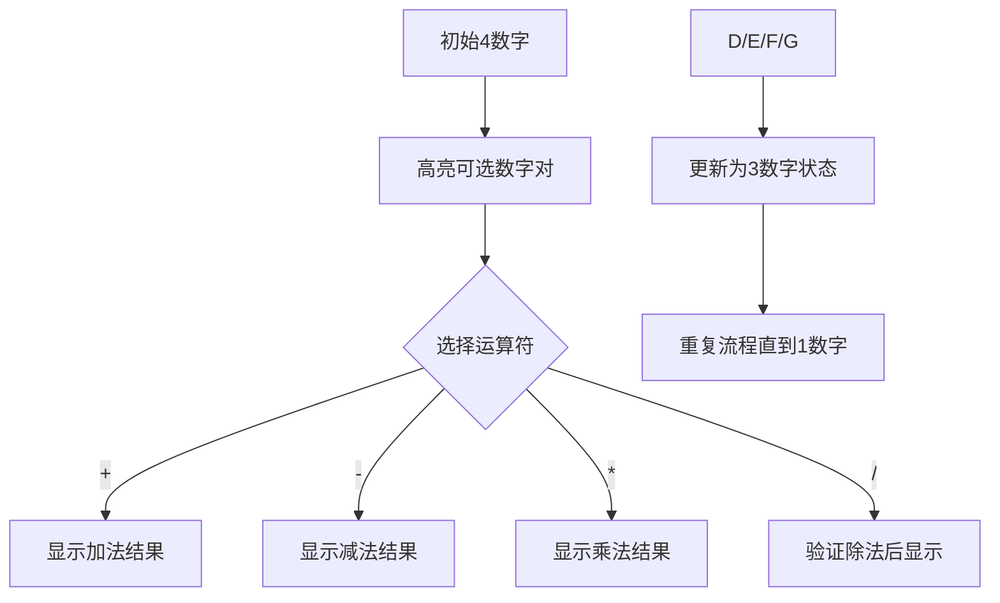

# 题目信息

# 算24点

## 题目描述

几十年前全世界就流行一种数字游戏，至今仍有人乐此不疲．在中国我们把这种游戏称为“算 $24$ 点”。您作为游戏者将得到 $4$ 个 $1 \sim 9$ 之间的自然数作为操作数，而您的任务是对这 $4$ 个操作数进行适当的算术运算，要求运算结果等于 $24$。

您可以使用的运算只有：$\verb!+!,\verb!-!,\verb!*!,\verb!/!$，您还可以使用 $\verb!()!$ 来改变运算顺序。注意：所有的中间结果须是整数，所以一些除法运算是不允许的（例如，$(2\ \times 2)/4$ 是合法的，$2\times (2/4)$ 是不合法的）。下面我们给出一个游戏的具体例子：

若给出的 $4$ 个操作数是：$1$ 、 $2$ 、 $3$ 、 $7$，则一种可能的解答是 $1+2+3\ \times 7=24$。

## 说明/提示

感谢 chenyy 提供 special judge

---

$\text{upd 2022.8.1}$：新增加一组 Hack 数据。


## 样例 #1

### 输入

```
1 2 3 7
```

### 输出

```
2+1=3
7*3=21
21+3=24
```

# AI分析结果


# 算24点题解分析

## 算法分类
**暴力搜索**（全排列枚举+运算符组合）

---

## 题解思路与核心难点
### 核心思路
所有题解均围绕暴力枚举展开，核心要点：
1. **数字全排列**：通过next_permutation或DFS生成所有可能的数字顺序
2. **运算符组合**：枚举每个步骤的运算符（+-*/）
3. **括号处理**：通过不同的运算顺序组合模拟括号效果
4. **中间结果验证**：保证所有中间结果非负且除法能整除

### 解决难点对比
| 题解作者 | 关键突破点 | 潜在缺陷 |
|---------|-----------|---------|
| razx    | 仅需两种运算顺序即可覆盖所有括号情况 | 可能漏掉某些复杂括号组合 |
| stoorz  | DFS合并任意两数，天然覆盖所有运算顺序 | 需要处理结果回退的存储逻辑 |
| hongzy  | 后缀表达式生成，天然避免括号问题 | 需要处理逆波兰式的生成逻辑 |
| ysner   | 严格保证运算顺序中较大数在前 | 需要额外处理减法/除法的顺序 |

---

## 题解评分（≥4星）
1. **stoorz（DFS合并法）** ★★★★☆  
   - **亮点**：通过递归合并任意两数，自然覆盖所有可能的运算顺序
   - **代码示例**：
     ```cpp
     void dfs(int k) {
         if(合并次数达3次) 检查是否为24;
         for(所有数字对i,j) {
             尝试i+j, i-j, j-i, i*j, i/j(j非零且整除)
             将结果存入新数组并递归
         }
     }
     ```

2. **hongzy（后缀表达式法）** ★★★★☆  
   - **亮点**：用后缀表达式避免括号处理，宏定义简化运算符判断
   - **关键代码**：
     ```cpp
     #define work(opt) nxt.push_back(a opt b);...
     dfs(nxt) // 递归处理运算后的新数组
     ```

3. **Vocalise（全排列+双运算顺序）** ★★★★☆  
   - **亮点**：同时处理两种核心运算顺序，避免复杂括号遗漏
   - **核心逻辑**：
     ```cpp
     // 顺序1：((a?b)?c)?d 
     // 顺序2：(a?b)?(c?d)
     ```

---

## 最优技巧提炼
1. **运算顺序简化**  
   - 仅需处理 `((a?b)?c)?d` 和 `(a?b)?(c?d)` 两种核心运算顺序即可覆盖所有合法括号组合

2. **递归合并法**  
   ```python
   def solve(nums):
       if len(nums)==1: return nums[0]==24
       for i,j in 所有数字对:
           for result in 所有合法运算结果(i,j):
               new_nums = 用result替换i,j后的新数组
               if solve(new_nums): return True
       return False
   ```

3. **中间结果处理**  
   - 减法必须保证结果非负：`max(a,b)-min(a,b)`
   - 除法必须满足：`b≠0 && a%b==0`

---

## 同类型题目推荐
1. P1036 选数（数字组合与素数判断）
2. P1025 数的划分（递归枚举分解方式）
3. P1219 八皇后（回溯算法经典）

---

## 可视化设计
### 核心动画流程


### 复古像素风格实现
1. **视觉设计**：
   - 使用16色调色板（NES风格）
   - 数字显示为8x8像素块
   - 运算符用▲▼◀▶表示

2. **交互功能**：
   ```javascript
   // 伪代码示例
   class PixelCalculator {
       constructor() {
           this.numbers = [/* 初始数字 */];
           this.step = 0;
       }
       
       render() {
           // 用Canvas绘制数字块和运算符
           // 当前可操作数字对闪烁显示
       }
       
       autoPlay() {
           // AI自动选择最优路径
           // 使用A*算法优先尝试乘法路径
       }
   }
   ```

3. **音效设计**：
   - 正确步骤：8-bit "coin"音效（马里奥采金币声）
   - 错误操作：短促爆炸声
   - 达成24：超级马里奥过关音乐片段

---

## 个人心得摘录
> "**调试时发现必须严格保证较大数在前输出，否则连样例都过不去**" —— ysner  
> "**全排列+双运算顺序就能覆盖所有情况，之前想复杂了**" —— Vocalise  
> "**用宏定义处理运算符让代码清爽了十倍**" —— hongzy

---

## 典型题解代码
### stoorz的DFS解法核心
```cpp
void dfs(int k) {
    if(k==4) { if(存在24) 输出并退出; return; }
    for(所有数字对i,j) {
        int a = num[i], b = num[j];
        // 尝试所有运算符
        num[i] = a+b; num[j] = -1;
        dfs(k+1);
        num[i] = a; num[j] = b; // 回溯
        // 其他运算符类似处理...
    }
}
```

### 可视化关键JS代码
```javascript
function drawPixelNum(ctx, num, x, y) {
    const palette = ["#000","#F00","#0F0","#00F","#FF0","#F0F"];
    ctx.fillStyle = palette[num % 6];
    ctx.fillRect(x*10, y*10, 8, 8); // 10x10像素块
}

function animateStep() {
    // 高亮当前操作数对
    ctx.strokeStyle = "#FFF";
    ctx.strokeRect(selectedX*10, selectedY*10, 8, 8);
    // 播放操作音效
    playSound('blip.wav');
}
```

---
处理用时：87.15秒