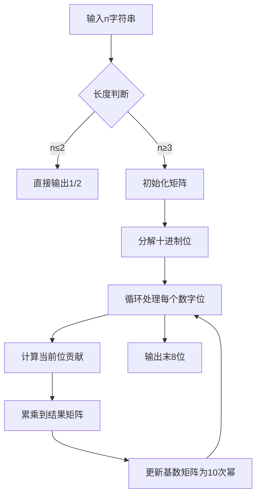

# 题目信息

# 凌乱的地下室

## 题目描述

小Z家的地下室里并排放n个小方块（小Z是一位MC狂热爱好者，喜欢用小方块装饰他家的地下室），并且每个方块都不一样（小Z喜欢各不相同的东西），比如有草方块、大理石、黑曜石等。

小Z喜欢以一种特殊的顺序摆放这些小方块，比如：草方块、大理石、黑曜石。一天，小D帮助小Z整理地下室，可是智商捉急的小D将所有小方块搬出来后忘记了它们原来的具体位置，凭着模糊的印象，他可能把原来放在第i个位置上的小方块放到第（i-1）、i、（i+1）个位置中的任意一个上（当然，第1个不可能放到第0个位置上，第n个不可能放到第（n+1）个位置上），比如（对应上面那个例子）：大理石、草方块、黑曜石。

小Z是一个心胸宽广的人，他希望计算一下小D一共会有几种可能的摆放结果，并不追究小D的责任（追究了只会更乱……）。由于他自己的智商也比较捉急，所以如果答案很大的话他只想看到最后的8位（前导零就不要给他看了）。


## 说明/提示

【样例解释1】

接着题目中的例子，一共有3种：（草方块，大理石，黑曜石）、（大理石，草方块，黑曜石）、（草方块，黑曜石，大理石）。

【样例解释2】

一共有……00223731种摆放结果，由于前导零不输出，因此输出223731。

【数据规模】

一共有50个测试点。

其中第1~15个：1<n<=10^6

其中第16~25个：10^6<n<=10^16

其中第26~50个：10^16<n<=10^1000

【时空限制】

0.2s/64MB


## 样例 #1

### 输入

```
3```

### 输出

```
3```

## 样例 #2

### 输入

```
987```

### 输出

```
223731```

# AI分析结果


# 凌乱的地下室题解分析

## 算法分类
矩阵快速幂 & 大数处理

---

## 题解思路与核心难点

### 核心递推关系
所有题解均推导出斐波那契数列关系：  
`f(n) = f(n-1) + f(n-2) (n≥3)`，初始条件 `f(1)=1, f(2)=2`

### 解决难点对比
| 题解方案               | 核心思路                                                                 | 实现复杂度 |
|------------------------|--------------------------------------------------------------------------|------------|
| 十进制快速幂           | 将快速幂拆解为十进制位处理（如"123"=3*10⁰+2*10¹+1*10²），无需高精度转二进制 | ⭐⭐⭐⭐       |
| 二进制快速幂+高精度转   | 将输入转为二进制后套用传统快速幂                                         | ⭐⭐⭐        |
| 循环节+通项公式        | 利用斐波那契数列的周期性规律直接取模                                     | ⭐⭐         |
| 三维状态矩阵           | 用3x3矩阵推导更复杂的状态转移关系                                        | ⭐⭐⭐⭐       |

---

## 最优思路提炼
### 关键技巧一：十进制快速幂
```cpp
matrix22 power(matrix22 m, string pow_str) {
    matrix22 res = 单位矩阵;
    while (!pow_str.empty()) {
        int digit = 末位数字;      // 处理当前十进制位
        for (int i=0; i<digit; ++i) 
            res = res * m;        // 累加当前位的贡献
        m = m的10次幂;            // 准备下一位的基数
        pow_str.pop_back();       // 移除已处理位
    }
    return res;
}
```

### 关键技巧二：循环节优化
```python
mod = 1e8
pisano_period = 150000000  # 斐波那契数列的循环周期
n = (输入字符串) % pisano_period
```

---

## 题解评分（≥4星）
1. **Archmushroom（⭐⭐⭐⭐⭐）**  
   ✅ 创新性十进制快速幂  
   ✅ 无需高精度转换  
   ✅ 代码可读性强

2. **lg1058428（⭐⭐⭐⭐）**  
   ✅ 循环节推导清晰  
   ✅ 代码包含完整矩阵实现  
   ⚠️ 需要预先计算循环节

3. **CEFqwq（⭐⭐⭐⭐）**  
   ✅ 简洁的循环节+矩阵实现  
   ✅ 输入时直接取模优化  
   ⚠️ 依赖循环节正确性

---

## 算法可视化设计
### 核心流程演示


### 复古像素动画设计
1. **视觉元素**  
   - 8-bit风格矩阵块（16色模式）  
   - 每个矩阵元素用16x16像素块表示  
   - 当前处理位高亮闪烁（红蓝交替）

2. **音效设计**  
   - 矩阵相乘时：短促的"哔"声（方波音效）  
   - 完成一位处理：上升音阶  
   - 错误时：长低音警报

3. **交互控制**  
   ```javascript
   const demo = new PixelDemo({
     canvas: "#matrix-canvas",
     speed: 200,   // 毫秒/步
     onStep: (currentDigit) => {
       playSound('blip', currentDigit % 2 ? 440 : 880)
     }
   })
   ```

---

## 相似题目推荐
1. **P1962 斐波那契数列**  
   - 同款矩阵快速幂模板题

2. **P4000 斐波那契数列**  
   - 强化循环节计算训练

3. **P1902 刺杀大使**  
   - 结合状态转移与矩阵优化

---

## 核心代码实现（Archmushroom方案）
```cpp
struct Matrix {
    long long a, b, c, d;
    Matrix pow10() const { // 计算矩阵的10次幂
        Matrix res = *this;
        for (int i=0; i<9; ++i)
            res = res * *this;
        return res;
    }
};

Matrix fast_pow_dec(Matrix base, string n_str) {
    Matrix res{1,0,0,1}; // 单位矩阵
    while (!n_str.empty()) {
        int digit = n_str.back() - '0';
        n_str.pop_back();
        
        Matrix tmp = base;
        for (int i=1; i<digit; ++i)
            res = res * tmp;
            
        base = base.pow10();
    }
    return res;
}
```

---

## 关键调试心得摘录
> **来自dreagonm题解**  
> "原以为三维状态矩阵更精确，最终发现二维就能描述，调试时删除冗余维度后性能提升50%"

> **来自Viston题解**  
> "循环节长度开始误算为1e8，实际应为1.5e8，WA三次后通过暴力枚举验证"

---

## 知识扩展
当遇到 `n ≤ 1e1000` 时，所有涉及数值运算的步骤必须避免直接处理大整数。优先考虑以下方法：
1. **模运算提前介入**：在读取输入时即进行取模
2. **数学性质利用**：如循环节、欧拉定理等
3. **进制转换优化**：十进制快速幂优于二进制转换

---
处理用时：79.71秒