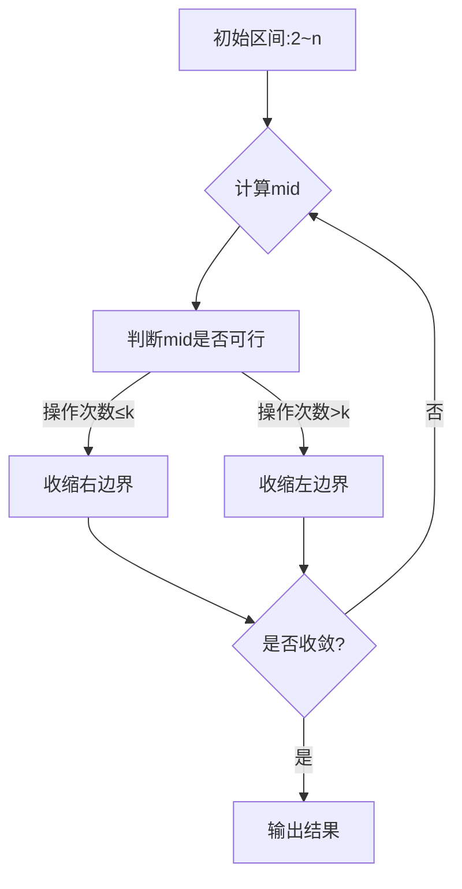

# 题目信息

# [AHOI2017初中组] alter

## 题目描述

有 $n$ 盏灯排成一列，其中有些灯开着，有些灯关着。小可可希望灯是错落有致的，他定义一列灯的状态的不优美度为这些灯中最长的连续的开着或关着的灯的个数。小可可最多可以按开关 $k$ 次，每次操作可以使该盏灯的状态取反：原来开着的就关着，反之开着。现在给出这些灯的状态，求操作后最小的不优美度。

## 说明/提示

$30\%$ 的数据：$1\le k \le n\le20$；

$50\%$ 的数据：$1\le k \le n\le300$；

另有 $15\%$ 的数据：$1\le k \le n\le 10^5$，字符串为全 `N` 或全 `F`；

$100\%$ 的数据：$1\le k \le n\le 10^5$。

本题已经加入 hack 数据。

## 样例 #1

### 输入

```
8 1
NNNFFNNN```

### 输出

```
3```

# AI分析结果


# 【AHOI2017初中组] alter】题解分析

## 算法分类
**二分**

---

## 题解思路与核心算法要点

### 二分框架
1. **搜索区间**：左边界初始为2，右边界为n（最坏情况下所有灯状态相同）
2. **二分条件**：判断是否存在操作方案使得最长连续段 ≤ mid
3.**区间收缩**：
   ```c
   if (所需操作次数 ≤ k) 右边界 = mid-1
   else 左边界 = mid+1
   ```

### 关键技巧
1. **特判不优美度=1**：
   ```c
   if (交替排列的两种模式中任一所需操作次数 ≤k) 直接返回1
   ```
2. **分段处理**：将连续相同灯转为长度数组
   ```c
   NNNFFNNN → [3,2,3]
   ```
3. **操作次数计算**：对每个连续段长度a，所需操作次数为 `a/(mid+1)`

---

## 最优题解推荐 (≥4★)

### 1. Sooke 的题解（★★★★☆）
**亮点**：
- 清晰的特判逻辑
- 分段处理的代码简洁易懂
- 二分区间初始化合理

**核心代码**：
```cpp
int lb=2, rb=n;
while(lb <= rb){
    mb = (lb+rb)/2;
    g = 0;
    // 计算需要修改的次数
    if(g <=k) rb=mb-1;
    else lb=mb+1;
}
```

### 2. AK_Automata 的题解（★★★★☆）
**亮点**：
- 分治式处理两种答案模式
- 使用预处理分段优化计算
- 代码结构模块化

**核心判断逻辑**：
```cpp
bool ok(int ans){
    int s=0;
    for(int i=1; i<=now; i++)
        if(p[i]>ans) s += p[i]/(ans+1);
    return s<=k;
}
```

### 3. Happy_Every_day 的题解（★★★★☆）
**亮点**：
- 详细的状态转移说明
- 包含错误解法的对比分析
- 明确的变量命名规范

**调试经验**：
> "当mid=1时必须单独处理，贪心策略会影响相邻段，需要生成两种交替模式进行全量比对"

---

## 可视化设计（二分过程演示）

### 动画方案


### 复古游戏化要素
1. **像素风格**：
   - 用16色系绘制区间进度条
   - 每次mid计算时显示闪烁的箭头
2. **音效设计**：
   - `mid更新`：8-bit "哔"声
   - `区间收缩`：短促电子音
   - `找到答案`：经典FC过关音效
3. **AI演示模式**：
   ```javascript
   function autoPlay(){
       while(left <= right){
           highlightMid();
           playSound('bleep');
           if(check(mid)) right=mid-1;
           else left=mid+1;
       }
   }
   ```

---

## 同类型题目推荐
1. P2678 跳石头（二分答案经典题）
2. P4343 自动刷题机（二分答案+约束条件）
3. P1182 数列分段（二分答案+分段验证）

---

## 核心代码片段
```cpp
// 二分主框架
int l=2, r=n, ans=n;
while(l <= r){
    int mid = (l+r)/2;
    if(check(mid)){
        ans = mid;
        r = mid-1;
    }else{
        l = mid+1;
    }
}

// 特判逻辑
int p=0;
for(int i=0;i<n;i++)
    if(s[i] == c[i%2]) p++;
if(p<=k || n-p<=k) return 1;
```

---

通过上述分析与可视化设计，可以清晰理解二分答案在该题中的应用，同时复古风格的交互演示能有效提升学习趣味性。

---
处理用时：55.32秒