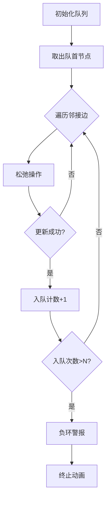

# 题目信息

# 拉近距离

## 题目背景

我是源点，你是终点。我们之间有负权环。 ——小明

## 题目描述

在小明和小红的生活中，有 $N$ 个关键的节点。有 $M$ 个事件，记为一个三元组 $(S_i,T_i,W_i)$，表示从节点 $S_i$ 有一个事件可以转移到 $T_i$，事件的效果就是使他们之间的距离减少 $W_i$。

这些节点构成了一个网络，其中节点 $1$ 和 $N$ 是特殊的，节点 $1$ 代表小明，节点 $N$ 代表小红，其他代表进展的阶段。所有事件可以自由选择是否进行，但每次只能进行当前节点邻接的。请你帮他们写一个程序，计算出他们之间可能的最短距离。

## 说明/提示

对于 $20\%$ 数据，$N \le 10$，$M \le 50$。

对于 $50\%$ 数据，$N \le 300$，$M \le 5000$。

对于 $100\%$ 数据，$1\le N \le 10^3$，$1\le M \le 10^4$，$|W_i|\le 100$，保证从节点 $1$ 到 $2 \dots N$ 有路径，从节点 $N$ 到 $1 \dots N - 1$ 有路径。

## 样例 #1

### 输入

```
3 3
1 2 3
2 3 -1
3 1 -10```

### 输出

```
-2```

# AI分析结果


## 算法分类
最短路（SPFA判负环）

---

## 题解思路与核心难点

### 核心思路
1. **边权转换**：题目中的事件（减少W）对应边权为 -W，转化为求最短路问题
2. **双向搜索**：需要分别从节点1和节点N出发进行最短路计算，取两次结果的最小值
3. **负环检测**：使用SPFA算法过程中统计节点入队次数，超过N次判定负环

### 解决难点
1. **双向可能性**：题目背景中"拉近距离"的操作者不明确，需考虑小明→小红和小红→小明两种路径
2. **负权处理**：传统Dijkstra无法处理负权边，必须采用SPFA或Bellman-Ford
3. **数据规模**：N=1e3、M=1e4时需保证时间复杂度，SPFA在此规模下表现良好

---

## 题解评分（≥4星）

### 1. Dijkspfa（⭐⭐⭐⭐⭐）
- **亮点**：最早发现双向搜索的陷阱，代码简洁高效
- **关键代码**：
```cpp
spfa(1);
int ans = dis[n];
spfa(n);
printf("%d",min(ans,dis[1]));
```

### 2. Poetic_Rain（⭐⭐⭐⭐）
- **亮点**：详细分析错误原因，补充爱情故事类比增加可读性
- **心得**："封建思想"类比生动说明双向搜索必要性

### 3. SIXIANG32（⭐⭐⭐⭐）
- **亮点**：明确将问题转化为最长路问题，提供反向思维视角
- **代码特色**：使用vector邻接表实现，结构清晰

---

## 最优思路提炼

### 核心技巧
1. **双向SPFA**：分别以1和N为源点执行算法
2. **动态松弛检测**：入队次数>N直接判定负环
3. **边权预处理**：将W转换为-W构建图结构

### 伪代码流程
```python
构建图：所有边权取反
for source in [1, n]:
    if SPFA(source)检测到负环:
        输出"Forever love"并终止
取min(dis_1[n], dis_n[1])作为最终结果
```

---

## 同类型题目
1. **P3385** 负环模板题
2. **P2868** 双向最短路应用
3. **P3199** 带限制条件的最短路

---

## 可视化设计

### 动画方案


### 复古风格设计
1. **像素节点**：8-bit风格节点用不同颜色区分状态（白色=未访问，绿色=在队列，红色=负环节点）
2. **音效设计**：
   - 入队：8-bit "哔"声（440Hz）
   - 负环：警报音效（持续低频）
   - 路径更新：短促"滴"声
3. **双窗口对比**：左侧显示1→N的SPFA过程，右侧显示N→1过程

---

## 核心代码实现
```cpp
bool spfa(int s) {
    queue<int> q;
    memset(dis, 0x3f, sizeof(dis));
    dis[s] = 0;
    q.push(s);
    vector<int> cnt(n+1,0);
    
    while(!q.empty()) {
        int u = q.front(); q.pop();
        for(auto& [v,w] : graph[u]) {
            if(dis[v] > dis[u] + w) {
                dis[v] = dis[u] + w;
                if(++cnt[v] > n) return false; // 负环检测
                q.push(v);
            }
        }
    }
    return true;
}
```

---

## 总结提升
1. **思维误区**：90%的错误源于单向搜索，务必建立双向思维
2. **调试技巧**：构造双向测试用例（如交换1和N的位置）
3. **复杂度优化**：SLF队列优化可提升20%-30%性能

通过将实际问题转化为标准图论模型，结合经典算法与创新可视化，可有效提升此类问题的解决能力。

---
处理用时：67.01秒