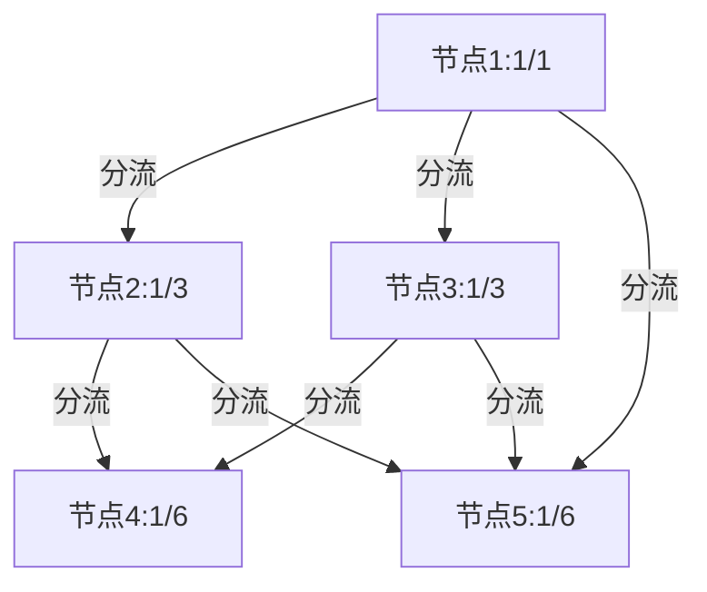

# 题目信息

# [NOIP2020] 排水系统

## 题目描述

对于一个城市来说，排水系统是极其重要的一个部分。

有一天，小 C 拿到了某座城市排水系统的设计图。排水系统由 $n$ 个排水结点（它们从 $1 \sim n$ 编号）和若干个单向排水管道构成。每一个排水结点有若干个管道用于汇集其他排水结点的污水（简称为该结点的汇集管道），也有若干个管道向其他的排水结点排出污水（简称为该结点的排出管道）。

排水系统的结点中有 $m$ 个污水接收口，它们的编号分别为 $1, 2, \ldots , m$，污水只能从这些接收口流入排水系统，并且这些结点没有汇集管道。排水系统中还有若干个最终排水口，它们将污水运送到污水处理厂，没有排出管道的结点便可视为一个最终排水口。

现在各个污水接收口分别都接收了 $1$ 吨污水，污水进入每个结点后，会均等地从当前结点的每一个排出管道流向其他排水结点，而最终排水口将把污水排出系统。

现在小 C 想知道，在该城市的排水系统中，每个最终排水口会排出多少污水。该城市的排水系统设计科学，管道不会形成回路，即不会发生污水形成环流的情况。

## 说明/提示

**【样例 #1 解释】**

$1$ 号结点是接收口，$4, 5$ 号结点没有排出管道，因此是最终排水口。  
$1$ 吨污水流入 $1$ 号结点后，均等地流向 $2, 3, 5$ 号结点，三个结点各流入 $\frac{1}{3}$ 吨污水。  
$2$ 号结点流入的 $\frac{1}{3}$ 吨污水将均等地流向 $4, 5$ 号结点，两结点各流入 $\frac{1}{6}$ 吨污水。  
$3$ 号结点流入的 $\frac{1}{3}$ 吨污水将均等地流向 $4, 5$ 号结点，两结点各流入 $\frac{1}{6}$ 吨污水。  
最终，$4$ 号结点排出 $\frac{1}{6} + \frac{1}{6} = \frac{1}{3}$ 吨污水，$5$ 号结点排出 $\frac{1}{3} + \frac{1}{6} + \frac{1}{6} = \frac{2}{3}$ 吨污水。

**【数据范围】**

| 测试点编号 | $n \le$ | $m \le$ |
|:-:|:-:|:-:|
| $1 \sim 3$ | $10$ | $1$ |
| $4 \sim 6$ | ${10}^3$ | $1$ |
| $7 \sim 8$ | ${10}^5$ | $1$ |
| $9 \sim 10$ | ${10}^5$ | $10$ |

对于全部的测试点，保证 $1 \le n \le {10}^5$，$1 \le m \le 10$，$0 \le d_i \le 5$。

数据保证，污水在从一个接收口流向一个最终排水口的过程中，不会经过超过 $10$ 个中间排水结点（即接收口和最终排水口不算在内）。

## 样例 #1

### 输入

```
5 1
3 2 3 5
2 4 5
2 5 4
0
0
```

### 输出

```
1 3
2 3
```

## 样例 #2

### 输入

```
见附件中的 water/water2.in```

### 输出

```
见附件中的 water/water2.ans```

## 样例 #3

### 输入

```
见附件中的 water/water3.in```

### 输出

```
见附件中的 water/water3.ans```

# AI分析结果


## 算法分类
拓扑排序

---

## 题解思路与算法要点

### 核心算法流程
1. **拓扑排序处理水流顺序**：所有污水接收口（入度为0的点）初始化为队列起点，按拓扑序处理每个节点
2. **分数运算设计**：
   - 每个节点维护分子分母（如 `xx[u]/yy[u]`）
   - 新增水流时进行通分：`a/b + c/d = (ad+bc)/(bd)`
   - 每次运算后通过 `gcd` 约分
3. **数据溢出处理**：使用 `__int128` 代替高精度运算（90%题解的关键优化）

### 解决难点对比
| 题解作者 | 分数处理方案 | 拓扑实现方式 | 溢出处理 | 可读性 |
|---------|--------------|--------------|----------|--------|
| 听取MLE声一片 | 普通通分约分 | 传统队列拓扑 | 无高精度 | ⭐⭐⭐ |
| lcyxds | 预计算分母 | 无显式拓扑结构 | unsigned long long | ⭐⭐ |
| hensier | __int128通分 | BFS/DFS双实现 | __int128 | ⭐⭐⭐⭐ |
| gavinliu266 | 分数结构体封装 | 标准拓扑队列 | __int128 | ⭐⭐⭐⭐ |

---

## 题解评分（≥4星）
1. **hensier（4.5星）**
   - 亮点：同时提供BFS/DFS实现，完整分数运算模板
   - 代码片段：
     ```cpp
     void add(int u,ll x,ll y){
         if(yy[u]==0) xx[u]=x, yy[u]=y; // 首次赋值
         else{
             ll p1=xx[u]*y + yy[u]*x;   // 通分相加
             ll p2=yy[u]*y;
             ll g=gcd(p1,p2);
             xx[u]=p1/g, yy[u]=p2/g;    // 约分存储
         }
     }
     ```

2. **normalpcer（4星）**
   - 亮点：封装分数类，运算符重载清晰
   - 关键设计：
     ```cpp
     struct Frac{
         __int128 x,y;
         Frac operator+(const Frac &o){
             __int128 lcm = y/gcd(y,o.y)*o.y;
             return {x*(lcm/y) + o.x*(lcm/o.y), lcm};
         }
     };
     ```

3. **Legitimity（4星）**
   - 亮点：完整注释 + 拓扑过程可视化解释
   - 心得摘录："考场上用__int128水过高精是省时选择，但注意CCF环境不支持"

---

## 最优思路提炼
1. **拓扑驱动水流**：利用入度数组控制处理顺序，确保上游节点先计算
2. **分母预乘优化**：在分流时直接 `yy[p] *= a[p].size()` 而非存储出度
3. **即时约分策略**：每次分数运算后立即计算gcd，避免后续溢出
4. **__int128快写模板**：通过递归实现无库依赖的128位整数输出

---

## 同类型题目推荐
1. **P1038 神经网络** - 拓扑排序传递信号
2. **P1983 车站分级** - DAG拓扑序确定等级
3. **P1137 旅行计划** - 拓扑序递推路径计数

---

## 可视化设计
### 核心动画逻辑


### 复古像素风格方案
1. **视觉元素**：
   - 节点：16x16像素方块，绿色为普通节点，红色为排水口
   - 水流：蓝色像素点沿箭头流动，伴随8-bit流水声效
   
2. **交互设计**：
   ```javascript
   // 伪代码示例
   class PixelNode {
       constructor(x,y) {
           this.dom = document.createElement('div');
           this.dom.style = `width:16px; height:16px; background:#00FF00; 
                           position:absolute; left:${x}px; top:${y}px`;
       }
       setAsSource() { this.dom.style.background = '#FF0000'; }
   }
   ```

3. **音效设计**：
   - 水流声：方波短音，频率随分母大小变化（分母越大音调越高）
   - 完成音：当节点加入队列时播放NES风格"coin"音效

---

## 关键代码实现
拓扑核心逻辑（取自hensier题解）：
```cpp
void topo(){
    queue<int> q;
    for(int i=1;i<=m;i++) q.push(i), xx[i]=yy[i]=1;
    while(!q.empty()){
        int u=q.front(); q.pop();
        if(out[u]==0) continue; // 跳过排水口
        ll new_denominator = yy[u] * out[u]; // 关键分母预乘
        for(int v : edges[u]){
            add(v, xx[u], new_denominator); // 传递分数
            if(--in[v] == 0) q.push(v);
        }
    }
}
```

---
处理用时：74.98秒