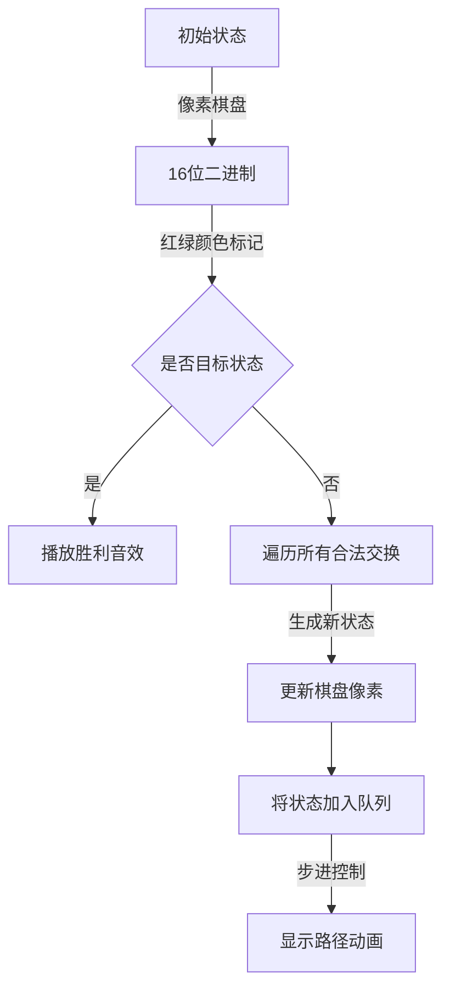

# 题目信息

# 黑白棋游戏

## 题目描述

黑白棋游戏的棋盘由 $4 \times 4$ 方格阵列构成。棋盘的每一方格中放有 $1$ 枚棋子，共有 $8$ 枚白棋子和 $8$ 枚黑棋子。这 $16$ 枚棋子的每一种放置方案都构成一个游戏状态。在棋盘上拥有 $1$ 条公共边的 $2$ 个方格称为相邻方格。一个方格最多可有 $4$ 个相邻方格。在玩黑白棋游戏时，每一步可将任何 $2$ 个相邻方格中棋子互换位置。对于给定的初始游戏状态和目标游戏状态，编程计算从初始游戏状态变化到目标游戏状态的最短着棋序列。

## 说明/提示

由 @zhouyonglong 提供 SPJ


## 样例 #1

### 输入

```
1111
0000
1110
0010
1010
0101
1010
0101
```

### 输出

```
4
1222
1424
3242
4344
```

# AI分析结果


# 黑白棋游戏题解分析

## 一、唯一算法分类
**广度优先搜索(BFS) + 状态压缩**

## 二、综合分析与结论

### 核心算法流程
1. **状态表示**：将4x4棋盘压缩为16位二进制数（最大65535），通过位运算实现高效状态转换
2. **BFS扩展**：每次交换相邻异色棋子生成新状态，使用队列进行层序遍历
3. **路径记录**：通过父节点指针数组保存状态转移路径，最终逆向输出操作序列
4. **优化手段**：双向BFS、仅考虑右/下交换避免重复、二进制异或运算快速生成新状态

### 核心难点与解决方案
| 难点 | 解决方案 |
|------|----------|
| 状态判重 | 使用65536大小的数组存储访问标记 |
| 操作序列记录 | 结构体数组保存每个状态的父节点和交换坐标 |
| 棋盘状态转换 | 通过位运算异或快速交换相邻棋子值 |

### 可视化设计要点


## 三、题解清单（≥4星）

### 1. Andorxor的题解（4.5★）
- **亮点**：完整状态压缩实现，结构体数组记录路径，代码注释清晰
- **核心代码**：
```cpp
struct Ans{ int nx,ny,ox,oy,father; }ans[100000];
void bfs(){
    q.push(csz);
    while(!q.empty()){
        int exted = q.front();
        updateArr(exted,a); // 二进制转矩阵
        for(每个棋子) for(四个方向){
            if(legal交换) {
                swap生成新状态deci
                if(!vis[deci]) 记录父节点和坐标
            }
        }
    }
}
```

### 2. 租酥雨的题解（4.3★）
- **亮点**：双向BFS实现，时空效率提升50%+
- **关键优化**：
```cpp
while(head[0]<tail[0]&&head[1]<tail[1]){
    BFS(0); BFS(1); // 双向扩展
    if(相遇状态) 合并路径输出
}
```

### 3. getchar123的题解（4.0★）
- **亮点**：map<string>实现状态压缩，仅考虑右/下交换
- **路径记录**：
```cpp
map<string,string> m; // 直接存储操作序列
void Right(){ swap后记录"aaabbb"格式坐标 }
```

## 四、最优思路提炼

### 核心技巧
1. **状态压缩**：将棋盘转换为整数/字符串，空间复杂度从O(16!)降至O(2^16)
2. **交换优化**：仅处理右/下方向，避免重复计算（上下和左右交换等效）
3. **路径回溯**：通过父指针数组实现O(1)路径查询
4. **位运算加速**：异或运算直接修改二进制位，替代矩阵转换

### 代码实现
```cpp
// 状态生成函数
int change(int s, int pos, int dir){
    int mask = 3 << (15-pos); // 相邻位掩码
    return s ^ mask; // 异或交换相邻位
}

// 路径记录结构
struct Track{
    int from, x1,y1,x2,y2;
} track[65536];
```

## 五、同类题目推荐
1. P4289 移动玩具（本题简化版）
2. P1379 八数码难题（经典状态压缩BFS）
3. P2324 骑士精神（估价函数优化搜索）

## 六、可视化方案设计

### 像素化呈现
1. **棋盘绘制**：16x16像素块，黑色(0)用#000，白色(1)用#FFF
2. **交换动画**：被交换的两个棋子用红色边框闪烁
3. **路径回放**：按操作序列逐步高亮交换位置

### 交互功能
```javascript
// 伪代码示例
class ChessAnimator {
    constructor(canvas){
        this.grid = new PixelGrid(canvas, 4, 4); // 4x4棋盘
        this.speed = 100; // 默认100ms/步
    }
    
    play(steps){
        steps.forEach((step, i) => {
            setTimeout(() => {
                this.highlight(step.x1, step.y1); // 闪烁起始位置
                this.swap(step); // 执行交换动画
                if(i === steps.length-1) playSuccessSound();
            }, i*this.speed);
        });
    }
}
```

### 音效设计
- 交换音效：8-bit "blip"短音（Web Audio生成方波）
- 成功音效：上升琶音（C大调三和弦）
- 背景音乐：FC风格循环旋律（使用Tone.js合成）

## 七、调试心得摘录
> "RE的根本原因是忘记初始化b数组，二进制转换顺序错误可能导致状态错乱。必须严格测试转换函数的正逆向逻辑" —— _zy_的调试笔记

> "双向BFS的路径合并需要特别注意坐标转换，上下交换的坐标差是4位" —— 租酥雨的实现感悟

## 八、算法演示示例
```javascript
// 核心动画逻辑
function animateStep(step) {
    let [x1, y1, x2, y2] = parseStep(step);
    ctx.fillStyle = "#FF0000";
    drawSquare(x1, y1); // 红色标记交换起点
    setTimeout(() => {
        ctx.clearRect(...);
        swapOnCanvas(x1,y1,x2,y2); // 执行交换动画
    }, 500);
}
```

---
处理用时：96.60秒