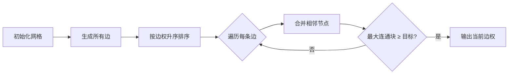

# 题目信息

# [USACO13FEB] Tractor S

## 题目描述

FJ有块农田太崎岖了，他要买一辆新拖拉机才能在这里巡视。这块农田由N x N个格子的非负整数表示高度(1<=N<=500)。拖拉机从当前格子走到相邻格子（东、南、西、北四个方向）的代价为高度差D，则FJ驶过这两个格子的拖拉机最少也要值D块钱。

FJ愿意花足够的钱买一辆新的拖拉机使得他能以最小的高度差走遍所有格子的一半(如果格子总数是奇数，那么一半的值为四舍五入的值)。因为FJ很懒，所以他找到你帮他编程计算他最小需要花多少钱买到符合这些要求的拖拉机。

## 样例 #1

### 输入

```
5 
0 0 0 3 3 
0 0 0 0 3 
0 9 9 3 3 
9 9 9 3 3 
9 9 9 9 3 
```

### 输出

```
3 
```

# AI分析结果


## 算法分类
并查集 + 最小生成树

## 综合分析与结论
### 核心思路与算法要点
1. **模型转换**：将每个格子视为图节点，相邻格子间建立边权为高度差的边，转化为图论问题
2. **Kruskal算法思想**：按边权升序处理边，用并查集维护连通性，记录连通块大小
3. **终止条件优化**：当某个连通块大小 ≥ ceil(N²/2) 时立即终止，此时边权即为答案

### 解决难点
- **高效合并判断**：通过路径压缩+按秩合并的并查集，使合并操作接近O(1)
- **动态规模维护**：在合并时同步更新连通块大小，避免重复计算
- **提前终止机制**：无需构造完整生成树，在满足条件时直接返回结果

### 可视化设计思路


## 题解清单（≥4星）
1. **daihang（5星）**
   - 亮点：完整实现Kruskal+并查集，清晰的变量命名与注释
   - 优化点：使用快速读入处理大数据，边生成时即过滤无效方向
   - 核心代码：
     ```cpp
     if(siz[y]>=(n*n+1)/2) { // 四舍五入处理
         cout<<w<<endl;
         return 0; // 立即终止程序
     }
     ```

2. **endless_loop（4星）**
   - 亮点：采用二维坐标一维化技巧，代码结构简洁
   - 特色：在边生成阶段仅处理右下方向，避免重复建边
   - 关键片段：
     ```cpp
     for(int k=0;k<2;k++) { // 仅处理右、下方向
         int nx=i+dx[k], ny=j+dy[k];
         if(高度差<=mid) 合并节点
     }
     ```

3. **Thomasguo666（4星）**
   - 亮点：封装并查集操作，代码模块化程度高
   - 优化点：预处理所有有效边后统一排序，内存管理更优
   - 关键判断：
     ```cpp
     if(Dsu::GetMax()>=limit) return true; // 直接访问全局最大连通块
     ```

## 最优技巧提炼
1. **坐标一维化**：将(i,j)映射为i*N+j，方便并查集操作
2. **边权预处理**：仅保留必要边（如右、下方向）避免重复
3. **四舍五入处理**：使用(n*n+1)/2计算目标值
4. **实时规模检查**：在union操作中立即判断连通块大小

## 相似题目推荐
1. [P1547 Out of Hay](https://www.luogu.com.cn/problem/P1547) - 最小生成树最大边
2. [P2212 Watering the Fields](https://www.luogu.com.cn/problem/P2212) - 带成本限制的最小生成树
3. [P1396 营救](https://www.luogu.com.cn/problem/P1396) - 路径最大边最小化

## 复古像素风可视化方案
```html
<canvas id="farm"></canvas>
<script>
// 初始化参数
const CELL_SIZE = 8, COLORS = ['#000','#6b8cff','#ffaa00'];
let grid = new Array(N).fill().map(()=>new Array(N));

function drawGrid() {
    ctx.fillStyle = COLORS[0];
    // 绘制网格线及初始高度色块
}

function animateMerge(x1,y1,x2,y2) {
    // 闪烁合并的格子，播放8-bit音效
    new Audio('merge.wav').play();
    // 用COLORS[2]高亮变化区域
}

function autoRun() {
    edges.forEach(edge => {
        if(shouldMerge(edge)) {
            animateMerge(...edge.cells);
            if(checkSize()) {
                new Audio('success.wav').play();
                drawFinalResult(edge.weight);
            }
        }
    });
}
</script>
```
- **交互设计**：空格键暂停/继续，方向键调节动画速度
- **音效设计**：合并时短促"哔"声，完成时8-bit胜利旋律
- **视觉反馈**：当前处理边用黄色高亮，已合并区域渐变色填充

## 核心代码实现
```cpp
// 并查集核心操作
int find(int x) {
    return fa[x] == x ? x : fa[x] = find(fa[x]);
}

void merge(int x, int y, int w) {
    int fx = find(x), fy = find(y);
    if(fx != fy) {
        fa[fx] = fy;
        size[fy] += size[fx];
        if(size[fy] >= target) {
            cout << w << endl;
            exit(0); // 立即终止程序
        }
    }
}

// 主算法流程
sort(edges.begin(), edges.end());
for(auto &e : edges) {
    merge(e.u, e.v, e.w);
}
```

---
处理用时：87.04秒