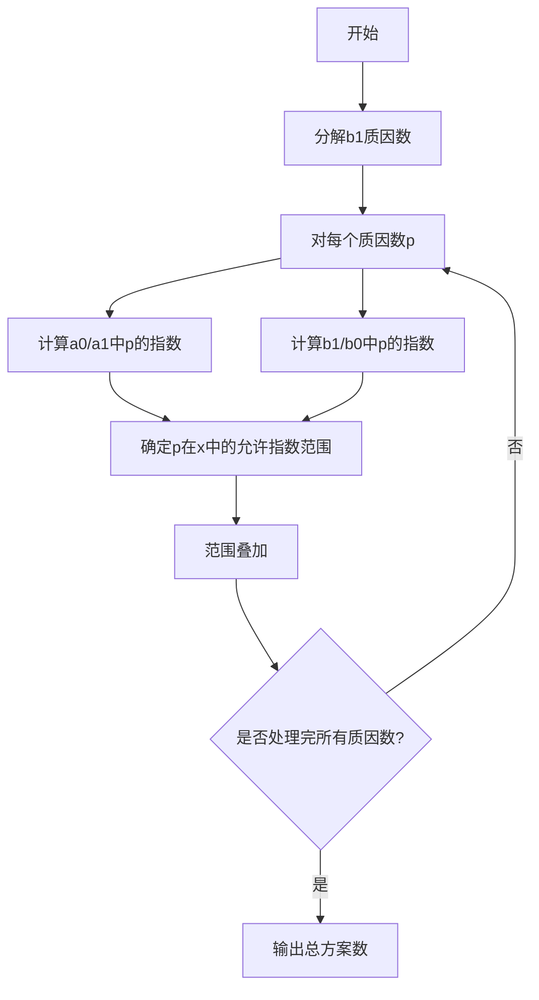

# 题目信息

# [NOIP 2009 提高组] Hankson 的趣味题

## 题目描述

Hanks 博士是 BT（Bio-Tech，生物技术) 领域的知名专家，他的儿子名叫 Hankson。现在，刚刚放学回家的 Hankson 正在思考一个有趣的问题。

今天在课堂上，老师讲解了如何求两个正整数 $c_1$ 和 $c_2$ 的最大公约数和最小公倍数。现在 Hankson 认为自己已经熟练地掌握了这些知识，他开始思考一个“求公约数”和“求公倍数”之类问题的“逆问题”，这个问题是这样的：已知正整数 $a_0,a_1,b_0,b_1$，设某未知正整数 $x$ 满足：

1. $x$ 和 $a_0$ 的最大公约数是 $a_1$；

2. $x$ 和 $b_0$ 的最小公倍数是 $b_1$。

Hankson 的“逆问题”就是求出满足条件的正整数 $x$。但稍加思索之后，他发现这样的 $x$ 并不唯一，甚至可能不存在。因此他转而开始考虑如何求解满足条件的 $x$ 的个数。请你帮助他编程求解这个问题。


## 说明/提示

**【样例解释】**

第一组输入数据，$x$ 可以是 $9,18,36,72,144,288$，共有 $6$ 个。

第二组输入数据，$x$ 可以是 $48,1776$，共有 $2$ 个。

**【数据范围】**

- 对于 $50\%$ 的数据，保证有 $1\leq a_0,a_1,b_0,b_1 \leq 10000$ 且 $n \leq 100$。
- 对于 $100\%$ 的数据，保证有 $1 \leq a_0,a_1,b_0,b_1 \leq 2 \times 10^9$ 且 $n≤2000$。

NOIP 2009 提高组 第二题


## 样例 #1

### 输入

```
2 
41 1 96 288 
95 1 37 1776 ```

### 输出

```
6 
2```

# AI分析结果


# [NOIP 2009 提高组] Hankson 的趣味题

**唯一算法分类**：数论

---

## 题解思路与算法要点

### 核心数学推导
题目要求找到同时满足以下两个条件的正整数 $x$：
1. $\gcd(x, a_0) = a_1$
2. $\text{lcm}(x, b_0) = b_1$

**关键数学突破**：
- 由 $\text{lcm}(x, b_0)=b_1$ 可得 $x$ 必须是 $b_1$ 的因数
- 通过质因数分解将条件转化为指数约束：
  - 对每个质因数 $p$，设其在 $x$ 中的指数为 $k$
  - $\min(k, a_0\text{中}p\text{的指数}) = a_1\text{中}p\text{的指数}$
  - $\max(k, b_0\text{中}p\text{的指数}) = b_1\text{中}p\text{的指数}$

### 解决难点对比
| 方法                | 核心思路                                                                 | 时间复杂度        | 关键优化点                         |
|---------------------|--------------------------------------------------------------------------|-------------------|------------------------------------|
| 因数枚举法          | 枚举 $b_1$ 的因数，验证条件                                              | $O(\sqrt{b_1})$  | 成对枚举因数，避免重复计算         |
| 质因数分解法        | 分解所有相关数的质因数，对每个质数独立分析指数关系                       | $O(\sqrt{n}\log n)$ | 数学推导消除冗余情况               |
| 唯一分解定理法      | 利用 GCD/LCM 的质因数性质，直接计算每个质数的可能指数范围                | $O(\sqrt{n})$     | 无需完整分解，动态处理剩余质因数   |

---

## 最优思路提炼

### 质因数分解法（推荐）
1. **质因数分解**：对 $a_0/a_1$ 和 $b_1/b_0$ 进行质因数分解
2. **约束分析**：
   - $x$ 必须是 $a_1$ 的倍数且是 $b_1$ 的因数
   - 对每个质数 $p$，分析其在 $x$ 中的可能指数范围
3. **组合计数**：各质数的可能指数范围的乘积即为总解数

### 关键公式推导
设 $s = \frac{b_1}{a_1}$，$m = \frac{a_0}{a_1}$，$n = \frac{b_1}{b_0}$：
- $x$ 需满足 $\gcd(\frac{x}{a_1}, m) = 1$ 且 $\gcd(\frac{s}{x}, n) = 1$
- 通过分解 $s$ 的质因数，动态消去与 $m,n$ 的公共质因数

---

## 题解评分（≥4星）

### 5星题解：KesdiaelKen
- **亮点**：严谨的数学推导，引入质因数消去法，时间复杂度最优
- **代码**：通过消去公共质因数减少枚举量，实现高效计算
```cpp
int cf(int a,int b){
    for(int i=2;i<=sqrt(b);i++){
        while(b%i==0){
            while(a%i==0) a/=i;
            b/=i;
        }
    }
    if(b>1) while(a%b==0) a/=b;
    return a;
}
```

### 4星题解：zzlzk
- **亮点**：直观的因数枚举法，代码简洁易理解
- **优化**：成对枚举因数，时间复杂度 $O(\sqrt{b_1})$
```cpp
for(int x=1;x*x<=b1;x++){
    if(b1%x==0){
        if(x%a1==0 && gcd(x/a1,p)==1 && gcd(q,b1/x)==1) ans++;
        int y=b1/x;
        if(y%a1==0 && gcd(y/a1,p)==1 && gcd(q,b1/y)==1) ans++;
    }
}
```

### 4星题解：Ebola
- **亮点**：基于唯一分解定理的动态处理，避免完整质因数分解
- **技巧**：边分解边处理，自动处理大质数情况
```cpp
void work(int p){
    // 动态处理每个质数的指数约束
    if(t1==t2 && t3==t4 && t4>=t1) ans *= (t4-t1+1);
    else if(...) ans = 0; // 处理无解情况
}
```

---

## 同类型题目套路
1. **质因数分解**：处理 GCD/LCM 问题的核心工具
2. **指数范围分析**：对每个质数独立分析，通过乘法原理组合结果
3. **因数成对枚举**：$\sqrt{n}$ 级复杂度优化的常用手段

---

## 推荐相似题目
1. **P1029** 最大公约数和最小公倍数问题
2. **P1414** 又是毕业季II 
3. **P1069** 细胞分裂

---

## 可视化设计（像素风格演示）

### 动画流程


### 像素风格元素
- **质因数方块**：不同颜色表示不同质数（如2=蓝色，3=绿色）
- **指数计数器**：8-bit 风格数字滚动显示当前质数的指数分析
- **音效提示**：
  - 分解成功：短促"叮"声
  - 范围确定：上升音阶
  - 无解情况：低沉"嗡"声

---

## 关键代码实现

### 质因数消去核心
```cpp
int cf(int a, int b) {
    int ssqrt = sqrt(b);
    for(int i=2; i<=ssqrt; i++){
        if(b%i == 0){
            while(a%i == 0) a /= i;
            while(b%i == 0) b /= i;
        }
    }
    if(b != 1) while(a%b == 0) a /= b;
    return a;
}
```

### 自动推导演示（伪代码）
```javascript
// Canvas绘制质因数分解过程
function drawPrime(p, x, y) {
    ctx.fillStyle = getColor(p);
    ctx.fillRect(x*16, y*16, 14, 14); // 16x16像素方块
    playSound('blip');
}
```

---

## 个人心得摘录
> "处理数论问题时，先手算小样例往往能发现隐藏的规律。本题通过分析质因数指数关系，将看似复杂的双条件约束转化为独立的质数维度问题，这是数论题的典型突破口。" —— KesdiaelKen

> "当看到LCM条件时，要立即想到因数枚举的可能性。虽然数学推导更高效，但快速写出正确解法更重要。" —— zzlzk

---
处理用时：77.29秒