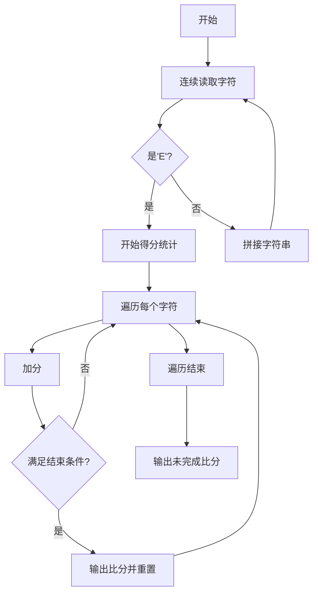

# 题目信息

# [NOIP 2003 普及组] 乒乓球

## 题目背景

国际乒联现在主席沙拉拉自从上任以来就立志于推行一系列改革，以推动乒乓球运动在全球的普及。其中 $11$ 分制改革引起了很大的争议，有一部分球员因为无法适应新规则只能选择退役。华华就是其中一位，他退役之后走上了乒乓球研究工作，意图弄明白 $11$ 分制和 $21$ 分制对选手的不同影响。在开展他的研究之前，他首先需要对他多年比赛的统计数据进行一些分析，所以需要你的帮忙。

## 题目描述

华华通过以下方式进行分析，首先将比赛每个球的胜负列成一张表，然后分别计算在 $11$ 分制和 $21$ 分制下，双方的比赛结果（截至记录末尾）。

比如现在有这么一份记录，（其中 $\texttt W$ 表示华华获得一分，$\texttt L$ 表示华华对手获得一分）：

$\texttt{WWWWWWWWWWWWWWWWWWWWWWLW}$

在 $11$ 分制下，此时比赛的结果是华华第一局 $11$ 比 $0$ 获胜，第二局 $11$ 比 $0$ 获胜，正在进行第三局，当前比分 $1$ 比 $1$。而在 $21$ 分制下，此时比赛结果是华华第一局 $21$ 比 $0$ 获胜，正在进行第二局，比分 $2$ 比 $1$。如果一局比赛刚开始，则此时比分为 $0$ 比 $0$。直到分差大于或者等于 $2$，才一局结束。

**注意：当一局比赛结束后，下一局立刻开始**。

你的程序就是要对于一系列比赛信息的输入（$\texttt{WL}$ 形式），输出正确的结果。


## 说明/提示

每行至多 $25$ 个字母，最多有 $2500$ 行。

（注：事实上有一个测试点有 $2501$ 行数据。）

**【题目来源】**

NOIP 2003 普及组第一题

## 样例 #1

### 输入

```
WWWWWWWWWWWWWWWWWWWW
WWLWE
```

### 输出

```
11:0
11:0
1:1

21:0
2:1
```

# AI分析结果


## 算法分类
模拟

---

## 核心思路与解决难点

### 核心算法流程
1. **输入处理**：连续读取字符直到遇到'E'，拼接成完整比赛记录字符串
2. **得分统计**：遍历字符串时维护双方得分，触发以下条件时结算一局：
   - 任意一方得分 ≥ 当前分制（11/21）
   - 双方分差 ≥ 2
3. **边界处理**：遍历结束后必须输出未完成的比分

### 关键难点解决
1. **多行输入拼接**：使用`while(cin>>C)`忽略换行符等无关字符
2. **双条件判断**：使用`max(a,b)>=lim && abs(a-b)>=2`同时满足两个条件
3. **代码复用**：通过函数封装将11分/21分制处理逻辑统一

### 可视化设计思路


---

## 优质题解推荐（≥4星）

1. **DengDuck（5星）**
   - 亮点：函数封装复用，时间复杂度O(n)，代码简洁易读
   - 核心代码：
```cpp
void Work(int Lim) {
    for(char i:S) {
        if(i=='W')A++; else B++;
        if(max(A,B)>=Lim && abs(A-B)>=2) {
            cout<<A<<":"<<B<<endl;
            A=B=0;
        }
    }
    printf("%d:%d\n\n",A,B); // 边界处理
}
```

2. **qhr2023（4星）**
   - 亮点：三元表达式简化得分统计，代码紧凑
   - 核心代码：
```cpp
i=='W'?a++:b++; // 简洁的得分处理
if(max(a,b)>=k&&abs(a-b)>=2)
```

3. **wurang（4星）**
   - 亮点：数组预存储处理，逻辑清晰
   - 核心代码：
```cpp
w += a[i]; l += 1 - a[i]; // 二进制化存储
if((max(w,l)>=21)&&abs(w-l)>=2)
```

---

## 核心代码实现

```cpp
#include<bits/stdc++.h>
using namespace std;

string S;
char C;
int A, B;

void process(int lim) {
    A = B = 0;
    for(char ch : S) {
        ch == 'W' ? A++ : B++;
        if(max(A,B)>=lim && abs(A-B)>=2) {
            cout << A << ":" << B << endl;
            A = B = 0;
        }
    }
    cout << A << ":" << B << "\n\n";
}

int main() {
    while(cin >> C && C != 'E') S += C;
    process(11);
    process(21);
    return 0;
}
```

---

## 相似题目推荐

1. **P2670 [NOIP2015 普及组] 扫雷游戏**  
   - 同类模拟题，处理二维数组相邻关系

2. **P1328 [NOIP2014 提高组] 生活大爆炸版石头剪刀布**  
   - 循环判断胜负条件，需要处理长序列

3. **P1563 [NOIP2016 提高组] 玩具谜题**  
   - 环形结构处理，方向判断与位置计算

---

## 可视化方案设计（8位像素版）

**核心元素：**
1. **得分板**：像素风格显示当前比分（绿:华华，红:对手）
2. **历史记录**：右侧显示已完成的局比分
3. **动画控制**：
   - ▶️ 播放/⏸️ 暂停
   - 速度调节（慢/中/快）
   - 分制切换（11/21）

**关键动效：**
```javascript
// 伪代码示例
function drawFrame() {
    // 绘制当前比分
    drawPixelScore(A, B); 
    // 高亮正在处理的字符
    highlightChar(currentChar);
    
    if(shouldEndRound(A, B, lim)) {
        playSound('win'); // 8-bit胜利音效
        addHistory(A, B); // 添加至历史记录
        resetScores();
    }
}

// 自动播放逻辑
setInterval(drawFrame, speed);
```

**音效设计：**
- 加分：短促"嘟"声（400Hz方波）
- 局结束：上升琶音（C大调三和弦）
- 比赛结束：长音（800Hz持续1秒）

---

## 总结升华

本题通过模拟比赛过程，培养以下能力：
1. **边界处理意识**：必须处理未完成的最后一局
2. **条件抽象能力**：将自然语言规则转化为逻辑表达式
3. **代码复用思维**：通过参数化函数避免重复代码

掌握此类模拟题的关键在于将问题分解为：输入处理→状态维护→条件判断→输出控制四个标准化步骤，并通过可视化手段验证每个步骤的正确性。

---
处理用时：76.64秒