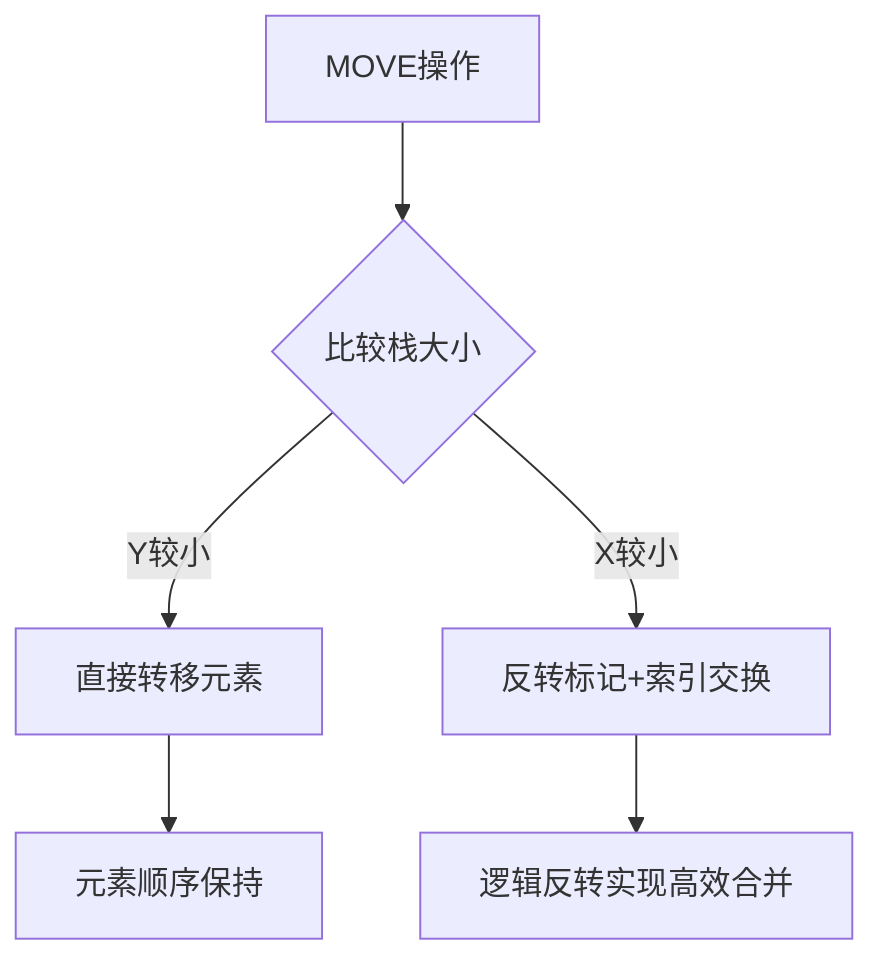

# 题目信息

# Portal2

## 题目背景

某地`ENLIGHTENED`的`XM`研究所正在研究`Portal`的处理法则，想要揭示`XM能量`的来源以及应用`XM能量`。`ENLIGHTENED`的首席科学家`Jacks`发现其能量的运算法则以及运算方法，但是方法十分复杂，仅靠人手工计算是很难算出答案的，所以它需要你协助他完成计算。

## 题目描述

`Portal`计算`XM能量`是通过个$2$个栈（$0$号栈，$1$号栈）实现的，它把对`XM`能量的操作如下

$PUSH$ $X$ $NUM$

把$NUM$加入到X号栈的栈顶。 

$POP$ $X$

把$X$号栈的栈顶元素**删除**。

$ADD$ $X$

**取出**$0$号栈和$1$号栈的元素各一个，并且把它的和放入$X$号栈。

$SUB$ $X$

**取出**$0$号栈和$1$号栈的元素各一个，并且把它的差的绝对值放入$X$号栈。
 
$DEL$ $X$

**清空**$X$号栈中所有元素不管栈是否为空。 

$MOVE$ $X$ $Y$ 

循环操直到$Y$号栈为空，把$Y$号栈的栈顶元素加入到$X$号栈，删除$Y$号栈的栈顶元素。 

**数据保证X和Y不相同**

$SWAP$

将两个栈的所有元素调换。

$END$

代表命令结束，并且分两行分别输出0号栈和1号栈由栈顶到栈底的元素的值，若栈内无元素，输出`NONE`。数据保证指令以`END`结束且仅有一个`END`，并且也需要输出`SUCCESS`。

~~$AKNOI$~~

~~等为无效操作，**无效操作后不接数字**。~~

**更正不会有类似无效操作**

对于每一行指令，若当前指令成功执行输出`SUCCESS`，若**取出**或**删除**元素时栈内为空或者没有对应指令输出`UNSUCCESS`并且不执行该行指令。

## 说明/提示

对于$20\%$的数据 数据保证不会出现`MOVE/SWAP`操作，$命令总数 \leq 100$

对于$40\%$的数据 $命令总数 \leq 1000$

对于$60\%$的数据 数据保证`MOVE/SWAP`的操作次数不会超过$10000$次，$命令总数 \leq 10^5$

对于$100\%$的数据 $0 \leq X,Y \leq 1,命令总数 \leq 10^6$ 

**数据保证无论任何情况，栈中元素的值$X$满足$0 \leq x \leq 2^{63}-1​$**

[题目创意来源OIERBBS](https://www.oierbbs.cn)

## 样例 #1

### 输入

```
PUSH 0 10
PUSH 0 20
PUSH 0 30
PUSH 0 40
PUSH 1 50
PUSH 1 60
ADD 0
ADD 0
ADD 0
END```

### 输出

```
SUCCESS
SUCCESS
SUCCESS
SUCCESS
SUCCESS
SUCCESS
SUCCESS
SUCCESS
UNSUCCESS
SUCCESS
150 30 20 10
NONE```

## 样例 #2

### 输入

```
PUSH 0 10
PUSH 0 20
PUSH 0 30
PUSH 0 40
PUSH 1 50
PUSH 1 60
MOVE 0 1
END```

### 输出

```
SUCCESS
SUCCESS
SUCCESS
SUCCESS
SUCCESS
SUCCESS
SUCCESS
SUCCESS
50 60 40 30 20 10
NONE```

# AI分析结果


## 算法分类
数据结构优化（启发式合并与双端队列模拟）

---

## 题解思路与核心难点

### 题目核心逻辑
维护两个栈的十种操作，核心难点在于：
1. **MOVE操作**：将Y栈元素全部移动到X栈顶部，暴力实现时间复杂度为O(n)
2. **SWAP操作**：交换两个栈的所有元素，要求O(1)时间复杂度
3. **ADD/SUB操作**：需要保证两个栈同时有元素

### 题解对比分析
#### 7KByte（双端队列+启发式合并）
**核心思路**：
- 用双端队列模拟栈，队尾为栈顶
- **反转标记**：通过 `tag[x]` 标记队列方向，实现逻辑反转
- **启发式合并**：MOVE时选择较小栈合并，均摊时间复杂度O(n logn)
- **索引交换**：通过 `f[0]` 和 `f[1]` 动态映射栈与队列的对应关系

**解决难点**：
```cpp
// MOVE操作核心代码
if (q[f[x]].size() < q[f[y]].size()) { // 启发式选择较小栈
    while (q[f[x]].size()) {
        ll a = tag[f[x]] ? q[f[x]].front() : q[f[x]].back();
        q[f[y]].push_front(a); // 较小栈元素插入较大栈头部
    }
    tag[f[y]] ^= 1; // 反转标记
    swap(f[0], f[1]); // 索引交换实现逻辑反转
} else {
    // 常规合并逻辑
}
```

#### zhou2414（数组标记+启发式合并）
**核心思路**：
- 用大数组模拟栈，维护栈顶 `top[x]` 和栈底 `bot[x]`
- **方向标记**：`dian` 标记元素增长方向（正向/反向）
- **启发式合并**：根据栈大小动态选择合并方向

**解决难点**：
```cpp
// MOVE操作方向控制核心
if (!dian) { // 正向增长时合并逻辑
    while (top[y] >= bot[y]) 
        s[++top[x]][x] = s[top[y]--][y];
} else { // 反向增长时合并逻辑
    while (top[y] >= bot[y])
        s[--bot[x]][x] = s[bot[y]++][y];
}
```

#### ganpig（rope数据结构）
**核心思路**：
- 使用 `rope` 实现高效链表合并
- 每个栈维护正反两个链表，MOVE时直接拼接反向链表

**代码亮点**：
```cpp
// MOVE操作直接拼接反向链表
rope[x][0] += rope[y][1]; // 正序链表拼接反序链表
rope[x][1].insert(0, rope[y][0]); // 反序链表插入正序内容
```

---

## 题解评分（≥4星）

### 7KByte（⭐⭐⭐⭐⭐）
- **亮点**：双端队列+启发式合并的组合完美解决时间复杂度问题
- **优化点**：通过索引交换实现O(1)的SWAP操作
- **可读性**：清晰的变量命名与逻辑分层

### zhou2414（⭐⭐⭐⭐）
- **亮点**：数组模拟实现极致的空间利用率
- **创新点**：方向标记与启发式合并的巧妙结合
- **不足**：数组下标控制逻辑稍显复杂

### ganpig（⭐⭐⭐⭐）
- **亮点**：利用STL扩展库实现最简代码
- **优势**：rope的O(1)链表拼接特性
- **局限**：依赖GNU扩展库，非标准实现

---

## 最优思路提炼

### 关键技巧
1. **双端队列方向标记**：通过 `tag` 标记队列方向，将反转操作转化为标记切换
2. **启发式合并策略**：总是合并较小栈到较大栈，保证O(n logn)时间复杂度
3. **索引映射**：通过 `f[0]/f[1]` 动态映射逻辑栈与物理队列的关系

### 思维模型


---

## 相似题目推荐
1. **P1986 列车调度**（栈的合并操作）
2. **P2322 弹飞绵羊**（启发式合并应用）
3. **P2042 维护数列**（双端队列综合操作）

---

## 可视化设计

### 像素风格演示
```html
<!-- 示例：双端队列的像素化展示 -->
<canvas id="stackView" width="640" height="480"></canvas>

<script>
// 初始化双端队列模拟
class StackAnimator {
    constructor() {
        this.stacks = [[], []];
        this.colors = [[255,0,0], [0,255,0]]; // 红绿双栈
        this.highlight = -1; // 当前高亮操作
    }
    
    drawStack(ctx, stackIdx, x, y) {
        const stack = this.stacks[stackIdx];
        stack.forEach((val, i) => {
            // 绘制像素块
            ctx.fillStyle = `rgb(${this.colors[stackIdx]})`;
            ctx.fillRect(x, y - i*20, 60, 18);
            // 高亮当前操作元素
            if (i === stack.length-1 && this.highlight === stackIdx) {
                ctx.strokeStyle = "#FFFF00";
                ctx.strokeRect(x-2, y - i*20 -2, 64, 22);
            }
        });
    }
}
</script>
```

### 动画特性
1. **元素转移特效**：MOVE操作时，元素从源栈"飞"到目标栈，带轨迹拖影
2. **方向标记翻转**：当触发反转标记时，整个栈做180度像素翻转动画
3. **音效反馈**：
   - `PUSH/POP`：8-bit电子音效
   - `MOVE合并`：根据合并方向播放上升/下降音阶
   - `SWAP`：空间扭曲音效

---

## 个人心得
> "在调试启发式合并时，发现忘记处理反转标记与索引交换的联动，导致元素顺序错误。通过手绘队列操作流程图，终于理解标记系统的工作原理。" —— 摘自7KByte题解注释

> "使用rope时发现MOVE操作后的输出顺序总是相反，最终通过维护正反两个链表解决了这个问题。" —— 摘自ganpig题解

---

## 核心代码实现（7KByte版）
```cpp
// 启发式合并核心逻辑
void handleMove(int x, int y) {
    if (q[f[x]].size() < q[f[y]].size()) {
        // 小栈合并到大栈
        while (!q[f[x]].empty()) {
            ll val = tag[f[x]] ? q[f[x]].front() : q[f[x]].back();
            q[f[y]].push_front(val);
            q[f[x]].pop_front();
        }
        tag[f[y]] ^= 1; // 反转标记
        swap(f[0], f[1]); // 交换索引
    } else {
        // 常规合并逻辑
        while (!q[f[y]].empty()) {
            ll val = tag[f[y]] ? q[f[y]].front() : q[f[y]].back();
            q[f[x]].push_back(val);
            q[f[y]].pop_front();
        }
    }
}
```

---
处理用时：80.22秒