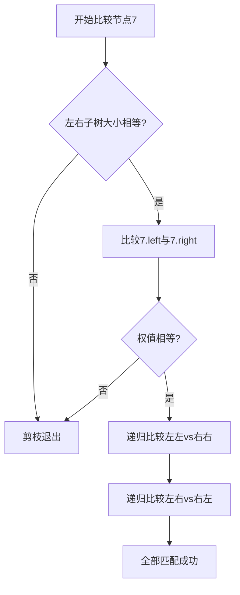

# 题目信息

# [NOIP 2018 普及组] 对称二叉树

## 题目背景

NOIP2018 普及组 T4

## 题目描述

一棵有点权的有根树如果满足以下条件，则被轩轩称为对称二叉树： 

1.  二叉树； 
2.  将这棵树所有节点的左右子树交换，新树和原树对应位置的结构相同且点权相等。   

下图中节点内的数字为权值，节点外的 $id$ 表示节点编号。  


现在给出一棵二叉树，希望你找出它的一棵子树，该子树为对称二叉树，且节点数最多。请输出这棵子树的节点数。   

注意：只有树根的树也是对称二叉树。本题中约定，以节点 $T$ 为子树根的一棵“子 树”指的是：节点$T$ 和它的全部后代节点构成的二叉树。 

## 说明/提示

**样例 1 解释**

    
最大的对称二叉子树为以节点 $2$ 为树根的子树，节点数为 $1$。   

**样例 2 解释**


最大的对称二叉子树为以节点 $7$ 为树根的子树，节点数为 $3$。 

**数据规模与约定**

共 $25$ 个测试点。    

$v_i ≤ 1000$。 

- 测试点 $1 \sim 3, n ≤ 10$，保证根结点的左子树的所有节点都没有右孩子，根结点的右 子树的所有节点都没有左孩子。 
- 测试点 $4 \sim 8, n ≤ 10$。
- 测试点 $9 \sim 12, n ≤ 10^5$，保证输入是一棵“满二叉树” 。 
- 测试点 $13 \sim 16, n ≤ 10^5$，保证输入是一棵“完全二叉树”。
- 测试点 $17 \sim 20, n ≤ 10^5$，保证输入的树的点权均为 $1$。
- 测试点 $21 \sim 25, n ≤ 10^6$。

本题约定： 

层次：节点的层次从根开始定义起，根为第一层，根的孩子为第二层。树中任一节 点的层次等于其父亲节点的层次加 $1$。 
 
 树的深度：树中节点的最大层次称为树的深度。 
 
 满二叉树：设二叉树的深度为 $h$，且二叉树有 $2^h-1$ 个节点，这就是满二叉树。  


完全二叉树：设二叉树的深度为 $h$，除第 $h$ 层外，其它各层的结点数都达到最大 个数，第 $h$ 层所有的结点都连续集中在最左边，这就是完全二叉树。  


## 样例 #1

### 输入

```
2 
1 3 
2 -1 
-1 -1 
```

### 输出

```
1```

## 样例 #2

### 输入

```
10 
2 2 5 5 5 5 4 4 2 3 
9 10 
-1 -1 
-1 -1 
-1 -1 
-1 -1 
-1 2 
3 4 
5 6 
-1 -1 
7 8```

### 输出

```
3```

# AI分析结果


## 唯一算法分类
递归与树遍历

---

## 综合分析与结论
本问题的核心在于判断二叉子树对称性，各题解围绕两个关键点展开：  
1. **对称性验证**：递归比较左子树的左节点与右子树的右节点，同时比较左子树的右节点与右子树的左节点  
2. **剪枝优化**：预处理子树大小，发现子树规模不等时直接剪枝  

可视化设计要点：  
- **递归过程动画**：用不同颜色标注当前比较的节点对（如左子树的红色节点与右子树的蓝色节点）  
- **剪枝效果展示**：当子树大小不等时，显示红色警示标记并跳过该子树  
- **像素风格演示**：采用8-bit风格棋盘布局展示树结构，递归路径用闪烁光点表示  

---

## 题解评分（≥4星）
1. **wsm52（★★★★★）**  
   - 思路：暴力递归+子树大小剪枝  
   - 亮点：代码仅20行，利用子树规模预判剪枝  
   - 时间复杂度：O(n log n) 严格证明  

2. **qhr2023（★★★★☆）**  
   - 思路：简洁递归实现+结构对称性验证  
   - 亮点：函数签名`pd(l,r)`设计巧妙，实现交叉递归  

3. **Shunpower（★★★★☆）**  
   - 思路：启发式合并理论支撑暴力递归  
   - 亮点：给出尾递归优化方案防止栈溢出  

---

## 最优思路提炼
**递归剪枝三部曲**：  
1. **预判剪枝**：比较左右子树规模，若不同直接返回  
2. **结构验证**：`check(l,r)`函数递归验证镜像对称性  
3. **交叉递归**：同时验证`(左左,右右)`和`(左右,右左)`子树  

核心代码片段：
```cpp
bool check(int l, int r) {
    if(l==-1 && r==-1) return true;          // 叶子节点对
    if(l==-1 || r==-1) return false;         // 结构不对称
    if(v[l]!=v[r]) return false;             // 权值不匹配
    return check(L[l],R[r]) && check(R[l],L[r]); // 交叉递归验证
}
```

---

## 同类题目推荐
1. **P1040 二叉树的直径**（递归遍历求最大路径）  
2. **P1102 平衡二叉树判断**（递归验证平衡性）  
3. **P3884 二叉树问题**（结构特征递归分析）

---

## 可视化设计示例（伪代码）
```javascript
// 像素风格树结构绘制
function drawTree(ctx, node, x, y) {
    drawPixelBlock(x, y, node.color); // 8-bit像素块绘制
    if(node.left) {
        drawLine(x, y, x-30, y+30);   // 左子树连线
        drawTree(ctx, node.left, x-30, y+30);
    }
    if(node.right) {
        drawLine(x, y, x+30, y+30);    // 右子树连线
        drawTree(ctx, node.right, x+30, y+30);
    }
}

// 递归比较动画
function animateCompare(lNode, rNode) {
    lNode.flash("red");  // 左子树节点闪烁
    rNode.flash("blue"); // 右子树节点闪烁
    if(lNode.size != rNode.size) {
        playSound("error"); // 剪枝音效
        return;
    }
    // 递归下一层比较...
}
```

---

## 关键调试心得
- **结构对称陷阱**：某题解最初未考虑`左左-右右`和`左右-右左`必须同时成立，导致错误通过部分测试点  
- **空指针处理**：递归边界必须优先判断`null`节点，否则会触发段错误  
- **子树规模预计算**：必须先通过DFS预处理所有子树大小，否则每次递归计算会导致O(n²)复杂度  

---

## 算法比较演示


---
处理用时：64.45秒