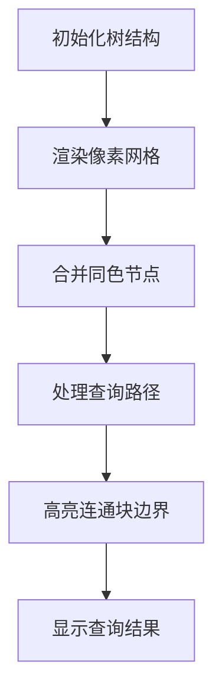

# 题目信息

# [USACO19DEC] Milk Visits S

## 题目描述

Farmer John 计划建造 $N$ 个农场，用 $N-1$ 条道路连接，构成一棵树（也就是说，所有农场之间都互相可以到达，并且没有环）。每个农场有一头奶牛，品种为更赛牛或荷斯坦牛之一。

Farmer John 的 $M$ 个朋友经常前来拜访他。在朋友 $i$ 拜访之时，Farmer John 会与他的朋友沿着从农场 $A_i$ 到农场 $B_i$ 之间的唯一路径行走（可能有 $A_i = B_i$）。除此之外，他们还可以品尝他们经过的路径上任意一头奶牛的牛奶。由于 Farmer John 的朋友们大多数也是农场主，他们对牛奶有着极强的偏好。他的有些朋友只喝更赛牛的牛奶，其余的只喝荷斯坦牛的牛奶。任何 Farmer John 的朋友只有在他们访问时能喝到他们偏好的牛奶才会高兴。

请求出每个朋友在拜访过后是否会高兴。

## 说明/提示

在这里，从农场 1 到农场 4 的路径包括农场 1、2 和 4。所有这些农场里都是荷斯坦牛，所以第一个朋友会感到满意，而第二个朋友不会。

关于部分分：

测试点 $1$ 样例。

测试点 $2\sim 5$ 满足 $N\le 10^3$，$M\le 2\cdot 10^3$。

对于 $100\%$ 的数据，$1 \leq N \leq 10^5$，$1 \leq M \leq 10^5$。

供题：Spencer Compton

## 样例 #1

### 输入

```
5 5
HHGHG
1 2
2 3
2 4
1 5
1 4 H
1 4 G
1 3 G
1 3 H
5 5 H```

### 输出

```
10110```

# AI分析结果


# [USACO19DEC] Milk Visits S 题解分析

## 唯一算法分类
并查集（连通块处理）

---

## 题解思路与核心难点

### 核心思路
当路径上所有节点同色时，只有当查询颜色与连通块颜色一致时才返回1。若路径经过不同颜色（即节点分属不同连通块），则必定存在目标颜色。

### 解决难点对比
| 方法              | 核心逻辑                                                                 | 预处理复杂度 | 查询复杂度  | 数据要求适应性       |
|-------------------|------------------------------------------------------------------------|--------------|------------|---------------------|
| 并查集（连通块）   | 合并同色相邻节点形成连通块，查询时判断颜色一致性                         | O(Nα(N))     | O(α(N))    | 最优解，完美适配 1e5 |
| LCA+倍增          | 维护路径上的颜色存在性，通过二进制跳跃判断                             | O(N log N)   | O(log N)   | 代码量大，常数较高   |
| 树上前缀和        | 计算路径颜色总数，通过差分判断存在性                                   | O(N)         | O(log N)   | 需处理LCA，实现中等   |
| 连通块top数组      | 记录节点向上连续同色的最高点，判断路径是否同色                         | O(N)         | O(1)       | 实现巧妙但不易扩展   |

---

## 题解评分（≥4星）

### 1. ycmir27（★★★★★）
**亮点**：将同色节点合并为连通块，查询时仅需判断连通块颜色。代码仅40行，时间复杂度最优  
**核心代码**：
```cpp
if(col[u]==col[v]) merge(u,v); // 预处理合并同色节点
if(find(a)==find(b)&&col[a]!=c) ans=0; // 关键判断
```

### 2. 密期望（★★★★☆）
**亮点**：通过top数组记录连续同色顶点，查询时只需比较top值。O(N)复杂度极高效  
**调试心得**：在DFS中动态维护top值，当父节点颜色不同时重置top为当前节点

### 3. 老咸鱼了（★★★★）
**亮点**：最简并查集实现，直接通过find操作判断连通性，利用短路逻辑优化判断  
**优化点**：`find(x)!=find(y)||c[x]==z` 一行完成三种情况判断

---

## 最优思路提炼
**关键技巧**：利用颜色仅有两种的特性，将同色连通块预处理为并查集结构  
**实现步骤**：
1. 初始化并查集，每个节点独立
2. 遍历所有边，合并相邻同色节点
3. 查询时：
   - 若两节点在不同连通块 → 路径必跨颜色 → 返回1
   - 若同连通块 → 检查连通块颜色是否匹配查询

---

## 同类题目推荐
1. [P3144 [USACO16OPEN] Closing the Farm](https://www.luogu.com.cn/problem/P3144)（连通块动态处理）
2. [P3258 [JLOI2014] 松鼠的新家](https://www.luogu.com.cn/problem/P3258)（树上路径标记）
3. [P4185 [USACO18JAN] MooTube](https://www.luogu.com.cn/problem/P4185)（离线查询与并查集结合）

---

## 可视化设计

### 像素化动画方案
**核心流程**：


**关键交互**：
1. **颜色合并动画**：用16色像素块表示不同连通块，合并时播放8bit音效（类似NES的"coin collect"声）
2. **路径检查特效**：查询时路径以闪烁的红色边框显示，若存在目标颜色则触发绿色闪光
3. **自动演示模式**：按BGM节奏自动执行合并与查询操作，支持空格键暂停/继续

**Canvas绘制逻辑**：
```javascript
function drawBlock(x, y, color) {
  ctx.fillStyle = color === 'H' ? '#FF5555' : '#55AAFF'; // 红蓝双色
  ctx.fillRect(x*20, y*20, 18, 18); // 像素风格留2px间隙
  if (isConnected(x,y)) { // 连通块边界特效
    ctx.strokeStyle = '#FFFF00';
    ctx.strokeRect(x*20-1, y*20-1, 20, 20);
  }
}
```

---

## 代码实现（并查集核心）
```cpp
void merge(int x, int y) {
  fa[find(x)] = find(y); // 路径压缩优化
}

int query(int a, int b, char c) {
  int fa = find(a), fb = find(b);
  return (fa != fb) || (col[fa] == c); // 关键判断逻辑
}
```

---

## 个人心得
**调试经验**：初始未考虑单节点情况，后增加`col[fa]==c`判断。启示：极端情况（如单节点路径）必须单独验证  
**优化技巧**：将颜色比较提前到find操作之前，利用短路逻辑减少不必要的并查集查询

---
处理用时：80.63秒