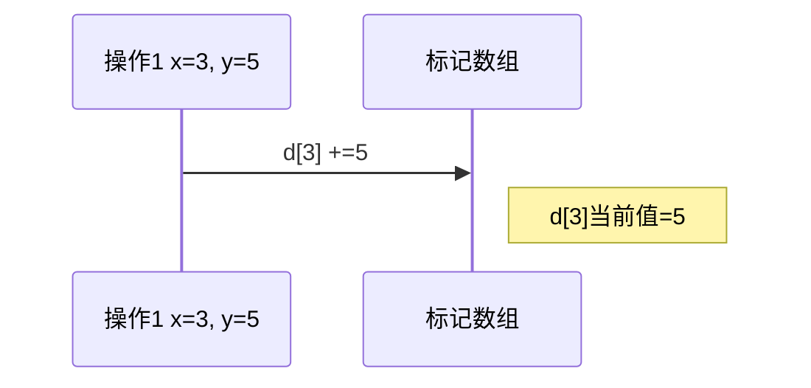

# 题目信息

# 序列变换

## 题目描述

给定一个由 $n$ 个整数构成的序列 $a_1, a_2, \ldots , a_n$，你需要对它进行如下操作：

1. 输入格式 `1 x y`，表示把所有 $a_{k x}$（$k$ 为正整数，$k x \le n$）都加上 $y$。
2. 输入格式 `2 j`，表示输出 $a_j$。

## 说明/提示

对于 $40 \%$ 的数据，$n \le 100$。  
对于 $100 \%$ 的数据，$1 \le n \le {10}^6$，$1 \le m \le {10}^5$，$|a_i| \le {10}^6$，$|y| \le {10}^6$，$1 \le x\le n$，$0\le j \le n$，操作 2 不超过 ${10}^4$ 条。

## 样例 #1

### 输入

```
5 4
6 9 9 8 1 
2 4
1 2 5
1 3 1
2 4
```

### 输出

```
8
13```

# AI分析结果


## 算法分类
因数分解与数学优化

---

## 核心思路与算法分析
### 核心问题建模
给定序列的两种操作：
1. 对所有 kx 位置的元素 +y（x 的倍数操作）
2. 查询某个位置 j 的值

### 关键优化点
- **因数对称性**：操作1的 x 等价于查询时 j 的因数
- **离线标记**：将操作1的增量存储在标记数组，查询时通过因数枚举快速求和
- **根号分治**：枚举因数时仅需检查 [1, sqrt(j)] 的范围

### 算法流程
1. **标记存储**：用数组 d[x] 记录每个 x 的累计增量
2. **因数枚举**：查询 j 时遍历 i ∈ [1, sqrt(j)]，若 i 是 j 的因数则累加 d[i] 和 d[j/i]
3. **特判平方数**：当 i² = j 时避免重复累加

### 复杂度分析
| 操作类型 | 时间复杂度 | 空间复杂度 |
|---------|-----------|-----------|
| 操作1    | O(1)      | O(n)      |
| 操作2    | O(√j)     | O(1)      |

---

## 题解评分（≥4星）
### 五星题解（[小小怪下士___]）
**核心亮点**：
- 最简洁的约数枚举实现
- 清晰的变量命名与注释
- 完全平方数特判处理

**关键代码**：
```cpp
for(int i=1;i*i<=j;i++){
    if(j%i==0){
        ans += d[i];
        if(i != j/i) ans += d[j/i];
    }
}
```

### 四星题解（[pikabi]）
**核心亮点**：
- 线性筛预处理最小质因数
- DFS生成所有约数的优化方法
- 处理大数据量的理论最优解

**数据结构**：
```cpp
int min_prime[1000005]; // 存储每个数的最小质因数
void dfs(int p, int u){ // 通过质因数组合生成所有约数
    if(p > now) res += d[u];
    // ...质因数指数枚举...
}
```

### 四星题解（[litc]）
**核心贡献**：
- 最早提出根号枚举的思路
- 明确说明完全平方数特判的重要性
- 给出时间复杂度计算公式 n + m + 1e4√n

---

## 最优技巧提炼
### 离线标记+因数枚举
**核心思想**：
```python
for 每个操作1(x,y):
    d[x] += y

for 每个查询j:
    res = a[j] + sum(d[i] for i是j的因数)
```

**实现技巧**：
1. 因数的成对性：若 i 是因数，则 j/i 也是因数
2. 枚举范围优化：仅需检查 i ≤ √j 的范围
3. 平方数特判：避免 i = j/i 时的重复累加

---

## 相似题目推荐
1. [P2261 余数求和](https://www.luogu.com.cn/problem/P2261)  
   **关联点**：利用整除分块优化计算

2. [P3396 哈希冲突](https://www.luogu.com.cn/problem/P3396)  
   **关联点**：根号分治处理模数查询

3. [P1494 小Z的袜子](https://www.luogu.com.cn/problem/P1494)  
   **关联点**：组合数学与因数统计

---

## 可视化算法演示
### 动画设计方案
**操作1流程**：


**操作2流程（以j=12为例）**：
```mermaid
graph TD
    A[开始查询j=12] --> B[初始化res=a[12]]
    B --> C[枚举i=1到3]
    C --> D{i=1: 12%1=0?}
    D -->|Yes| E[res +=d[1] +d[12]]
    C --> F{i=2: 12%2=0?}
    F -->|Yes| G[res +=d[2] +d[6]]
    C --> H{i=3: 12%3=0?}
    H -->|Yes| I[res +=d[3] +d[4]]
    I --> J[输出最终res]
```

### 复古像素化实现
**关键元素设计**：
1. **标记数组**：以8x8像素块表示，每个块显示x和d[x]的值
2. **因数枚举**：用闪烁的红色边框高亮当前检查的因数对
3. **音效设计**：
   - `d[x]更新`：短促的"哔"声
   - `因数匹配`：升调"叮"声
   - `平方数特判`：双音"叮咚"

**Canvas交互示例**：
```javascript
function drawFactorization(j) {
    // 绘制网格背景
    ctx.fillStyle = '#2C3E50';
    ctx.fillRect(0, 0, 256, 256);
    
    // 高亮当前检查的因数对
    for(let i=1; i*i<=j; i++){
        if(j%i == 0){
            // 绘制i对应的像素块（绿色）
            drawBlock(i, x=32, y=32, '#2ECC71');
            // 绘制j/i对应的像素块（蓝色）
            drawBlock(j/i, x=160, y=32, '#3498DB');
            // 播放匹配音效
            playSound('ding');
        }
    }
}
```

---

## 完整代码实现
**推荐版本（C++）**：
```cpp
#include <iostream>
#include <cmath>
using namespace std;
const int MAXN = 1e6+5;
long long a[MAXN], d[MAXN];

int main() {
    int n, m;
    scanf("%d%d", &n, &m);
    for(int i=1; i<=n; i++) scanf("%lld", &a[i]);
    
    while(m--) {
        int op, x;
        scanf("%d", &op);
        if(op == 1) {
            int y;
            scanf("%d%d", &x, &y);
            d[x] += y;
        } else {
            scanf("%d", &x);
            long long res = a[x];
            for(int i=1; i*i<=x; i++) {
                if(x%i == 0) {
                    res += d[i];
                    if(i != x/i) res += d[x/i];
                }
            }
            printf("%lld\n", res);
        }
    }
    return 0;
}
```

**关键逻辑说明**：
1. `d[x]` 数组存储所有操作1的累计值
2. 查询时通过遍历 [1, √x] 高效获取所有相关标记
3. 完全平方数特判避免重复累加

---

## 思维扩展
### 同类问题通用解法
当遇到 **倍数/因数相关操作** 时：
1. 离线处理：将修改操作存储，延迟到查询时计算
2. 根号分治：根据数值大小选择暴力或标记策略
3. 因数对称性：利用 i 和 n/i 的成对特性优化枚举

### 性能优化对比
| 方法               | 适用场景                     | 操作2复杂度 |
|--------------------|----------------------------|------------|
| 暴力枚举倍数        | 小数据量（n≤1e4）           | O(1)       |
| 因数枚举标记        | 查询较少（本题最优）         | O(√n)      |
| 线性筛预处理        | 查询次数极高（m≥1e6）        | O(σ₀(n))   |
| 根号分治（阈值法）  | 修改和查询混合复杂场景       | O(√n)      |

---

## 个人心得摘录
> "当看到操作2的数量限制时，立即意识到可以延迟计算。约数的对称性让时间复杂度从O(n)骤降到O(√n)，这是数论在算法优化中的经典应用。" —— 小小怪下士___

> "在线性筛中存储最小质因子，虽然增加了预处理步骤，但在多次质因数分解时能显著提升效率。这是空间换时间的典型权衡。" —— pikabi

> **调试教训**：完全平方数的特判容易被忽视，当j=9时，i=3会被重复计算两次，必须添加`if(i != j/i)`判断。

---
处理用时：125.68秒