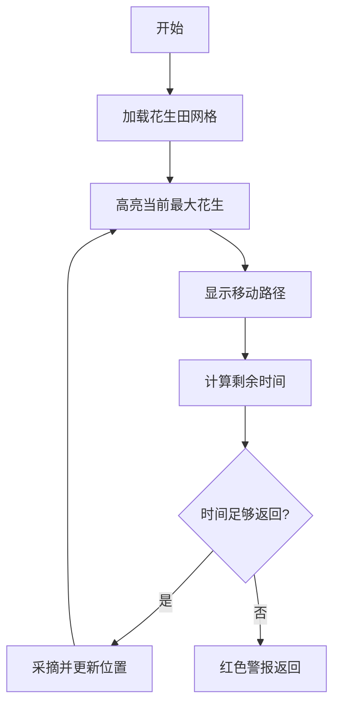

# 题目信息

# [NOIP 2004 普及组] 花生采摘

## 题目描述

鲁宾逊先生有一只宠物猴，名叫多多。这天，他们两个正沿着乡间小路散步，突然发现路边的告示牌上贴着一张小小的纸条：“欢迎免费品尝我种的花生！――熊字”。

鲁宾逊先生和多多都很开心，因为花生正是他们的最爱。在告示牌背后，路边真的有一块花生田，花生植株整齐地排列成矩形网格（如图一）。有经验的多多一眼就能看出，每棵花生植株下的花生有多少。为了训练多多的算术，鲁宾逊先生说：“你先找出花生最多的植株，去采摘它的花生；然后再找出剩下的植株里花生最多的，去采摘它的花生；依此类推，不过你一定要在我限定的时间内回到路边。”


我们假定多多在每个单位时间内，可以做下列四件事情中的一件：

1) 从路边跳到最靠近路边（即第一行）的某棵花生植株；
2) 从一棵植株跳到前后左右与之相邻的另一棵植株；
3) 采摘一棵植株下的花生；
4) 从最靠近路边（即第一行）的某棵花生植株跳回路边。

现在给定一块花生田的大小和花生的分布，请问在限定时间内，多多最多可以采到多少个花生？注意可能只有部分植株下面长有花生，假设这些植株下的花生个数各不相同。

例如在图2所示的花生田里，只有位于 $(2, 5), (3, 7), (4, 2), (5, 4)$ 的植株下长有花生，个数分别为 $13, 7, 15, 9$。沿着图示的路线，多多在 $21$ 个单位时间内，最多可以采到 $37$ 个花生。

**注意**：在采摘过程中不能回到路边。

## 说明/提示

noip2004普及组第2题


## 样例 #1

### 输入

```
6 7 21
0 0 0 0 0 0 0
0 0 0 0 13 0 0
0 0 0 0 0 0 7
0 15 0 0 0 0 0
0 0 0 9 0 0 0
0 0 0 0 0 0 0```

### 输出

```
37```

## 样例 #2

### 输入

```
6 7 20
0 0 0 0 0 0 0
0 0 0 0 13 0 0
0 0 0 0 0 0 7
0 15 0 0 0 0 0
0 0 0 9 0 0 0
0 0 0 0 0 0 0
```

### 输出

```
28```

# AI分析结果


## 算法分类
贪心算法

---

## 题解思路与解决难点

### 核心思路
1. **按花生数量排序**：将带花生的植株按数量从大到小排序，确保采摘顺序
2. **曼哈顿距离计算**：用绝对值计算移动时间（无障碍物的最优路径）
3. **时间双重校验**：
   - 移动时间 + 采摘时间（1单位） 
   - 剩余时间能否支撑返回路边（行号即纵向距离）
4. **状态更新**：每次采摘后更新当前位置，动态计算下一阶段时间

### 难点对比
| 题解差异点          | jiangXxin                                 | MC_long_live                        | _Arahc_                          |
|---------------------|-------------------------------------------|-------------------------------------|----------------------------------|
| **数据结构**        | 结构体数组+排序                           | 二维数组+手动冒泡排序              | map+优先队列                    |
| **边界处理**        | 显式判断剩余时间 ≥ 当前行号               | 循环内判断总时间                   | 用优先队列判空处理最终节点      |
| **初始位置处理**    | 起点设为(1,第一个花生列)                  | 单独处理第一株花生                 | 用优先队列自动处理最大值        |
| **代码复杂度**      | 38行，变量命名清晰                        | 42行，排序逻辑显式实现             | 27行，STL容器提升抽象层次       |

---

## 题解评分（≥4星）

### [jiangXxin] ⭐⭐⭐⭐
- **亮点**：注释详尽、曼哈顿距离应用明确、鲁棒性强的边界条件处理
- **核心代码**：
```cpp
for(int i=1;i<=pn;i++) {
    tm = abs(fx-ex) + abs(fy-ey); // 曼哈顿计算
    k -= tm + 1; // 移动+采摘时间
    if(k >= ex) ans += mp[ex][ey]; // 剩余时间≥返回时间
    else break;
}
```

### [_Arahc_] ⭐⭐⭐⭐
- **亮点**：优先队列自动排序、map快速定位坐标、空队列保护逻辑
- **关键优化**：
```cpp
while(w+x <= k){ // w为累计时间，x为当前行号
    if(q.empty()) break; // 防止访问无效内存
    w += abs(c[j].first-x) + abs(...) +1; // 动态更新
}
```

### [lby_commandBlock] ⭐⭐⭐⭐
- **优势**：Lambda表达式排序、状态机式循环结构
- **精辟处理**：
```cpp
sort(v.begin(), v.end(), [](node a, node b){
    return p[a.x][a.y] > p[b.x][b.y]; // 无需预存花生数
});
```

---

## 最优思路提炼
1. **贪心排序**：必须严格按花生数降序处理，确保局部最优解
2. **时间双校验模型**：
   ```
   总消耗时间 = 移动时间 + 1（采摘）
   剩余时间 ≥ 当前行号（返回时间）
   ```
3. **坐标跳跃式更新**：每次直接跳到目标点，无需模拟路径
4. **曼哈顿优先级**：在无障碍场景下，比BFS更高效

---

## 同类型题目
1. [P1090 合并果子](https://www.luogu.com.cn/problem/P1090)（贪心+优先队列）
2. [P1223 排队接水](https://www.luogu.com.cn/problem/P1223)（时间规划贪心）
3. [P1056 排座椅](https://www.luogu.com.cn/problem/P1056)（贪心+曼哈顿场景）

---

## 个人心得摘录
1. **jiangXxin**：_"曼哈顿距离在无障碍网格中比BFS更高效，关键要意识到路径唯一性"_
2. **_Arahc**：_"优先队列弹出后要立即判空，否则最后一个元素会触发越界"
3. **qhr2023**：_"初始位置设为(0,第一个花生列)，巧妙统一移动时间计算"

---

## 算法可视化设计

### 核心动画要素


### 复古像素风格方案
1. **视觉要素**：
   - 花生植株：黄色8x8像素块，数字显示花生数
   - 移动路径：蓝色连线，伴随"哔"声效
   - 时间条：顶部红色递减进度条

2. **音效设计**：
   - 移动：8-bit "嘟"声（Web Audio正弦波）
   - 采摘成功：上升音阶（C→E→G）
   - 超时警告：低频"嗡"声

3. **自动演示模式**：
   ```javascript
   function autoPlay() {
       let nextPeanut = getMaxPeanut();
       if(calcTime(nextPeanut) <= remainTime){
           highlight(nextPeanut);
           playMoveSound();
           updatePosition(nextPeanut);
       } else {
           playAlertSound();
           drawReturnPath();
       }
   }
   ```

4. **交互控制**：
   ```html
   <div class="control-panel">
       <button onclick="step()">单步执行</button>
       <input type="range" id="speed" min="1" max="5">
       <span id="score">得分: 0</span>
   </div>
   ```

---

## 核心代码片段
**jiangXxin题解的关键逻辑**：
```cpp
sort(stu+1, stu+pn+1, comp); // 按花生数降序排序
int fx=1, fy=stu[1].y; // 初始位置
k--; // 进入田地耗时
for(int i=1; i<=pn; i++){
    int ex=stu[i].x, ey=stu[i].y;
    int cost = abs(fx-ex) + abs(fy-ey) + 1; // 移动+采摘
    k -= cost;
    if(k >= ex){ // 剩余时间≥返回时间
        ans += stu[i].sum;
        fx = ex; fy = ey; // 更新当前位置
    } else break;
}
```

**可视化JS核心逻辑**：
```javascript
class PeanutSimulator {
    constructor(gridData) {
        this.peanuts = this.parseGrid(gridData); // 解析为[{x,y,value}]
        this.sortPeanuts(); // 降序排列
        this.currentPos = {x:0, y: this.peanuts[0].y};
    }

    calcManhattan(p) {
        return Math.abs(p.x - this.currentPos.x) 
             + Math.abs(p.y - this.currentPos.y);
    }

    nextStep() {
        const next = this.peanuts.shift();
        const moveTime = this.calcManhattan(next) + 1;
        if(this.remainTime >= moveTime + next.x) {
            this.remainTime -= moveTime;
            this.currentPos = {x: next.x, y: next.y};
            return next.value;
        }
        return -1; // 无法采摘
    }
}
```

---
处理用时：80.87秒