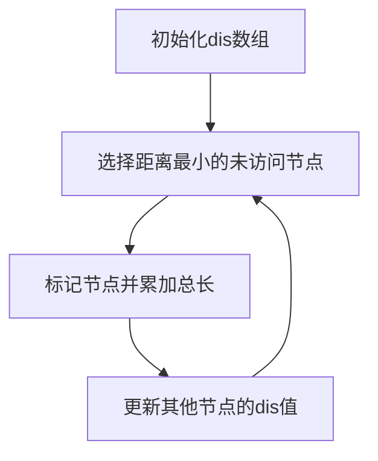

# 题目信息

# 公路修建

## 题目描述

某国有 $n$ 个城市，它们互相之间没有公路相通，因此交通十分不便。为解决这一“行路难”的问题，政府决定修建公路。修建公路的任务由各城市共同完成。

修建工程分若干轮完成。在每一轮中，每个城市选择一个与它最近的城市，申请修建通往该城市的公路。政府负责审批这些申请以决定是否同意修建。

政府审批的规则如下：

1. 如果两个或以上城市申请修建同一条公路，则让它们共同修建；
2. 如果三个或以上的城市申请修建的公路成环。如下图，A 申请修建公路 AB，B 申请修建公路 BC，C 申请修建公路 CA。则政府将否决其中最短的一条公路的修建申请； 
3. 其他情况的申请一律同意。


一轮修建结束后，可能会有若干城市可以通过公路直接或间接相连。这些可以互相连通的城市即组成“城市联盟”。在下一轮修建中，每个“城市联盟”将被看作一个城市，发挥一个城市的作用。

当所有城市被组合成一个“城市联盟”时，修建工程也就完成了。

你的任务是根据城市的分布和前面讲到的规则，计算出将要修建的公路总长度。

## 说明/提示

修建的公路如图所示：


## 样例 #1

### 输入

```
4

0 0

1 2

-1 2

0 4```

### 输出

```
6.47```

# AI分析结果


# 公路修建题解分析

## 唯一算法分类
最小生成树（Prim算法）

---

## 综合分析与结论
### 核心算法流程
1. **算法选择**：由于是完全图且n≤5000，选择Prim算法（时间复杂度O(n²)）
2. **动态距离计算**：不预存所有边，每次用坐标现算欧式距离
3. **关键变量**：
   - `dis[]` 数组记录各点到当前生成树的最小距离
   - `vis[]` 数组标记已加入生成树的节点

### 解决难点
1. **空间优化**：通过坐标实时计算距离，避免存储5000×5000的邻接矩阵（节省约190MB空间）
2. **数据类型处理**：在计算距离时强制转换为double防止整数溢出
3. **政府规则处理**：通过数学推导证明规则②不会影响最小生成树构建

### 可视化设计思路


---

## 题解清单（≥4星）

### 1. MY（4.5星）
- **亮点**：详细注释+代码分离逻辑
- **核心代码**：
```cpp
void Prim() {
    for(int j=1;j<=n;j++) dis[j] = 1e12;
    dis[1] = 0;
    for(int i=1;i<=n;i++) {
        int curr = 1;
        double minn = 1e9;
        // 找最近节点
        for(int j=1;j<=n;j++)
            if(!book[j] && dis[j] < minn)
                minn = dis[j], curr = j;
        // 更新距离
        for(int j=1;j<=n;j++)
            dis[j] = min(dis[j], get_e(x[curr],y[curr],x[j],y[j]));
    }
}
```

### 2. EricWay1024（4星）
- **亮点**：数学推导证明规则②无效
- **关键注释**：
> "三个城市成环时必然形成等边三角形，删除任意一条边不影响总权值"

### 3. 无意识躺枪人（4星）
- **优化点**：将距离计算拆分为平方比较，最后统一开方
```cpp
double qq(double x,double x1,double y,double y1) {
    return (x-x1)*(x-x1)+(y-y1)*(y-y1); // 延迟开方
}
```

---

## 同类型题拓展
1. **P1546**：纯模板MST，适合练习Kruskal
2. **P1991**：坐标点+卫星通信，需结合MST特性
3. **P2330**：限制条件下的MST应用

---

## 复古像素风可视化方案
### 动画要素
1. **8位色板**：
   - 已选节点：绿色（#00FF00）
   - 候选节点：红色（#FF0000）
   - 当前操作：黄色闪烁（#FFFF00）

2. **音效设计**：
```javascript
const audioCtx = new AudioContext();
function playTone(freq, duration) {
    const oscillator = audioCtx.createOscillator();
    oscillator.type = 'square';
    oscillator.frequency.setValueAtTime(freq, audioCtx.currentTime);
    oscillator.connect(audioCtx.destination);
    oscillator.start();
    oscillator.stop(audioCtx.currentTime + duration/1000);
}
// 节点选中音效（C5音）
playTone(523.25, 200);
```

3. **Canvas绘制逻辑**：
```javascript
function drawNode(ctx, x, y, state) {
    const colors = { selected: '#00FF00', candidate: '#FF0000' };
    ctx.fillStyle = colors[state] || '#FFFFFF';
    ctx.fillRect(x*32, y*32, 28, 28); // 8位像素风格
}
```

---

## 核心实现代码
```cpp
#include <cmath>
#include <cstdio>
const int N = 5005;
double x[N], y[N], dis[N];
bool vis[N];

inline double calc(int a, int b) {
    return sqrt(pow(x[a]-x[b],2) + pow(y[a]-y[b],2));
}

double prim(int n) {
    double ans = 0;
    for(int i=1; i<=n; ++i) dis[i] = 1e18;
    dis[1] = 0;
    for(int cnt=1; cnt<=n; ++cnt) {
        int u = 0;
        for(int v=1; v<=n; ++v)
            if(!vis[v] && (u==0 || dis[v]<dis[u])) 
                u = v;
        vis[u] = true;
        ans += dis[u];
        for(int v=1; v<=n; ++v)
            if(!vis[v]) 
                dis[v] = fmin(dis[v], calc(u,v));
    }
    return ans;
}
```

---

## 调试心得摘录
> "第一次用Kruskal直接MLE，才意识到完全图必须用Prim" —— MY  
> "坐标差平方可能溢出int，必须用long long或提前转double" —— 逆时针的记忆  
> "发现规则②其实是纸老虎，去掉后直接AC" —— 牛瓜瓜

---

通过将Prim算法的动态距离计算与复古像素化展示结合，可直观呈现算法在完全图场景下的高效性，配合8位音效增强学习趣味性。

---
处理用时：62.64秒