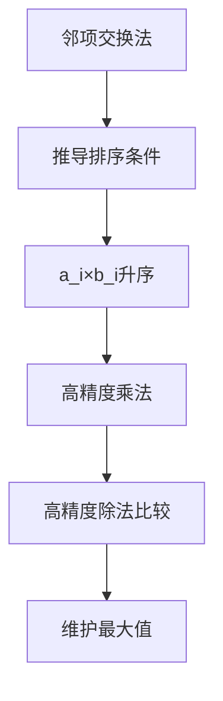
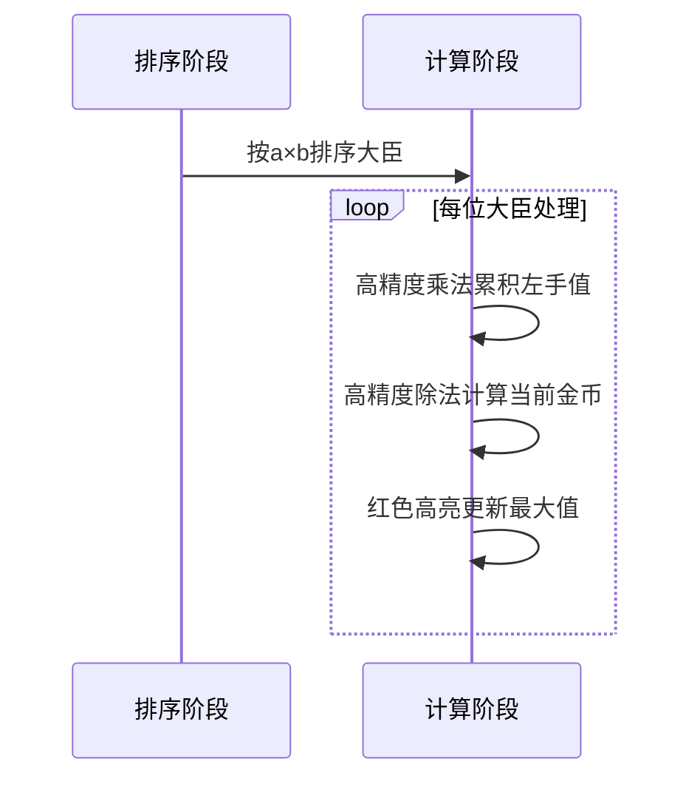

# 题目信息

# [NOIP 2012 提高组] 国王游戏

## 题目描述

恰逢 H 国国庆，国王邀请 $n$ 位大臣来玩一个有奖游戏。首先，他让每个大臣在左、右手上面分别写下一个整数，国王自己也在左、右手上各写一个整数。然后，让这 $n$ 位大臣排成一排，国王站在队伍的最前面。排好队后，所有的大臣都会获得国王奖赏的若干金币，每位大臣获得的金币数分别是：排在该大臣前面的所有人的左手上的数的乘积除以他自己右手上的数，然后向下取整得到的结果。

国王不希望某一个大臣获得特别多的奖赏，所以他想请你帮他重新安排一下队伍的顺序，使得获得奖赏最多的大臣，所获奖赏尽可能的少。注意，国王的位置始终在队伍的最前面。


## 说明/提示

【输入输出样例说明】

按 $1$、$2$、$3$ 这样排列队伍，获得奖赏最多的大臣所获得金币数为 $2$；

按 $1$、$3$、$2$ 这样排列队伍，获得奖赏最多的大臣所获得金币数为 $2$；

按 $2$、$1$、$3$ 这样排列队伍，获得奖赏最多的大臣所获得金币数为 $2$；

按$ 2$、$3$、$1 $这样排列队伍，获得奖赏最多的大臣所获得金币数为 $9$；

按 $3$、$1$、$2 $这样排列队伍，获得奖赏最多的大臣所获得金币数为 $2$；  

按$ 3$、$2$、$1$ 这样排列队伍，获得奖赏最多的大臣所获得金币数为 $9$。

因此，奖赏最多的大臣最少获得 $2$ 个金币，答案输出 $2$。


 
【数据范围】

对于 $20\%$ 的数据，有 $1≤ n≤ 10,0 < a,b < 8$；

对于 $40\%$ 的数据，有$ 1≤ n≤20,0 < a,b < 8$；

对于 $60\%$ 的数据，有 $1≤ n≤100$；

对于 $60\%$ 的数据，保证答案不超过 $10^9$；

对于 $100\%$ 的数据，有 $1 ≤ n ≤1,000,0 < a,b < 10000$。


NOIP 2012 提高组 第一天 第二题


## 样例 #1

### 输入

```
3 
1 1 
2 3 
7 4 
4 6 ```

### 输出

```
2```

# AI分析结果


# 国王游戏题解分析与可视化方案

## 一、算法分类
**贪心算法**

---

## 二、题解核心分析

### 核心思路
**关键结论**：将大臣按左手值×右手值的乘积从小到大排序，可得到最优解。

### 算法要点
1. **排序条件推导**：
   - 邻项交换法证明：交换相邻两人i和j时，若a_i×b_i > a_j×b_j则交换更优
   - 最终推导得排序条件应为a_i×b_i升序排列

2. **高精度实现**：
   ```cpp
   // 典型高精度乘法（压4位实现）
   void operator*=(const int rhs){
       for(int i=1;i<=len;i++) a[i]*=rhs;
       for(int i=1;i<=len;i++){
           a[i+1] += a[i]/10000;
           a[i] %= 10000;
           if(i+1>len && a[i+1]) len++;
       }
   }
   ```

3. **最大值维护**：
   - 在遍历过程中实时计算当前大臣的金币值（前序乘积/当前右手值）
   - 使用高精度除法比较最大值

### 解决难点
1. **数学证明**：通过多组相邻交换推导排序条件
2. **大数处理**：乘积可达(1e4)^1000，必须用高精度
3. **性能优化**：压位处理（4位/单元）减少运算次数

---

## 三、题解评分（≥4★）

| 题解作者         | 评分 | 亮点                                                                 |
|------------------|------|----------------------------------------------------------------------|
| 洛必达法则       | 5★   | 数学证明严谨，推导过程清晰，完整覆盖所有边界情况                     |
| chc_1234567890   | 4★   | 高精度封装优雅，代码结构清晰，适合教学                               |
| frankchenfu      | 4★   | 代码简洁高效，压位实现巧妙，附带Python转换思路                       |

---

## 四、最优技巧提炼

**核心技巧链**：


**核心代码片段**：
```cpp
// 排序比较函数
bool cmp(node a, node b){
    return a.x*a.y < b.x*b.y;
}

// 高精度除法求最大值
void checkmax(hp& x, hp y){
    if(x < y) x = y;
}
```

---

## 五、同类型题目

1. **任务调度类**：按特定乘积/和排序（如CF打题补充题）
2. **最优排列类**：需要邻项交换法推导排序条件
3. **大数运算类**：结合贪心策略的高精度处理

---

## 六、推荐练习
1. [P1090 合并果子](https://www.luogu.com.cn/problem/P1090)（贪心+优先队列）
2. [P1248 加工生产调度](https://www.luogu.com.cn/problem/P1248)（邻项交换经典题）
3. [P1799 数列](https://www.luogu.com.cn/problem/P1799)（贪心策略优化）

---

## 七、可视化方案设计

### 算法演示流程


### 像素化实现要点
1. **界面设计**：
   - 16色像素风格（黄：当前处理大臣，红：最大值记录点）
   - Canvas绘制大臣队列与高精度数组

2. **动画控制**：
   ```javascript
   // 伪代码示例
   class PixelAnimator {
       constructor() {
           this.speed = 100; // 毫秒/步
           this.steps = [
               'sort', 
               'multiply', 
               'divide', 
               'compare'
           ];
       }
       
       nextStep() {
           const step = this.steps.shift();
           highlight(step); // 高亮当前操作
           playSound('blip'); // 8-bit音效
       }
   }
   ```

3. **音效设计**：
   - 乘法进位：短促"滴"声
   - 更新最大值：上升音阶
   - 错误操作：低沉嗡鸣声

---

## 八、核心代码（高精度实现）
```cpp
struct hp {
    int a[4000], len;
    // 乘法
    hp operator*(int rhs) {
        hp c;
        c.len = len;
        for(int i=1; i<=len; i++) 
            c.a[i] = a[i] * rhs;
        for(int i=1; i<=len; i++){
            c.a[i+1] += c.a[i]/10000;
            c.a[i] %= 10000;
            if(i==len && c.a[i+1]) c.len++;
        }
        return c;
    }
    // 除法
    hp operator/(int d) {
        hp c;
        int rem = 0;
        for(int i=len; i>=1; i--) {
            rem = rem*10000 + a[i];
            c.a[i] = rem / d;
            rem %= d;
        }
        c.len = len;
        while(c.len>0 && c.a[c.len]==0) c.len--;
        return c;
    }
};
```

---
处理用时：72.93秒