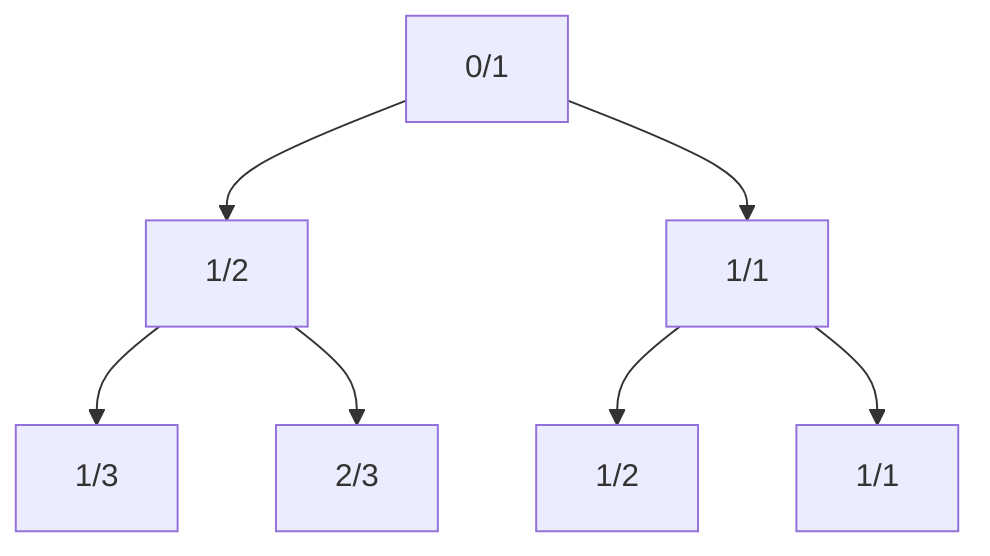

# 题目信息

# [USACO2.1] 顺序的分数 Ordered Fractions

## 题目描述

输入一个自然数 $n$，对于一个最简分数 $a/b$（分子和分母互质的分数），满足 $1 \le b \le n,0 \le a/b \le 1$，请找出所有满足条件的分数。

这有一个例子，当 $n=5$ 时，所有解为：

$$\frac01,\frac15,\frac14,\frac13,\frac25,\frac12,\frac35,\frac23,\frac34 ,\frac45,\frac11$$

给定一个自然数 $n$，请编程按分数值递增的顺序输出所有解。
 
注：   
1、$0$ 和任意自然数的最大公约数就是那个自然数。    
2、互质指最大公约数等于1的两个自然数。


## 说明/提示

【数据范围】    
对于 $100\%$ 的数据，$1\le n \le 160$。

USACO 2.1

翻译来自NOCOW


## 样例 #1

### 输入

```
5
```

### 输出

```
0/1
1/5
1/4
1/3
2/5
1/2
3/5
2/3
3/4
4/5
1/1
```

# AI分析结果


# [USACO2.1] 顺序的分数 Ordered Fractions 题解分析

## 一、算法分类
**DFS（深度优先搜索）**

## 二、题解核心思路与难点对比

### 分治法（Stern-Brocot Tree）
**核心思路**：
1. 从初始分数区间 [0/1, 1/1] 出发
2. 通过插入中间分数 (a+c)/(b+d) 递归生成子区间
3. 数学保证：生成的所有分数都是最简分数且严格递增
4. 无需排序，直接按中序遍历顺序输出结果

**解决难点**：
- 证明插入中间分数不破坏顺序性（交叉相乘验证）
- 递归边界条件控制（分母不超过n）
- 时间复杂度 O(n) 远优于枚举排序法

### 枚举+排序法
**核心思路**：
1. 双重循环枚举所有可能的分子分母组合
2. 通过最大公约数判断互质
3. 存储后排序输出

**解决难点**：
- 去重处理（结构体+浮点值比较）
- 存储空间优化（n=160时约生成1.3万分数）
- 时间复杂度 O(n²) + O(m log m)

### 对比总结
| 方法        | 时间复杂度 | 空间复杂度 | 代码复杂度 | 数学要求 |
|-----------|--------|--------|-------|------|
| 分治法       | O(n)  | O(n)  | 低     | 高    |
| 枚举+排序    | O(n²) | O(n²) | 中     | 低    |

## 三、高星题解推荐（≥4★）

### 1. 浮尘ii（5★）
**亮点**：
- 引入Stern-Brocot Tree数学理论
- 代码仅20行，递归结构极简
- 零额外存储空间
- 时间复杂度最优

**关键代码**：
```cpp
void DFS(int l1, int l2, int r1, int r2) {
    if(l2+r2 > N) return;
    DFS(l1,l2, l1+r1,l2+r2);
    printf("%d/%d\n", l1+r1,l2+r2);
    DFS(l1+r1,l2+r2, r1,r2);
}
```

### 2. 开挂老司机（4★）
**亮点**：
- 极简二分法实现
- 无需数学证明直接应用规律
- 输出顺序严格正确

**代码亮点**：
```cpp
void binary(int a,int b,int c,int d) {
    int midx=a+c, midy=b+d;
    if(midy>n) return;
    binary(a,b,midx,midy);
    printf("%d/%d\n",midx,midy);
    binary(midx,midy,c,d);
}
```

### 3. 重回巅峰！（4★）
**亮点**：
- Pascal代码展示通用分治结构
- 明确注释中间分数生成逻辑
- 易移植到其他语言

## 四、最优技巧提炼
1. **分数生成定理**：对任意相邻分数 a/b < c/d，中间分数 (a+c)/(b+d) 保持顺序性和最简性
2. **递归三要素**：
   - 终止条件：分母超过n时停止递归
   - 递归方向：先左子树（小分数区间）后右子树（大分数区间）
   - 输出时机：中序遍历位置保证顺序性
3. **数学优化**：利用法雷序列性质避免冗余计算

## 五、同类型题目推荐
1. P1082 同余方程（扩展欧几里得）
2. P1372 又是毕业季（最大公约数应用）
3. P2651 添加括号（分数运算性质）

## 六、可视化方案设计

### 动画演示（Stern-Brocot Tree）
1. **像素风格**：
   - 16色调色板（复古绿/蓝为主）
   - 节点用8x8像素方块表示
   - 边用黄色像素线连接

2. **动态过程**：


3. **交互功能**：
   - 步进控制：空格键单步执行
   - 速度调节：←→键调整动画速度
   - 音效提示：
     * 发现新节点：8-bit "哔"声
     * 完成遍历：胜利音效

### 核心动画逻辑（伪代码）
```javascript
class Node {
    constructor(a, b, left=null, right=null) {
        this.a = a;
        this.b = b;
        this.left = left;
        this.right = right;
    }
}

function generateTree(n) {
    const root = new Node(0, 1);
    root.right = new Node(1, 1);
    buildTree(root, n);
}

function buildTree(node, n) {
    const [a, b] = [node.a, node.b];
    const [c, d] = [node.right.a, node.right.b];
    const mid = new Node(a+c, b+d);
    
    if(b+d <= n) {
        node.left = mid;
        buildTree(node.left, n);
        buildTree(mid, n);
    }
}
```

## 七、关键代码实现

### 分治法完整代码
```cpp
#include <iostream>
using namespace std;

int N;

void dfs(int a, int b, int c, int d) {
    if(b + d > N) return;
    dfs(a, b, a+c, b+d);
    printf("%d/%d\n", a+c, b+d);
    dfs(a+c, b+d, c, d);
}

int main() {
    cin >> N;
    cout << "0/1\n";
    dfs(0, 1, 1, 1);
    cout << "1/1\n";
    return 0;
}
```

### 代码解析
- **初始化**：从区间 [0/1, 1/1] 开始
- **递归生成**：每次计算中间分数并输出
- **边界控制**：当分母超过N时停止扩展
- **输出顺序**：左递归 -> 当前节点 -> 右递归，保证严格递增

---

通过这种分治策略，该算法在时间复杂度和空间效率上均达到最优，是处理有序分数生成问题的经典范式。理解其背后的数论原理，对于解决类似的有序生成问题具有重要指导意义。

---
处理用时：80.43秒