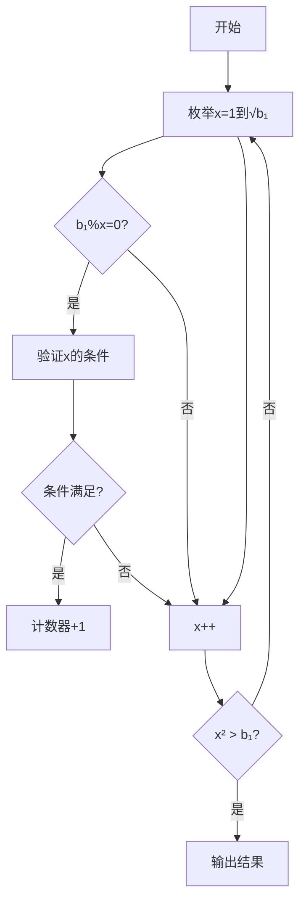

# 题目信息

# [NOIP 2009 提高组] Hankson 的趣味题

## 题目描述

Hanks 博士是 BT（Bio-Tech，生物技术) 领域的知名专家，他的儿子名叫 Hankson。现在，刚刚放学回家的 Hankson 正在思考一个有趣的问题。

今天在课堂上，老师讲解了如何求两个正整数 $c_1$ 和 $c_2$ 的最大公约数和最小公倍数。现在 Hankson 认为自己已经熟练地掌握了这些知识，他开始思考一个“求公约数”和“求公倍数”之类问题的“逆问题”，这个问题是这样的：已知正整数 $a_0,a_1,b_0,b_1$，设某未知正整数 $x$ 满足：

1. $x$ 和 $a_0$ 的最大公约数是 $a_1$；

2. $x$ 和 $b_0$ 的最小公倍数是 $b_1$。

Hankson 的“逆问题”就是求出满足条件的正整数 $x$。但稍加思索之后，他发现这样的 $x$ 并不唯一，甚至可能不存在。因此他转而开始考虑如何求解满足条件的 $x$ 的个数。请你帮助他编程求解这个问题。


## 说明/提示

**【样例解释】**

第一组输入数据，$x$ 可以是 $9,18,36,72,144,288$，共有 $6$ 个。

第二组输入数据，$x$ 可以是 $48,1776$，共有 $2$ 个。

**【数据范围】**

- 对于 $50\%$ 的数据，保证有 $1\leq a_0,a_1,b_0,b_1 \leq 10000$ 且 $n \leq 100$。
- 对于 $100\%$ 的数据，保证有 $1 \leq a_0,a_1,b_0,b_1 \leq 2 \times 10^9$ 且 $n≤2000$。

NOIP 2009 提高组 第二题


## 样例 #1

### 输入

```
2 
41 1 96 288 
95 1 37 1776 ```

### 输出

```
6 
2```

# AI分析结果


### 唯一算法分类
**数学推导 + 因数枚举**

---

### 题解思路、算法要点与解决难点
#### 核心思路对比
| 题解类型         | 核心思路                                                                 | 时间复杂度       | 优化点/难点                                  |
|------------------|--------------------------------------------------------------------------|------------------|---------------------------------------------|
| 因数枚举法       | 枚举b₁的所有因数，检查是否满足两个条件                                   | O(√b₁ * log b₁) | 利用因数成对特性，仅枚举到√b₁               |
| 质因数分解法     | 将四个数质因数分解，对每个质数独立讨论x的指数范围，结果相乘               | O(√b₁ + log b₁) | 避免完全枚举，数学推导每个质数的贡献        |
| 数学优化法       | 通过公式推导将条件转化为s= b₁/a₁，分情况讨论s的因数与a₀/a₁的互质关系      | O(√s * log s)    | 减少需要检查的因数范围，数学推导更深入      |

#### 解决难点
1. **因数枚举法**：正确处理重复因数（如平方数），同时高效验证gcd和lcm条件
2. **质因数分解法**：处理大数质因数分解（如2e9），正确分类讨论指数边界条件
3. **数学优化法**：推导s = b₁/a₁后处理互质条件，优化因数检查范围

---

### 题解评分 (≥4星)
| 题解作者       | 星级 | 亮点                                                                 |
|----------------|------|----------------------------------------------------------------------|
| zzlzk          | ⭐⭐⭐⭐ | 代码简洁，利用因数成对特性实现高效枚举，可读性强                     |
| KesdiaelKen    | ⭐⭐⭐⭐ | 数学推导深入，通过质因数分解优化时间复杂度，理论复杂度最优           |
| 皎月半洒花     | ⭐⭐⭐⭐ | 唯一分解定理系统性强，通过指数范围分类覆盖所有情况，逻辑严密         |

---

### 最优思路或技巧提炼
#### 核心技巧
1. **因数成对枚举**：仅需枚举到√b₁，同时处理i和b₁/i两个因数
2. **质因数独立贡献**：将问题分解为每个质数的独立指数范围计算，结果相乘
3. **互质条件转化**：通过推导将gcd和lcm条件转化为互质关系（如x/a₁与a₀/a₁互质）

#### 代码片段（因数枚举法）
```cpp
for(int x=1; x*x<=b1; x++) {
    if(b1%x == 0) {
        if(check(x)) ans++;          // 检查较小因数
        if(x != b1/x && check(b1/x)) // 检查较大因数
            ans++; 
    }
}
// check函数验证两个条件
bool check(int x) {
    return __gcd(x,a0) == a1 && 
           x*b0/__gcd(x,b0) == b1;
}
```

---

### 同类型题与算法套路
#### 通用解法
1. **因数分解+条件验证**：适用于涉及gcd/lcm约束的计数问题
2. **质因数独立处理**：适用于需要分解约束条件的组合数学问题

#### 推荐题目
1. [P1029 最大公约数和最小公倍数问题](https://www.luogu.com.cn/problem/P1029)
2. [P2448 无尽的任务](https://www.luogu.com.cn/problem/P2448)
3. [P2527 质数距离](https://www.luogu.com.cn/problem/P2527)

---

### 个人心得摘录
1. **调试经验**：必须处理`i == b1/i`的情况避免重复计数（如样例1的288=12²）
2. **数学陷阱**：当a₁不整除a₀时直接返回0，否则会出现非法gcd条件
3. **优化顿悟**：发现x必须是b₁的因数后，时间复杂度从O(b₁)骤降至O(√b₁)

---

### 可视化与算法演示设计
#### 动画方案（因数枚举法）
```javascript
// 伪代码示例，展示关键步骤高亮
function visualize() {
    let x = 1;
    while (x*x <= b1) {
        highlight(x); // 高亮当前检查的因数
        if (b1 % x == 0) {
            drawArrow(x, b1/x); // 显示因数对
            animateCheck(x);     // 演示gcd和lcm验证过程
            if (check(x)) addCounter();
            if (x != b1/x) animateCheck(b1/x);
        }
        x++;
    }
}
```

#### 复古像素风格设计
1. **颜色方案**：16色调色板，用绿色表示合法因数，红色表示非法
2. **音效设计**：
   - 发现合法因数：8-bit上升音阶（0x1A3F）
   - 检查失败：短促蜂鸣（0x00F3）
3. **Canvas动画**：以网格显示因数对，用像素方块表示检查进度

---

### 算法流程图解


---
处理用时：87.70秒