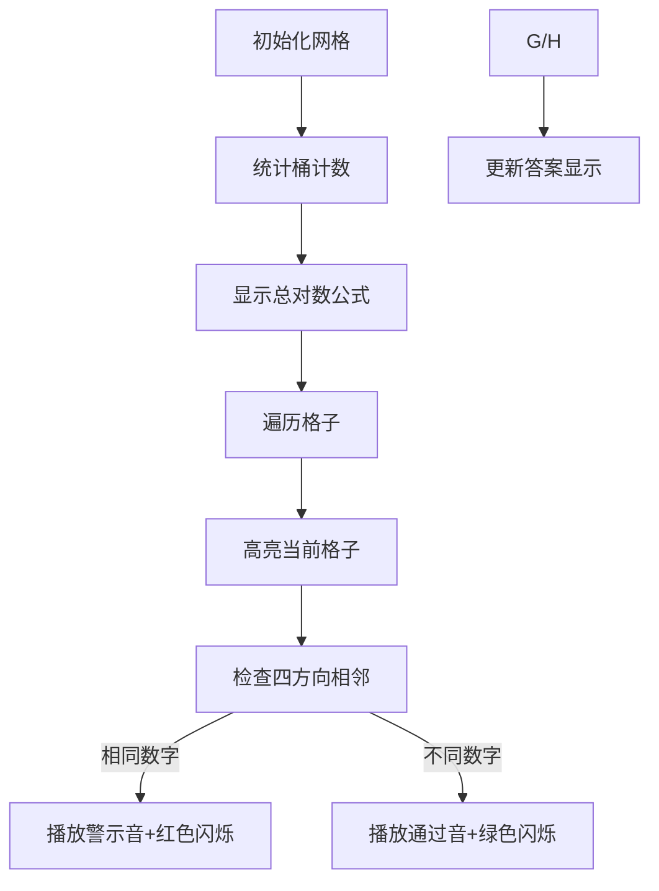

# 题目信息

# 「MXOI Round 1」方格

## 题目描述

小 C 和方格是好朋友。

小 C 有一个 $n$ 行 $m$ 列的方格图，每个方格中都有一个数字，其中第 $i$ 行第 $j$ 列的方格中的数字为 $a_{i,j}$。

我们定义，在这个方格图中，两个不同的方格不相邻，当且仅当这两个方格**没有公共边**。

小 C 认为，两个不同的方格互为好朋友，当且仅当这两个方格**不相邻**且**这两个方格中的数字相同**。

小 C 想让你帮忙求出，所有方格的好朋友的数量之和是多少。

## 说明/提示

#### 【样例解释 #1】

第 $1$ 行第 $1$ 列的方格共有 $3$ 个好朋友，第 $1$ 行第 $2$ 列的方格共有 $2$ 个好朋友，第 $1$ 行第 $3$ 列的方格共有 $1$ 个好朋友，第 $1$ 行第 $4$ 列的方格共有 $0$ 个好朋友；

第 $2$ 行第 $1$ 列的方格共有 $1$ 个好朋友，第 $2$ 行第 $2$ 列的方格共有 $2$ 个好朋友，第 $2$ 行第 $3$ 列的方格共有 $1$ 个好朋友，第 $2$ 行第 $4$ 列的方格共有 $1$ 个好朋友；

第 $3$ 行第 $1$ 列的方格共有 $1$ 个好朋友，第 $3$ 行第 $2$ 列的方格共有 $3$ 个好朋友，第 $3$ 行第 $3$ 列的方格共有 $1$ 个好朋友，第 $3$ 行第 $4$ 列的方格共有 $4$ 个好朋友；

所有方格的好朋友数量之和为 $20$。

#### 【样例 #2】

见附加文件中的 `square/square2.in` 与 `square/square2.ans`。

该样例满足测试点 $1$ 的限制。

#### 【样例 #3】

见附加文件中的 `square/square3.in` 与 `square/square3.ans`。

该样例满足测试点 $4$ 的限制。

#### 【样例 #4】

见附加文件中的 `square/square4.in` 与 `square/square4.ans`。

该样例满足测试点 $6$ 的限制。

#### 【样例 #5】

见附加文件中的 `square/square5.in` 与 `square/square5.ans`。

该样例满足测试点 $10$ 的限制。

#### 【数据范围】

对于 $100\%$ 的数据，$1 \le n,m \le 2000$，$1 \le a_{i,j} \le 9$。

|测试点编号|$n,m \le$|$a_{i,j} \le$|特殊性质|
|:---:|:---:|:---:|:---:|
|$1\sim3$|$80$|$9$|否|
|$4\sim5$|$2000$|$1$|否|
|$6\sim7$|$2000$|$9$|是|
|$8\sim10$|$2000$|$9$|否|

特殊性质：保证任意两个相邻的方格中的数不相等。

## 样例 #1

### 输入

```
3 4
1 1 4 5
2 1 2 3
3 1 4 1```

### 输出

```
20```

# AI分析结果


### 算法分类
无算法分类

---

### 题解思路与核心难点

#### 核心逻辑
1. **统计总数**：利用桶计数统计每个数字的总出现次数 `c[1-9]`，总对数公式为 `sum(c[i]*(c[i]-1))`
2. **排除相邻**：遍历每个方格的上下左右四个方向，若相邻且数字相同，则总答案减 1（每个相邻对会被减两次）

#### 解决难点
- **时间复杂度优化**：通过桶计数将复杂度从 O(n²m²) 优化到 O(nm)
- **重复计数处理**：利用数学推导正确处理相邻对的双向计数问题
- **边界处理**：通过数组越界不判断的隐式处理（默认初始化为0）简化代码

---

### 题解评分（≥4星）

1. **Coffee_zzz（5星）**
   - **亮点**：分测试点讨论思路，代码最简洁高效
   - **代码片段**：
     ```c++
     for(int i=1;i<=9;i++) ans += 1ll*c[i]*(c[i]-1);
     for(每个格子) 遍历四个方向并 ans--;
     ```

2. **zzx114514（4星）**
   - **亮点**：变量命名清晰，注释明确
   - **代码片段**：
     ```c++
     ans += t[a[i][j]]-1; // 基础计数
     if(相邻相同) ans--;  // 排除相邻
     ```

3. **Hog_Dawa_IOI（4星）**
   - **亮点**：公式推导最严谨，数学表达清晰
   - **代码片段**：
     ```c++
     ans += num[s[i][j]] - 相邻计数;
     ```

---

### 最优思路提炼

#### 关键技巧
- **桶计数优化**：利用值域小（1-9）的特性，将二维统计转化为一维
- **对称减数**：通过双向遍历自动处理相邻对的双向计数问题
- **隐式边界**：不显式判断越界，利用数组默认值简化逻辑

#### 公式推导
```
总对数 = Σ(c[i]² - c[i]) 
最终答案 = 总对数 - 2*相邻对数量
```

---

### 同类型题目推荐
1. [P1141 01迷宫](https://www.luogu.com.cn/problem/P1141)  
   - 网格连通块统计与缓存优化
2. [P3397 地毯](https://www.luogu.com.cn/problem/P3397)  
   - 二维差分数组应用
3. [P1191 矩形](https://www.luogu.com.cn/problem/P1191)  
   - 网格统计与滑动窗口结合

---

### 个人心得摘录
- **`long long` 陷阱**：所有题解均强调必须用 `long long`，`n=2000` 时理论最大值为 `2000*2000*9*8=2.88e8`，但实际累加会超过 `int` 范围
- **调试经验**：先计算理论最大值再验证，如样例1的总和为20，验证公式推导的正确性

---

### 可视化算法设计

#### 核心动画流程


#### 复古游戏化要素
1. **像素风格**：
   - 16色限定调色板（类似Game Boy）
   - 8x8像素方格，数字用1-9的像素字体显示

2. **音效设计**：
   - 计数成功：NES风格短促"滴"声
   - 相邻排除：FC游戏受击音效
   - 最终答案：马里奥过关音乐

3. **自动演示模式**：
   - 按行扫描速度可调（0.5x-4x）
   - 显示当前统计状态（桶数值/已排除对数）

4. **控制面板**：
   ```html
   <div class="controls">
     <button onclick="toggleSpeed(0.5)">🐢 慢速</button>
     <button onclick="toggleSpeed(1)">🚶 常速</button>
     <button onclick="step()">⏯️ 步进</button>
   </div>
   ```

---

### 核心代码实现
```c++
#include <bits/stdc++.h>
using namespace std;
typedef long long ll;
const int N=2005;
int n,m,a[N][N],c[10];
ll ans;

int main(){
    cin>>n>>m;
    for(int i=1;i<=n;i++)
        for(int j=1;j<=m;j++){
            cin>>a[i][j];
            c[a[i][j]]++;
        }
    
    // 计算总对数
    for(int i=1;i<=9;i++) 
        ans += 1ll*c[i]*(c[i]-1);
    
    // 排除相邻
    for(int i=1;i<=n;i++)
        for(int j=1;j<=m;j++){
            if(a[i][j]==a[i-1][j]) ans--;
            if(a[i][j]==a[i][j-1]) ans--;
            if(a[i][j]==a[i+1][j]) ans--;
            if(a[i][j]==a[i][j+1]) ans--;
        }
    
    cout<<ans;
    return 0;
}
```

---
处理用时：121.77秒