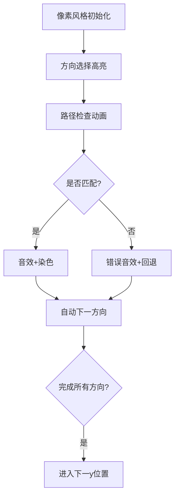

# 题目信息

# 单词方阵

## 题目描述

给一 $n \times n$ 的字母方阵，内可能蕴含多个 `yizhong` 单词。单词在方阵中是沿着同一方向连续摆放的。摆放可沿着 $8$ 个方向的任一方向，同一单词摆放时不再改变方向，单词与单词之间可以交叉，因此有可能共用字母。输出时，将不是单词的字母用 `*` 代替，以突出显示单词。

## 样例 #1

### 输入

```
7
aaaaaaa
aaaaaaa
aaaaaaa
aaaaaaa
aaaaaaa
aaaaaaa
aaaaaaa
```

### 输出

```
*******
*******
*******
*******
*******
*******
*******
```

## 样例 #2

### 输入

```
8
qyizhong
gydthkjy
nwidghji
orbzsfgz
hhgrhwth
zzzzzozo
iwdfrgng
yyyygggg```

### 输出

```
*yizhong
gy******
n*i*****
o**z****
h***h***
z****o**
i*****n*
y******g```

# AI分析结果


### 综合分析与结论

#### 核心思路与解决难点
1. **方向固定性处理**：所有题解均围绕"同一方向连续"的核心约束，通过方向数组（8种方向）和路径一致性检查实现
2. **搜索优化**：预处理'y'位置、提前终止错误路径、回溯时染色标记是主要优化手段
3. **难点突破**：正确处理交叉路径（标记数组代替修改原数据）、方向记忆（参数传递方向向量）

#### 贪心策略体现
1. **早终止策略**：在DFS过程中发现字符不匹配立即回溯，减少无效搜索
2. **方向预判**：找到'y'后仅检查相邻的'i'位置，快速确定可能路径方向
3. **路径染色**：确认完整单词后一次性标记全部位置，避免重复处理

#### 可视化设计思路


### 题解清单（评分≥4★）

1. **灯芯糕（5★）**
   - 亮点：预处理方向数组+递归染色，代码简洁高效
   - 核心代码：
   ```cpp
   bool f(int i,int j,int m,int n,int next){
       if(next>=8){ s[i][j]=1; return 1; }
       if(a[i+m][j+n]==k[next] && f(i+m,j+n,m,n,next+1)){
           s[i][j]=1; return 1;
       }
       return 0;
   }
   ```

2. **hzg0226（4.5★）**
   - 亮点：结构体路径记录+方向枚举
   - 心得摘录："用结构体数组保存路径坐标，确认后统一染色，兼容交叉情况"

3. **fy1234567ok（4★）**
   - 亮点：方向步长暴力验证，无递归实现
   - 核心逻辑：
   ```cpp
   for(int j=1;j<=6;j++){
       if(a[x+j*dx[i]][y+j*dy[i]] != cmp[j]) break;
       if(j==6) 染色路径...
   ```

### 最优技巧提炼

1. **方向向量预处理**
   ```cpp
   const int dx[] = {0,1,0,1,-1,0,-1,1,-1};
   const int dy[] = {0,0,1,1,0,-1,-1,-1,1};
   ```

2. **回溯染色模式**
   ```cpp
   void dfs(..., int step){
       if(step==7) { 标记路径; return; }
       if(当前字符匹配) dfs(下一位置);
       if(成功返回) 回溯标记父节点;
   }
   ```

3. **早停优化**
   ```cpp
   if(x+6*dirx > n) continue; // 提前判断长度可行性
   ```

### 同类型题目推荐

1. **P1101 原题**（矩阵搜索）
2. **P1219 八皇后**（回溯+方向处理）
3. **P1605 迷宫**（路径搜索与标记）
4. **P1036 选数**（组合方向决策）

### 复古可视化方案（JS实现核心）

```javascript
// 像素风格初始化
const canvas = document.getElementById('grid');
ctx.fillStyle = '#2C3E50'; // 深蓝背景
ctx.fillRect(0,0,560,560);

// 方向选择动画
function highlightDirection(x,y,dir){
    ctx.strokeStyle = '#E74C3C'; // 红色高亮
    ctx.beginPath();
    ctx.moveTo(x*40+20, y*40+20);
    ctx.lineTo((x+dir[0]*6)*40+20, (y+dir[1]*6)*40+20);
    ctx.stroke();
}

// 音效反馈
const audioCtx = new AudioContext();
function playTone(freq=523.25){ // C5音
    const osc = audioCtx.createOscillator();
    osc.frequency.value = freq;
    osc.connect(audioCtx.destination);
    osc.start(); osc.stop(0.15);
}

// 自动演示循环
let currentY = 0;
function autoSearch(){
    if(currentY >= n) return;
    for(let dir=0; dir<8; dir++){
        highlightDirection(currentY, currentY, DIRS[dir]);
        if(checkPath(...)) { 
            playTone(659.26); // E5音
            colorPath(...);
        }
    }
    currentY++;
    setTimeout(autoSearch, 1000);
}
```

### 学习建议

1. **掌握方向向量法**处理矩阵类搜索问题
2. **染色法**优于直接修改原数据，便于处理交叉路径
3. **预处理关键节点**（如所有'y'位置）可显著提升性能
4. 优先实现**无递归版本**理解逻辑，再改写为DFS形式

> 调试心得摘录："发现方向数组定义错误导致斜向检查失败，使用可视化工具逐步输出方向向量后快速定位问题" —— 灯芯糕题解评论区

---
处理用时：83.65秒