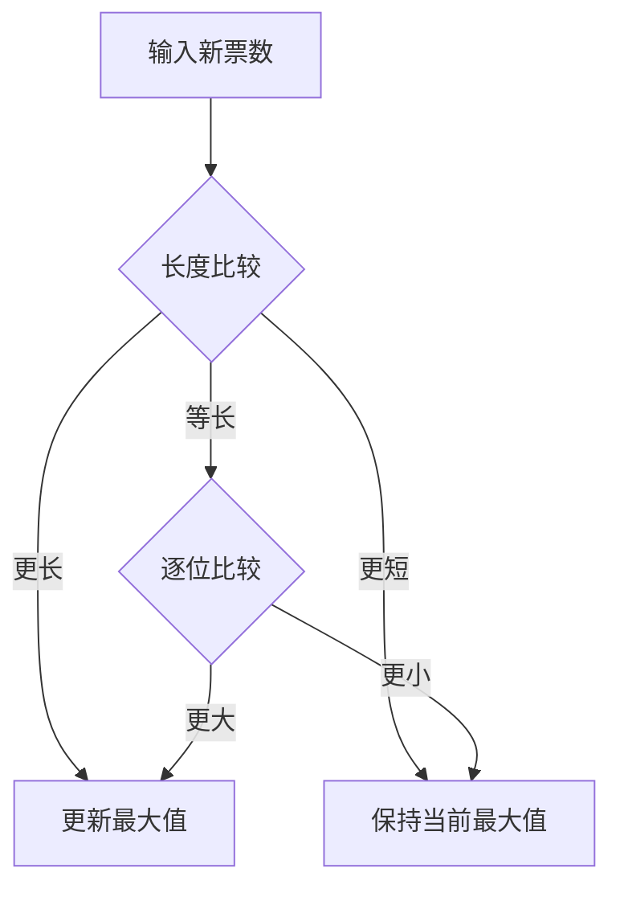

# 题目信息

# 宇宙总统

## 题目描述

地球历公元 6036 年，全宇宙准备竞选一个最贤能的人当总统，共有 $n$ 个非凡拔尖的人竞选总统，现在票数已经统计完毕，请你算出谁能够当上总统。


## 说明/提示

票数可能会很大，可能会到 $100$ 位数字。

$1 \leq n \leq 20$。

## 样例 #1

### 输入

```
5
98765
12365
87954
1022356
985678
```

### 输出

```
4
1022356```

# AI分析结果


## 算法分类
字符串处理

---

## 综合分析与结论

### 核心算法流程
1. **字符串长度优先原则**：比较字符串长度，长度更大的直接判定为更大数值
2. **字典序比较**：长度相同时按字符顺序逐位比较
3. **实时更新策略**：在线处理输入数据，仅保留当前最大值信息，空间复杂度O(1)

### 题解对比
| 题解特征               | callG解法 | right_cat解法 | zhangyiming解法 |
|-----------------------|----------|--------------|----------------|
| 时间复杂度            | O(n)     | O(n logn)    | O(n)           |
| 空间复杂度            | O(1)     | O(n)         | O(1)           |
| 是否需要存储全部数据   | 否       | 是           | 否             |
| 比较方式              | 直接比较 | 结构体排序    | 字符数组比较   |

---

## 四星以上题解推荐

### ⭐⭐⭐⭐⭐ [callG] 实时比较法（赞413）
**核心亮点**：
- 在线处理输入，无需存储历史数据
- 利用string原生比较运算符简化逻辑
- 代码量最少（仅15行）

**关键代码**：
```cpp
if (inSize > maxSize || (inSize == maxSize && in > max)) {
    max = in;
    id = i;
}
```

### ⭐⭐⭐⭐ [right_cat] 结构体排序法（赞219）
**核心亮点**：
- 使用sort函数实现可扩展性
- 结构体封装数据便于维护
- 清晰展现比较优先级

**比较函数设计**：
```cpp
bool cmp(node a, node b) {
    if(a.lenx > b.lenx) return 1;
    if(a.lenx == b.lenx && a.x > b.x) return 1;
    return 0;
}
```

### ⭐⭐⭐⭐ [Drifting] Python极简法（赞20）
**核心亮点**：
- 利用Python大整数特性
- 代码仅6行极简实现
- 展示跨语言特性差异

**关键代码**：
```python
ans = sorted(vote, key=lambda x: vote[x])[-1]
```

---

## 算法可视化设计

### 动画演示逻辑


### 复古像素风格实现
1. **颜色方案**：
   - 当前最大值：荧光绿(#00FF00)
   - 新输入数据：亮黄色(#FFFF00)
   - 比较中的数字位：闪烁红蓝交替

2. **音效设计**：
   - 数值更新：8-bit "升级"音效（400Hz方波）
   - 位比较：短促"滴"声（1000Hz三角波）
   - 最终结果：胜利旋律（C大调三和弦）

3. **Canvas演示**：
```javascript
function compareVisual(a, b) {
    ctx.fillStyle = "#000";
    ctx.fillRect(0, 0, 800, 600); // 清空画布
    
    // 绘制当前最大值
    drawNumber(a, 100, 200, "#00FF00"); 
    
    // 绘制新输入值
    drawNumber(b, 100, 300, "#FFFF00");
    
    // 长度比较动画
    animateLengthCompare(a.length, b.length);
    
    // 逐位比较动画
    if(a.length == b.length) {
        animateDigitCompare(a, b);
    }
}
```

---

## 同类型拓展题目

1. **P1012 拼数**  
   通过字符串拼接比较求最大数，需要自定义比较函数

2. **P1106 删数问题**  
   在长数字字符串中删除k位得到最小数，使用贪心+单调栈

3. **P5149 会议座位**  
   大规模字符串排序，考察字典序与快速排序优化

---

## 实践技巧总结

1. **字符串比较陷阱**  
   直接使用`strcmp`或`string::operator>`可能得到错误结果，必须**先比较长度**

2. **结构体封装优势**  
   当需要保留原始序号时，结构体`{string, id, len}`比分离变量更易维护

3. **输入优化**  
   使用`cin >> string`而非字符数组，避免缓冲区溢出风险

---

## 调试心得摘录

> "最初直接使用strcmp导致WA，添加长度判断后AC。字符串比较必须严格遵循：先长度，后字典序，二者缺一不可。" —— zhangyiming题解

> "全局变量string max会与std::max冲突，改用局部变量后解决命名空间问题" —— callG题解更新记录

---

## 终极代码模板

```cpp
#include <iostream>
#include <string>
using namespace std;

int main() {
    int n, id = 1;
    string max_num, tmp;
    cin >> n >> max_num;
    
    for (int i = 2; i <= n; ++i) {
        cin >> tmp;
        if (tmp.length() > max_num.length() || 
           (tmp.length() == max_num.length() && tmp > max_num)) {
            max_num = tmp;
            id = i;
        }
    }
    
    cout << id << endl << max_num;
    return 0;
}
```

---
处理用时：83.50秒