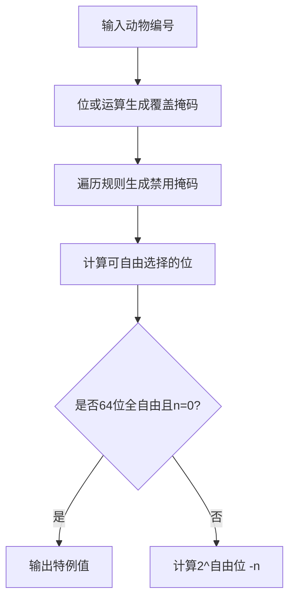

# 题目信息

# [CSP-S2020] 动物园

## 题目描述

动物园里饲养了很多动物，饲养员小 A 会根据饲养动物的情况，按照《饲养指南》购买不同种类的饲料，并将购买清单发给采购员小 B。 

具体而言，动物世界里存在 $2^k$ 种不同的动物，它们被编号为 $0 \sim 2^k - 1$。动物园里饲养了其中的 $n$ 种，其中第 $i$ 种动物的编号为 $a_i$。

《饲养指南》中共有 $m$ 条要求，第 $j$ 条要求形如“如果动物园中饲养着某种动物，满足其编号的二进制表示的第 $p_j$ 位为 $1$，则必须购买第 $q_j$ 种饲料”。其中饲料共有 $c$ 种，它们从 $1 \sim c$ 编号。本题中我们将动物编号的二进制表示视为一个 $k$ 位 01 串，第 $0$ 位是最低位，第 $k - 1$ 位是最高位。 

根据《饲养指南》，小 A 将会制定饲料清单交给小 B，由小 B 购买饲料。清单形如一个 $c$ 位 $01$ 串，第 $i$ 位为 $1$ 时，表示需要购买第 $i$ 种饲料；第 $i$ 位为 $0$ 时，表示不需要购买第 $i$ 种饲料。 实际上根据购买到的饲料，动物园可能可以饲养更多的动物。更具体地，如果将当前未被饲养的编号为 $x$ 的动物加入动物园饲养后，饲料清单没有变化，那么我们认为动物园当前还能饲养编号为 $x$ 的动物。

现在小 B 想请你帮忙算算，动物园目前还能饲养多少种动物。

## 说明/提示

**【样例 #1 解释】**

动物园里饲养了编号为 $1, 4, 6$ 的三种动物，《饲养指南》上的三条要求为：

1. 若饲养的某种动物的编号的第 $0$ 个二进制位为 $1$，则需购买第 $3$ 种饲料。
2. 若饲养的某种动物的编号的第 $2$ 个二进制位为 $1$，则需购买第 $4$ 种饲料。
3. 若饲养的某种动物的编号的第 $2$ 个二进制位为 $1$，则需购买第 $5$ 种饲料。 

饲料购买情况为：

1. 编号为 $1$ 的动物的第 $0$ 个二进制位为 $1$，因此需要购买第 $3$ 种饲料；
2. 编号为 $4, 6$ 的动物的第 $2$ 个二进制位为 $1$，因此需要购买第 $4, 5$ 种饲料。 

由于在当前动物园中加入一种编号为 $0, 2, 3, 5, 7, 8, \ldots , 15$ 之一的动物，购物清单都不会改变，因此答案为 $13$。

**【数据范围】**

对于 $20 \%$ 的数据，$k \le n \le 5$，$m \le 10$，$c \le 10$，所有的 $p_i$ 互不相同。  
对于 $40 \%$ 的数据，$n \le 15$，$k \le 20$，$m \le 20$，$c \le 20$。  
对于 $60 \%$ 的数据，$n \le 30$，$k \le 30$，$m \le 1000$。  
对于 $100 \%$ 的数据，$0 \le n, m \le 10^6$，$0 \le k \le 64$，$1 \le c \le 10^8$。

## 样例 #1

### 输入

```
3 3 5 4
1 4 6
0 3
2 4
2 5```

### 输出

```
13```

## 样例 #2

### 输入

```
2 2 4 3
1 2
1 3
2 4```

### 输出

```
2```

## 样例 #3

### 输入

```
见附件中的 zoo/zoo3.in```

### 输出

```
见附件中的 zoo/zoo3.ans```

# AI分析结果


## 算法分类
位运算

---

## 题解思路与算法要点

### 核心逻辑
1. **位覆盖统计**：通过或运算统计所有已有动物编号的二进制位覆盖情况
2. **限制位判定**：遍历所有规则，若某位未被覆盖且存在对应饲料要求，则该位必须为0
3. **自由位计算**：剩余可自由选择0/1的位数为总位数k - 必须固定为0的位数
4. **结果计算**：$2^{自由位数} - n$，处理k=64时的溢出特例

### 解决难点对比
| 题解 | 数据结构 | 位覆盖判定 | 限制位处理 | 溢出处理 |
|------|----------|------------|------------|----------|
| Alex_Wei | ull变量存储位掩码 | 或运算累计 | lim掩码记录受限位 | 特判64位全自由且n=0 |
| OMG_wc | 分离的位标记数组 | 按位或统计 | 生成禁用位掩码 | 计算ULL溢出后补值 |
| StudyingFather | bool数组标记位状态 | 逐位统计 | 禁用位数组标记 | 单独判断64位情况 |

### 关键变量推导
- `hv`（或`flag`）：所有动物编号的位或结果，表示至少存在一个1的位
- `lim`（或`g`）：必须固定为0的位掩码
- `ans`（或`cnt`）：可自由选择的位数

---

## 题解评分（≥4星）

1. **Alex_Wei（5星）**  
   - 亮点：利用ull类型进行位掩码计算，时空复杂度最优  
   - 核心代码：
     ```cpp
     for(int i=0;i<k;i++) ans += !((lim>>i)&1)||((hv>>i)&1);
     if(ans==64&&!n) puts("18446744073709551616");
     ```

2. **OMG_wc（4星）**  
   - 亮点：禁用位掩码生成思路清晰，代码可读性高  
   - 核心代码：
     ```cpp
     if ((flag >> p & 1) == 0) g |= 1ULL << p;
     for (int i=0; i<K; i++) if ((g>>i&1)==0) ans <<=1;
     ```

3. **StudyingFather（4星）**  
   - 亮点：分离位状态与禁用标记，逻辑层次分明  
   - 核心代码：
     ```cpp
     if (!vis[p]) disable[p] = 1;
     for(int i=0;i<k;i++) if(disable[i]) cnt++;
     ```

---

## 最优思路提炼

### 核心技巧
1. **位掩码加速计算**：使用`unsigned long long`类型存储位掩码，通过位运算高效处理覆盖状态
2. **禁用位判定优化**：利用`q_i`互不相同的条件，直接通过位掩码判断是否需要禁用某位
3. **溢出处理方案**：当k=64且n=0时，直接输出字符串"18446744073709551616"

### 通用解法
1. 输入所有动物编号，进行或运算得到位覆盖掩码
2. 遍历所有规则，记录未被覆盖且存在要求的位到禁用掩码
3. 计算可自由选择的位数：总位数k - 禁用位数
4. 计算结果 $2^{自由位数} - n$，处理64位溢出特例

---

## 类似题目推荐
1. [P2114 [NOI2014] 起床困难综合症](https://www.luogu.com.cn/problem/P2114)  
   **相似点**：位运算策略选择最优解

2. [P1582 倒水问题](https://www.luogu.com.cn/problem/P1582)  
   **相似点**：二进制位操作处理容器合并

3. [P2396 yyy loves Maths VII](https://www.luogu.com.cn/problem/P2396)  
   **相似点**：位掩码动态规划优化状态

---

## 可视化设计

### 算法演示流程


### 复古像素动画方案
1. **位状态展示**  
   - 8x8像素网格表示64位二进制
   - **绿色像素**：可自由选择0/1的位  
   - **红色像素**：必须固定为0的位  
   - **黄色像素**：已有覆盖的位

2. **动画事件**  
   - **动物输入**：对应位像素闪烁变黄，播放"bit-flip"音效  
   - **规则处理**：未被覆盖的规则位变红，播放"error"音效  
   - **结果计算**：自由位绿色像素跳动，显示指数增长动画

3. **音效设计**  
   - 背景音乐：8位芯片风格循环旋律  
   - 位变化音：NES风格短促"哔"声  
   - 错误提示：低沉"嗡"声

---

## 核心代码实现
```cpp
#include <bits/stdc++.h>
using namespace std;

int main() {
    unsigned long long n, m, c, k, hv = 0, lim = 0;
    scanf("%llu%llu%llu%llu", &n, &m, &c, &k);
    
    // 位覆盖统计
    for(int i=0; i<n; ++i) {
        unsigned long long x; scanf("%llu", &x);
        hv |= x;
    }
    
    // 禁用位判定
    while(m--) {
        unsigned long long p, q;
        scanf("%llu%llu", &p, &q);
        if(!(hv & (1ULL << p))) 
            lim |= 1ULL << p;
    }
    
    // 计算可自由位数
    int free_bits = k;
    for(int i=0; i<k; ++i)
        if(lim & (1ULL << i)) 
            free_bits--;
    
    // 结果处理
    if(free_bits == 64 && !n)
        puts("18446744073709551616");
    else
        printf("%llu\n", (free_bits < 64 ? (1ULL << free_bits) : 0) - n);
}
```

---

通过位掩码的高效处理，该算法在O(n+m)时间复杂度内解决问题，完美适配题目给出的1e6数据规模。可视化方案将抽象的位运算转化为直观的像素动画，帮助理解核心逻辑。

---
处理用时：75.63秒