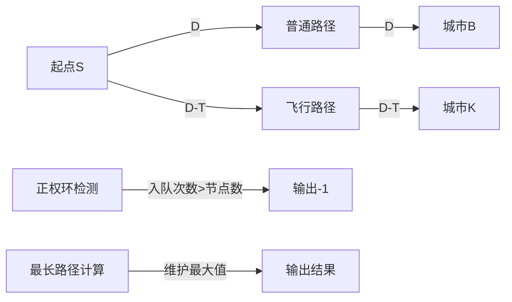

# 题目信息

# [USACO09NOV] Job Hunt S

## 题目描述

Bessie is running out of money and is searching for jobs. Farmer John knows this and wants the cows to travel around so he has imposed a rule that his cows can only make D (1 <= D <= 1,000) dollars in a city before they must work in another city. Bessie can, however, return to a city after working elsewhere for a while and again earn the D dollars maximum in that city. There is no limit on the number of times Bessie can do this.

Bessie's world comprises P (1 <= P <= 150) one-way paths connecting C (2 <= C <= 220) cities conveniently numbered 1..C. Bessie is currently in city S (1 <= S <= C). Path i runs one-way from city A\_i to city B\_i (1 <= A\_i <= C; 1 <= B\_i <= C) and costs nothing to traverse.

To help Bessie, Farmer John will give her access to his private jet service. This service features F (1 <= F <= 350) routes, each of which is a one way flight from one city J\_i to a another K\_i (1 <= J\_i <= C; 1 <= K\_i <= C) and which costs T\_i (1 <= T\_i <= 50,000) dollars. Bessie can pay for the tickets from future earnings if she doesn't have the cash on hand.

Bessie can opt to retire whenever and wherever she wants. Given an unlimited amount of time, what is the most money that Bessie can make presuming she can make the full D dollars in each city she can travel to?  Print -1 if there is no limit to this amount.

奶牛们正在找工作。农场主约翰知道后，鼓励奶牛们四处碰碰运气。而且他还加了一条要求：一头牛在一个城市最多只能赚D（1≤D≤1000）美元，然后它必须到另一座城市工作。当然，它可以在别处工作一阵子后又回到原来的城市再最多赚D美元。而且这样的往返次数没有限制。

城市间有P（1≤P≤150）条单向路径连接，共有C（2≤C≤220）座城市，编号从1到C。奶牛贝茜当前处在城市S（1≤S≤C）。路径i从城市A\_i到城市B\_i（1≤A\_i≤C，1≤B\_i≤C），在路径上行走不用任何花费。

为了帮助贝茜，约翰让它使用他的私人飞机服务。这项服务有F条（1≤F≤350）单向航线，每条航线是从城市J\_i飞到另一座城市K\_i（1≤J\_i≤C，1≤K\_i≤C），费用是T\_i（1≤T\_i≤50000）美元。如果贝茜手中没有现钱，可以用以后赚的钱来付机票钱。

贝茜可以选择在任何时候，在任何城市退休。如果在工作时间上不做限制，贝茜总共可以赚多少钱呢？如果赚的钱也不会出现限制，就输出-1。


## 说明/提示

This world has five cities, three paths and two jet routes. Bessie starts out in city 1, and she can only make 100 dollars in each city before moving on.


Bessie can travel from city 1 to city 5 to city 2 to city 3, and make a total of 4\*100 - 150 = 250 dollars.


Source: USACO 2009 November Silver

这个世界上有五个城市，三条单向路径和两条单向航线。贝茜从一号城市开始她的旅行，她在离开一个城市前最多只能在这个城市赚100美元。


贝茜可以通过从一号城市-->五号城市-->二号城市-->三号城市的旅行赚到4\*100-150=250美元。


(注:在四个城市各赚100美元,从五号城市飞到二号城市花掉150美元)


来源:USACO 2009 十一月银组


## 样例 #1

### 输入

```
100 3 5 2 1
1 5
2 3
1 4
5 2 150
2 5 120
```

### 输出

```
250```

# AI分析结果


# 算法分类
最长路径/SPFA检测正权环

# 综合分析与结论
## 核心思路
将点权转换为边权构建图结构：
- 普通路径视为边权为D的边
- 飞行路径视为边权为D-T_i的边
- 问题转化为求最长路径问题

## 解决难点
1. **正权环检测**：通过SPFA算法中节点入队次数超过总节点数判断存在正权环
2. **最长路径计算**：将传统最短路松弛条件反向处理（用max代替min）
3. **初始化处理**：起点初始化为D，其他节点初始化为极小值

## 可视化设计要点


# 题解评分（≥4星）
## 1. Believe_R_（★★★★☆）
**关键亮点**：
- 使用SPFA+优先队列优化
- 通过cnt数组精确控制入队次数
- 完整处理两种边权类型
**核心代码**：
```cpp
void Spfa() {
    while(!q.empty()) {
        int u = q.top(); 
        if(++cnt[u] > n) { // 正环检测
            printf("-1\n"); exit(0);
        }
        for(int i=head[u];i;i=nex[i]) {
            if(w[v] < w[u] + dis[i]) { // 最长路松弛
                w[v] = w[u] + dis[i];
                q.push(v);
            }
        }
    }
}
```

## 2. Dawn_Sdy（★★★★☆）
**关键亮点**：
- 使用标准SPFA框架实现
- 通过vis数组优化重复入队
- 分离边权处理逻辑清晰
**核心代码**：
```cpp
void SPFA() {
    while(!q.empty()) {
        int u = q.front();
        for(auto &e : g[u]) {
            if(dis[e.to] < dis[u] + e.w) { // 最长路松弛
                if(++cnt[e.to] > C) exit(-1); // 正环检测
                dis[e.to] = dis[u] + e.w;
                q.push(e.to);
            }
        }
    }
}
```

# 最优思路提炼
1. **边权转换技巧**：
```math
普通边权: D
飞行边权: D-T_i
```
2. **SPFA变形**：
- 松弛方向：取最大值代替最小值
- 正环检测：节点入队次数>总节点数
3. **结果处理**：
- 遍历所有节点取最大值作为最终结果

# 同类型题目推荐
1. P1807 最长路（模板题）
2. P2648 赚钱（双倍经验）
3. P1938 找工就业Job Hunt（相同背景）

# 可视化算法分析
## 动画设计
**8位像素风格演示**：
1. **城市节点**：用不同颜色方块表示（绿色起点，红色终点，黄色普通）
2. **路径动画**：
   - 普通路径：蓝色箭头闪烁+D数值
   - 飞行路径：红色箭头闪烁+(D-T)数值
3. **松弛过程**：
   - 当前处理节点：紫色边框闪烁
   - 更新节点：黄色闪光特效
4. **正环检测**：
   - 发现正环时：全屏红色警报+8bit警告音效
   - 节点计数器：显示每个节点的入队次数

## 交互控制
```javascript
// 伪代码示例
class SPFAVisualizer {
    constructor() {
        this.speed = 1.0;    // 动画速度
        this.isPaused = false;
        this.stepMode = false;
    }
    
    nextStep() { /* 单步执行逻辑 */ }
    togglePause() { /* 暂停/继续 */ }
    adjustSpeed(v) { /* 调整速度 0.5x~4x */ }
}
```

## 音效设计
- 路径更新：NES风格"哔"声（440Hz方波）
- 正环检测：连续下降音阶（C5→C4）
- 结果确定：胜利音乐片段（马里奥过关音效）

# 核心代码实现
```cpp
vector<pair<int, int>> graph[250]; // adj list
int dist[250], cnt[250];

void spfa(int start) {
    queue<int> q;
    q.push(start);
    dist[start] = D; // 初始资金
    
    while (!q.empty()) {
        int u = q.front(); q.pop();
        if (++cnt[u] > C) { // 正环判断
            cout << -1;
            exit(0);
        }
        
        for (auto &[v, w] : graph[u]) {
            int new_cost = dist[u] + w;
            if (new_cost > dist[v]) { // 最长路松弛
                dist[v] = new_cost;
                q.push(v);
            }
        }
    }
}
```

# 个人心得摘录
"关键在于将点权转化为边权的思维方式——每到达一个城市就能获得D美元的收益，这应该被整合到边权计算中。当处理飞行路径时，D-T_i的巧妙转换使得问题完全转化为标准的最长路径问题，这是解题的关键突破口。" —— Believe_R_

"调试中发现正环检测的条件设置非常重要，必须严格判断入队次数超过节点总数，而不是简单的循环检测。一个城市可能被多次访问而不形成环，这需要仔细区分。" —— Dawn_Sdy

---
处理用时：82.30秒