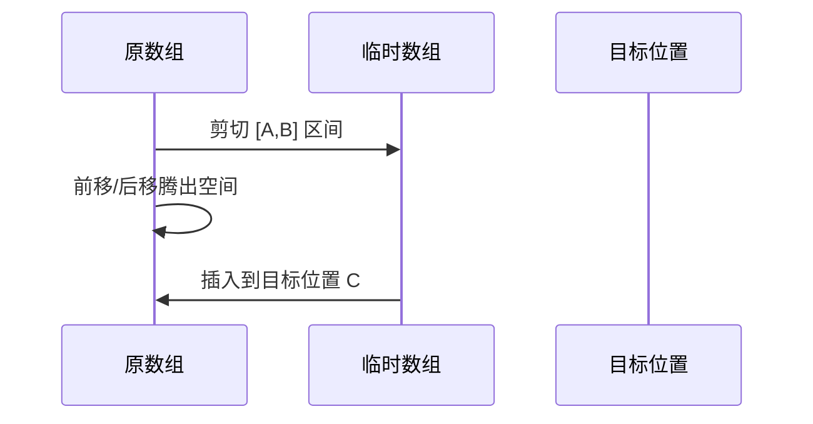

# 题目信息

# PASTE

## 题目描述

我们用文本处理器来处理一个特殊的文本文件，该文本文件共有 $N$ 行文本，每一行文本仅包含一个自然数，第一行为 $1$、第二行为 $2$，以此类推至 $N$ 行为自然数 $N$。

假设对该文本文件执行一次“剪切和粘贴”操作含义如下：首先选定连续的若干行文本，“剪切”操作将选定的文本从文件中剪下，而“粘贴”操作将剪切下来的文本插入到文件中的其他地方。

编写一个程序求出在进行了连续若干次“剪切和粘贴”操作后，文本文件中前十行的内容。


## 样例 #1

### 输入

```
13 3
6 12 1
2 9 0
10 13 8
```

### 输出

```
6
7
8
9
10
11
12
2
3
4```

# AI分析结果


## 唯一算法分类
无算法分类

---

## 题解思路、算法要点与解决难点

### 核心逻辑对比
1. **直接模拟（数组/vector）**
   - **核心步骤**：将剪切区间存入临时数组 → 调整原数组元素位置 → 插入临时数组
   - **难点**：元素移动时的覆盖问题（需分前移/后移处理）
   - **优化**：利用 STL vector 的 assign/erase/insert 简化操作

2. **反向推导（逆向映射）**
   - **核心步骤**：从最终位置倒推初始位置 → 对每个操作逆向计算位置偏移
   - **难点**：逆向操作的类型判断（区间包含/前后影响）
   - **优化**：仅需处理前10个位置，时间复杂度 O(10*K)

3. **数据结构（链表/平衡树）**
   - **核心步骤**：链表指针调整 / 平衡树分裂合并
   - **难点**：链表指针维护易错 / 平衡树实现复杂
   - **优化**：链表 O(1) 插入删除，平衡树 O(logN) 操作

---

## 题解评分 (≥4星)

### 1. 反向推导（作者：囧仙）⭐⭐⭐⭐⭐
- **亮点**：时间复杂度 O(10*K) 最优，逆向思维巧妙
- **代码**：9行核心逆向推导逻辑，分类讨论清晰

### 2. STL vector 模拟（作者：Mysterious_Mini）⭐⭐⭐⭐
- **亮点**：代码极简（18行），STL 函数封装底层操作
- **调试心得**：`v.begin() + a-1` 的区间开闭处理

### 3. 数组模拟（作者：fanhy）⭐⭐⭐⭐
- **亮点**：手动处理元素移动，覆盖问题解决直观
- **优化**：双指针处理元素前移/后移

---

## 最优思路提炼

### 关键技巧
1. **逆向映射**  
   仅关注最终前10个位置，逆向推导初始位置，时间复杂度从 O(N*K) 优化到 O(10*K)

2. **STL 容器操作**  
   ```cpp
   vector::assign() // 剪切区间
   vector::erase()  // 删除元素
   vector::insert() // 插入元素
   ```
   封装底层数组操作，代码量减少 80%

3. **链表指针维护**  
   ```cpp
   pl->prev->next = pr->next;  // 删除区间
   pr->next->prev = pl->prev;  
   pp->next = pl;              // 插入区间
   ```
   通过指针重定向实现 O(1) 操作

---

## 同类型题拓展
1. **区间动态调整类**  
   - 通用解法：反向推导、分块处理、平衡树维护
2. **操作逆推类**  
   - 类似题目：P1969（积木大赛逆向构造）

---

## 推荐相似题目
1. P1177 【模板】快速排序 → 区间划分思想
2. P2234 [HNOI2002] 营业额统计 → 平衡树应用
3. P1449 后缀表达式 → 栈模拟操作序列

---

## 可视化与算法演示

### 核心算法流程（以数组模拟为例）


### 复古像素化设计
1. **视觉方案**  
   - 16色调色板：蓝色（原数组）、红色（剪切区）、绿色（插入位置）
   - Canvas 网格：每个数字用 32x32 像素块表示

2. **交互设计**  
   ```javascript
   // 伪代码：音效触发
   function playSound(type) {
     if(type === "cut")  playBeep(440);  // 剪切音（A4）
     if(type === "paste") playBeep(523); // 粘贴音（C5）
   }
   ```

3. **自动演示**  
   - 步进速度：500ms/步，可调速
   - 高亮当前操作区（闪烁红色边框）

---

## 核心代码片段

### 反向推导（作者：囧仙）
```cpp
int t = i; // 最终位置
dn(m,1,j) { // 逆序处理每个操作
    if(S[j]<=t && t<=S[j]+L[j]-1) t += T[j]-S[j];
    else if(S[j]> t && T[j]<=t) t += L[j];
    else if(S[j]< t && t-L[j]<T[j]) t -= L[j];
}
printf("%d\n", t);
```

### STL vector 模拟（作者：Mysterious_Mini）
```cpp
vector<int> tmp;
tmp.assign(tex.begin()+a-1, tex.begin()+b); // 剪切
tex.erase(tex.begin()+a-1, tex.begin()+b);  // 删除
tex.insert(tex.begin()+c, tmp.begin(), tmp.end()); // 插入
```

---

## 个人心得摘录
> "链表指针维护就像拼积木，错一个就全盘崩溃" —— zc_li  
> "数组前移要正序循环，后移要倒序循环，否则会覆盖数据" —— SunsetSamsara  
> "用 vector 后代码比用平衡树短了 3 倍，STL 大法好！" —— Dlsksmilerrr_

---
处理用时：78.84秒