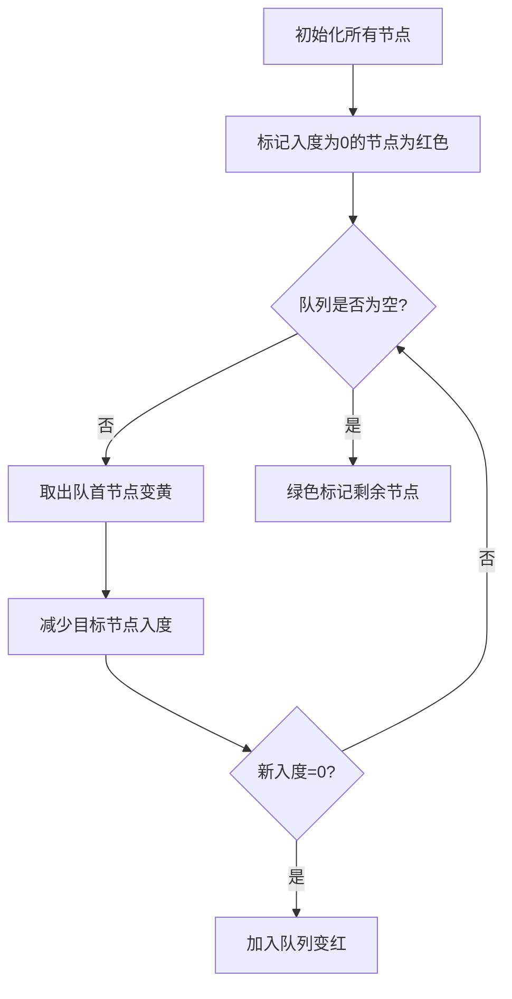

# 题目信息

# [USACO17DEC] The Bovine Shuffle S

## 题目描述

Farmer John 坚信快乐的奶牛能产更多的奶，因此他在谷仓里安装了一个巨大的迪斯科球，并计划教他的奶牛跳舞！

在查阅了流行的奶牛舞蹈后，Farmer John 决定教他的奶牛“Bovine Shuffle”。Bovine Shuffle 包括他的 $N$ 头奶牛（$1 \leq N \leq 100,000$）以某种顺序排成一行，然后进行连续的“洗牌”，每次洗牌可能会重新排列奶牛的顺序。为了让奶牛更容易找到自己的位置，Farmer John 为他的奶牛队伍标记了位置 $1 \ldots N$，因此队伍中的第一头奶牛位于位置 1，第二头位于位置 2，依此类推，直到位置 $N$。

一次洗牌由 $N$ 个数字 $a_1 \ldots a_N$ 描述，其中位于位置 $i$ 的奶牛在洗牌期间移动到位置 $a_i$（因此，每个 $a_i$ 都在 $1 \ldots N$ 范围内）。每头奶牛在洗牌期间都会移动到它的新位置。不幸的是，所有的 $a_i$ 不一定互不相同，因此多只奶牛可能会在洗牌期间尝试移动到同一位置，之后它们将在所有剩余的洗牌中一起移动。

Farmer John 注意到，无论进行多少次洗牌，他的队伍中某些位置始终会有奶牛。请帮助他计算这样的位置数量。

## 样例 #1

### 输入

```
4
3 2 1 3```

### 输出

```
3
```

# AI分析结果


## 唯一算法分类
拓扑排序/环检测

## 综合分析与结论
### 核心思路
将位置关系建模为有向图，每个位置指向其变换后的位置。经过无限次变换后，只有环上的位置会保留奶牛。通过拓扑排序去除所有不在环上的节点，剩余环节点的数量即为答案。

### 核心难点
1. 动态入度调整：不能仅凭初始入度判断，需要持续维护入度变化
2. 环的准确检测：需区分简单环、自环和复杂环结构
3. 大规模数据处理：需处理1e5级别的数据，要求O(n)时间复杂度

### 可视化设计要点
1. **颜色标记**：红色表示入度0节点，黄色表示待处理节点，绿色表示最终保留的环节点
2. **动态队列**：可视化展示队列处理入度0节点的过程
3. **入度变化动画**：用箭头和数字实时显示节点入度变化
4. **复古像素风格**：
   - 8-bit风格节点：每个节点显示为16x16像素方块
   - Chiptune音效：处理节点时播放NES风格音效
   - 自动演示模式：按空格键切换自动/手动模式

## 题解清单（≥4星）
1. **QAQ永动机（5星）**
   - 亮点：完整拓扑实现，详细错误案例分析
   - 代码：队列处理入度0节点，O(n)时间复杂度
   - 心得：通过错误样例修正拓扑思路

2. **0xFF（4星）**
   - 亮点：清晰的拓扑排序步骤说明
   - 代码：标准队列实现，注释规范

3. **Kirisame_Marisa_（4星）**
   - 亮点：环长度和的数学证明
   - 代码：DFS找环实现，适用较小规模数据

## 最优思路与代码实现
### 关键代码（拓扑排序核心）
```cpp
int in[N], a[N], ans;
queue<int> q;

// 初始化入度
for(int i=1; i<=n; i++) in[a[i]]++;

// 拓扑排序
for(int i=1; i<=n; i++) 
    if(!in[i]) q.push(i);
while(!q.empty()) {
    int u = q.front(); q.pop();
    if(--in[a[u]] == 0) q.push(a[u]);
}

// 统计结果
for(int i=1; i<=n; i++)
    ans += (in[i] != 0);
```

### 核心思想
1. **入度维护**：通过队列动态维护入度为0的节点
2. **环保留原理**：拓扑排序后剩余节点的入度必然属于环结构
3. **空间优化**：仅需存储a[]和in[]两个数组

## 相似题目推荐
1. **P2661 信息传递** - 最小环检测
2. **P2746 [USACO5.3] 校园网** - 强连通分量应用
3. **P1137 旅行计划** - 拓扑排序+DP

## 可视化方案设计
### 动画演示流程


### 复古游戏化要素
1. **像素绘制**：Canvas绘制16x16节点网格，每帧更新颜色
2. **音效触发**：
   - 节点入队：8-bit "beep"声（440Hz方波）
   - 找到环：胜利音效（快速上升琶音）
3. **自动演示**：
   ```javascript
   function autoStep() {
       if(queue.length > 0) {
           processNode();
           setTimeout(autoStep, 500);
       } else {
           playVictorySound();
       }
   }
   ```

## 总结提升
本题的核心在于将实际问题转化为图论模型。当遇到涉及重复变换/状态转移的问题时，可以优先考虑：是否形成闭环？如何检测稳定状态？拓扑排序在处理这类单向依赖问题时具有普适性，其变体可应用于任务调度、依赖解析等多个领域。

---
处理用时：64.28秒