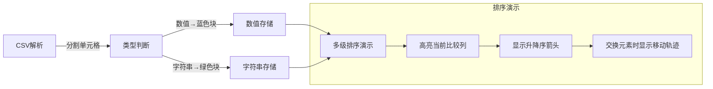

# 题目信息

# [信息与未来 2024] 数据排序

## 题目描述

在计算机世界中，“表格”是一种简单、基础而且十分通用的数据结构，在数据库、人工智能等领域中都有广泛的应用。表格由若干行、若干列的单元格组成：

| Name     | p1   | p2   | p3   | Score |
| :------- | :--- | ---- | ---- | ----- |
| ZhangSan | 40   | 30   | 28   | 98    |
| LiSi     | 40   | 28   | 30   | 98    |
| WangWu   | 40   | 25   | 20   | 85    |

CSV (Comma-Separated Values) 是一种常用的表格格式。Dr. X 需要你编程处理简化的 CSV 文
件，格式规定如下：

- CSV 文件包含 $n$ 行数据，其中第一行是标题行。
- CSV 文件每行一个字符串，对应了表格的一行。行中的单元格由**半角逗号**分隔。
- 每个单元格至少包含一个字符。单元格有两种类型：
  - **数值单元格**：由至少一个数字字符 $(0\sim 9)$ 组成。
  - **字符串单元格**：由数字字符 $(0\sim 9)$ 和大小写字母 $(\tt{a\sim z},\tt{A\sim Z})$ 组成,且至少包含一个字母。

- 标题行的所有单元格都是字符串单元格，且互不相同。标题行中包含了列的名称。

以下是一个 CSV 文件的示例：

```
Name,p1,p2,p3,Score
ZhangSan,40,30,28,98
LiSi,40,28,30,98
WangWu,40,25,20,85
```

你的任务是**根据指定的列为表格中的行排序**。例如根据 `Score- , Name+ , p3-` 排序意味着：

- 优先按 Score 列从大到小排序。Score 列都是数值单元格，因此按数值排序。

- 如果 Score 列相同，按 Name 列从小到大排序。Name 列都是字符串单元格，因此按照字典排序。

- 如果 Score 和 Name 列都相同，按 p3 列从大到小排序。p3 列都是数值单元格，因此按数
  值排序。

我们保证 CSV 文件每一行的单元格数量相同，且除标题行外，**每一列要么全是数值单元格，要么全是字符串单元格**。

## 说明/提示

对于 $100\%$ 的数据，满足 $1 \leq n \leq 100$，表格不超过 $10$ 列，字符串单元格不超过 $16$ 个字符，且数值单元格中的数值是 $0$ 到 $10^4$ 之间的整数。

>本题原始满分为 $20\text{pts}$。

## 样例 #1

### 输入

```
4
Name,p1,p2,p3,Score
ZhangSan,40,30,28,98
LiSi,40,28,30,98
WangWu,40,25,20,85
3
Score-
Name+
p3-```

### 输出

```
Name,p1,p2,p3,Score
LiSi,40,28,30,98
ZhangSan,40,30,28,98
WangWu,40,25,20,85```

# AI分析结果


### 算法分类
模拟 + 多级排序

---

### 题解思路与解决难点分析

#### 核心难点
1. **CSV解析与类型判断**：需正确分割单元格，并区分数值型（全数字）和字符串型（含字母）
2. **多级排序**：按指定顺序比较多个字段，处理不同类型数据的比较逻辑
3. **稳定排序**：当所有排序条件相同时需保持输入顺序

#### 关键实现对比
| 题解方案                     | 数据结构                     | 类型判断方式               | 排序稳定性实现           |
|------------------------------|------------------------------|--------------------------|--------------------------|
| FFTotoro (variant)          | `vector<variant<int,string>>` | 解析时检查全数字          | `stable_sort` + 返回false|
| 沉石鱼惊旋 (结构体分类型存储) | 结构体存储数值/字符串         | 预处理每列类型            | 记录原始ID               |
| xiaoshumiao (统一字符串存储)  | 字符串数组 + 类型标记         | 比较时动态判断类型        | `stable_sort`            |

#### 创新点提炼
- **类型统一存储**：使用 `variant` 或结构体分类型存储，避免重复类型判断
- **排序条件预解析**：将排序规则转换为（列索引，排序方向）的元组数组
- **字典序数值比较**：部分题解采用先长度后字典序的方式比较字符串形式的数值

---

### 题解评分（≥4★）

1. **FFTotoro（5★）**
   - 亮点：使用 `variant` 优雅处理类型，`stable_sort` 保证稳定性
   - 代码：[核心片段]
   ```cpp
   stable_sort(T.begin(),T.end(),[&](auto x,auto y){
     for(auto [a,s]:C)
       if(x[a]!=y[a])return s?x[a]<y[a]:x[a]>y[a];
     return false; // 保证稳定
   });
   ```

2. **沉石鱼惊旋（4★）**
   - 亮点：结构体分类型存储，原始ID保序
   - 代码：[比较逻辑]
   ```cpp
   bool ccmp(vector<node> a, vector<node> b) {
     for (排序条件) {
       if (数值列) return 升降序比较;
       else return 字符串比较;
     }
     return a[0].x < b[0].x; // 原始顺序
   }
   ```

3. **Ag2WO4（Python版）（4★）**
   - 亮点：单行lambda实现多级排序，利用ASCII码转换实现升降序
   ```python
   sorted(b, key=lambda p: [
      数值处理 if 数值 else 字符串哈希,
      *(44-ord(排序方向)) # 升降序转换
   ])
   ```

---

### 最优思路与技巧

#### 核心实现流程
1. **预处理阶段**：
   ```mermaid
   graph TD
     A[解析标题行] --> B[建立列名到索引的映射]
     B --> C[解析数据行并判断列类型]
     C --> D[预转换数值类型]
   ```

2. **排序条件处理**：
   ```cpp
   vector<pair<列索引, 升降序标记>> rules = {
     {score列索引, '-'}, 
     {name列索引, '+'},
     {p3列索引, '-'}
   };
   ```

3. **比较函数实现**：
   ```cpp
   bool compare(Row a, Row b) {
     for (auto &rule : rules) {
       if (a[列] != b[列]) {
         if (数值列) return 数值比较;
         else return 字符串比较;
       }
     }
     return a.原始顺序 < b.原始顺序; // 稳定关键
   }
   ```

---

### 可视化设计（像素风格演示）

#### 动画要素


#### 交互功能
- **8位风格**：16色调色板（数值蓝 #0000FF，字符串绿 #00FF00）
- **音效设计**：
  - 单元格分割：短促 "滴" 声
  - 排序交换：滑动物品音效
  - 稳定保持：保持原序时播放持续低音
- **控制面板**：
  ```html
  <div class="ctrl-panel">
    <button onclick="step()">▶️ 单步执行</button>
    <input type="range" id="speed" min="1" max="10">
    <span>🎚️ 速度: <span id="speed-value">5</span></span>
  </div>
  ```

---

### 相似题目推荐
1. P1781 宇宙总统（多条件排序）
2. P1068 分数线划定（稳定排序应用）
3. P1177 快速排序（排序算法实践）

---

### 调试心得摘录
> "stable_sort 的返回false是关键，否则会破坏相同元素的原始顺序" —— FFTotoro  
> "数值字符串比较要先比长度，否则'100'会比'99'小" —— _WHX985_

---

### 核心代码片段
FFTotoro题解的关键解析函数：
```cpp
vector<variant<int,string>> f(string s) {
  vector<variant<int,string>> a;
  for (解析单元格) {
    bool is_num = all_of(t.begin(), t.end(), ::isdigit);
    if (is_num) a.emplace_back(stoi(t));
    else a.emplace_back(t);
  }
  return a;
}
```

沉石鱼惊旋题解的比较逻辑：
```cpp
bool ccmp(vector<node> a, vector<node> b) {
  for (每个排序规则) {
    if (数值列) {
      if (升序) return a.x < b.x;
      else return a.x > b.x;
    } else {
      if (升序) return a.y < b.y;
      else return a.y > b.y;
    }
  }
  return a[0].x < b[0].x; // 原始顺序
}
```

---

### 总结
本题核心在于正确处理多类型数据的分级排序，最优方案需兼顾代码简洁性与执行效率。使用 `stable_sort` 或记录原始顺序可解决稳定性问题，而预处理排序条件能显著提升代码可维护性。可视化设计应重点突出多级比较过程与类型差异，帮助理解排序逻辑的优先级传递。

---
处理用时：95.11秒