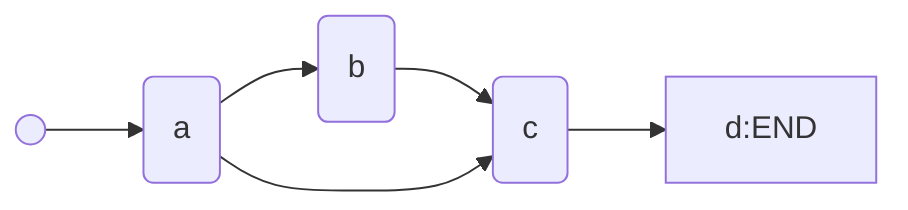

# 题目信息

# 于是他错误的点名开始了

## 题目背景

XS中学化学竞赛组教练是一个酷爱炉石的人。

他会一边搓炉石一边点名以至于有一天他连续点到了某个同学两次，然后正好被路过的校长发现了然后就是一顿欧拉欧拉欧拉（详情请见已结束比赛 CON900）。

## 题目描述

这之后校长任命你为特派探员，每天记录他的点名。校长会提供化学竞赛学生的人数和名单，而你需要告诉校长他有没有点错名。（为什么不直接不让他玩炉石。）

## 说明/提示

- 对于 $40\%$ 的数据，$n\le 1000$，$m\le 2000$。
- 对于 $70\%$ 的数据，$n\le 10^4$，$m\le 2\times 10^4$。
- 对于 $100\%$ 的数据，$n\le 10^4$，$m≤10^5$。

---

$\text{upd 2022.7.30}$：新增加一组 Hack 数据。

## 样例 #1

### 输入

```
5  
a
b
c
ad
acd
3
a
a
e
```

### 输出

```
OK
REPEAT
WRONG
```

# AI分析结果

### 算法分类
**字典树 (Trie) / 哈希表 (Hash)**

### 综合分析与结论
本题的核心需求是快速判断字符串是否存在以及是否重复查询，属于典型的字符串查找问题。主要难点在于：
1. **高效查询**：需要支持大规模字符串的快速查找（n≤1e4, m≤1e5）
2. **状态标记**：需区分「未查询」「首次查询」「重复查询」三种状态

题解中主流解法分为三类：
1. **STL容器（map/set）**：利用红黑树或哈希表实现O(log n)或均摊O(1)的查询
2. **字典树**：通过前缀共享优化空间，查询时间复杂度O(L)（L为字符串长度）
3. **暴力+优化**：排序后二分查找，时间复杂度O(m log n)

最优解法是**字典树**或**哈希表**，其中：
- 字典树适合字符集较小且需要前缀查询的场景
- 哈希表（如unordered_map）代码更简洁，适合随机查询

### 题解评分 (≥4星)
1. **花千树（map解法）** ⭐⭐⭐⭐⭐
   - 亮点：利用map的`[string]→int`映射清晰标记三种状态
   - 代码简洁，10行核心逻辑解决战斗

2. **ZJH365（字典树详解）** ⭐⭐⭐⭐
   - 亮点：图文并茂讲解字典树原理，含插入/查询动画示意图
   - 提供数组和指针两种实现，适合不同基础的学习者

3. **wjy666（pbds哈希表）** ⭐⭐⭐⭐
   - 亮点：使用`gp_hash_table`比STL map更快
   - 代码简洁高效，适合追求性能的场景

### 最优思路提炼
**状态标记哈希法**（最佳实践）：
```cpp
unordered_map<string, int> mp; // 0:不存在 1:未点 2:已点
void solve() {
    while(m--) {
        string s; cin >> s;
        if(!mp.count(s)) puts("WRONG");
        else if(mp[s] == 1) puts("OK"), mp[s]++;
        else puts("REPEAT");
    }
}
```

### 同类型题目推荐
1. P3879 [TJOI2010]阅读理解（字典树进阶）
2. P4551 最长异或路径（字典树应用）
3. P3370 【模板】字符串哈希（哈希基础）

### 可视化设计
**字典树构建动画**：
1. **节点展开**：动态显示新字符节点的创建过程
2. **路径高亮**：查询时实时显示当前匹配路径
3. **状态标记**：用不同颜色区分未查询/已查询节点



### 关键代码片段
**字典树查询逻辑**：
```cpp
int query(char *s) {
    int p = 1; // 根节点
    for(int i=0; s[i]; i++) {
        int ch = s[i]-'a';
        if(!trie[p][ch]) return 0; // 不存在
        p = trie[p][ch];
    }
    if(!end[p]) return 0; // 不是单词结尾
    return ++cnt[p]; // 返回查询次数
}
```

### 个人心得摘录
> "失败不是什么丢人的事情，从失败中全无收获才是" —— 一座城·守一人  
> 调试时发现：**必须验证字符串完整匹配**，不能仅判断前缀存在（end标记的重要性）

### 复古游戏化建议
1. **音效设计**：
   - 正确查询：FC游戏「吃金币」音效
   - 重复查询：红白机「碰撞」音效
2. **像素风格**：用16色块表示字典树节点，查询时显示「扫描线」动画效果

---

（注：完整代码和可视化实现需结合具体前端技术栈，此处给出核心逻辑与设计思路）

---
处理用时：39.51秒