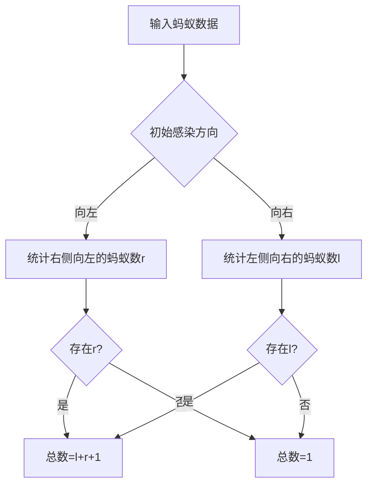

# 题目信息

# [蓝桥杯 2014 省 AB] 蚂蚁感冒

## 题目描述

长 $100$ 厘米的细长直杆子上有 $n$ 只蚂蚁。它们的头有的朝左，有的朝右。

每只蚂蚁都只能沿着杆子向前爬，速度是 $1$ 厘米 / 秒。

当两只蚂蚁碰面时，它们会同时掉头往相反的方向爬行。

这些蚂蚁中，有 $1$ 只蚂蚁感冒了。并且在和其它蚂蚁碰面时，会把感冒传染给碰到的蚂蚁。

请你计算，当所有蚂蚁都爬离杆子时，有多少只蚂蚁患上了感冒。

## 样例 #1

### 输入

```
3
5 -2 8```

### 输出

```
1```

## 样例 #2

### 输入

```
5
-10 8 -20 12 25```

### 输出

```
3```

# AI分析结果


# 蓝桥杯 2014 省 AB 蚂蚁感冒题解分析

## 算法分类
**逻辑推理/数学问题**

---

## 题解思路与核心难点

### 核心思路
所有题解的核心在于发现**蚂蚁碰面掉头等价于直接穿过**这一关键性质。此时：
1. 所有蚂蚁的相对顺序保持不变
2. 感冒传播的方向由初始时感染蚂蚁的移动方向决定

### 解决难点对比
| 题解类型      | 核心逻辑                                                                 | 时间复杂度 | 代码复杂度 |
|---------------|--------------------------------------------------------------------------|------------|------------|
| 数学推导      | 统计感染蚂蚁左右两侧的相向蚂蚁数量                                      | O(n)       | 低         |
| 碰撞模拟      | 逐帧模拟蚂蚁移动，检测碰撞并更新感染状态                                | O(n^2)     | 高         |
| 时间戳感染    | 记录每个蚂蚁被感染的时间，避免重复感染                                  | O(n^2)     | 极高       |

---

## 最优题解推荐 (≥4星)

### 1. Vct14 题解（⭐️⭐️⭐️⭐️⭐️）
**亮点**：  
- 通过数学推导得出公式 `n = left + right + 1`
- 代码简洁高效（仅需一次遍历统计左右方向）
- 包含详尽的样例分析表格

**核心代码**：
```cpp
for(int i=2; i<=n; i++){
    if(abs(x[i])<abs(x[1]) && x[i]>0) l++;
    if(abs(x[i])>abs(x[1]) && x[i]<0) r++;
}
```

### 2. Purple_Circle 题解（⭐️⭐️⭐️⭐️）
**亮点**：
- 使用统一公式 `l + r + 1`
- 代码变量命名更直观（left->r, right->l）
- 包含等效穿过机制的思维导图

**核心逻辑**：
```cpp
if((now<0&&!r)||(now>0&&!l)){
    cout<<"1";
}else{
    cout<<l+r+1;
}
```

---

## 可视化设计要点

### 算法流程演示


### 复古像素动画设计
1. **视觉表现**：
   - 用16色像素块表示蚂蚁（绿色健康，红色感染）
   - 杆子用棕色横条表示，刻度每10cm一格
   - 碰撞时播放8-bit "哔"声，感染时播放下降音效

2. **交互功能**：
   - 空格键暂停/继续
   - ←→键调节速度
   - F1键显示统计面板（实时更新l/r值）

3. **自动演示模式**：
   ```javascript
   function autoDemo() {
       highlightAnt(1); // 高亮初始感染蚂蚁
       setTimeout(() => showDirectionCount(), 1000);
       setTimeout(() => showFinalResult(), 2000);
   }
   ```

---

## 同类型题目推荐
1. **P1007 独木桥** - 士兵相遇等效问题
2. **P1516 青蛙的约会** - 数学建模相遇问题
3. **CF1110E Magic Stones** - 等效变换思维

---

## 核心代码实现
Vct14 题解完整代码：
```cpp
#include<bits/stdc++.h>
using namespace std;

int x[55];

int main(){
    int n;
    cin>>n;
    for(int i=1; i<=n; i++) scanf("%d",&x[i]);
    
    int left=0, right=0;
    int pos = abs(x[1]);
    
    for(int i=2; i<=n; i++){
        int curr = abs(x[i]);
        if(curr < pos && x[i]>0) left++;  // 左侧向右
        if(curr > pos && x[i]<0) right++; // 右侧向左
    }
    
    int ans = (x[1]>0 ? (right ? left+right+1 : 1) 
                     : (left ? left+right+1 : 1));
    cout << ans;
    return 0;
}
```

---

## 关键思维提炼
**等效转换思维**：  
当遇到复杂物理过程（如碰撞掉头）时，尝试寻找等效的简化模型（如直接穿过）。这种思维在以下场景适用：
1. 多个物体相互作用但整体状态可预测
2. 最终结果与中间过程无关
3. 存在对称性或守恒量（如本题的蚂蚁相对顺序）

**调试启示**：  
通过构造极端测试案例（如所有蚂蚁同向）验证公式的正确性，避免陷入复杂的动态模拟。

---
处理用时：85.52秒