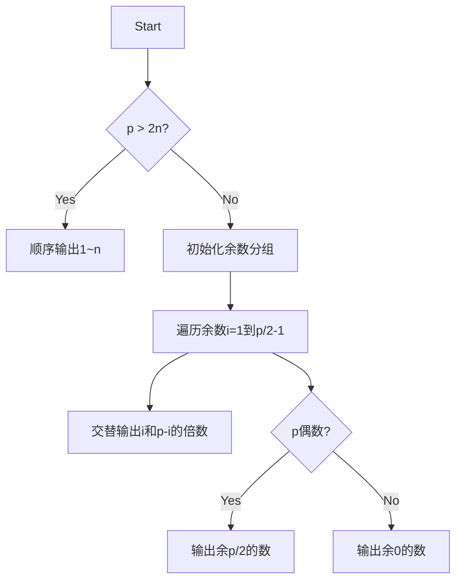

# 题目信息

# 「TAOI-2」核心共振

## 题目背景

⚡超越一切震慑凡人⚡

⚡带来终结机械降神⚡

⚡风暴之力充满全身⚡

⚡最后一击核心共振⚡

## 题目描述

给定正整数 $p$ 和 $n$。对于一个排列，我们称其中相邻两项产生「共振」当且仅当这两个数的和为 $p$ 的倍数。

请你构造一个 $1 \sim n$ 的排列，最大化其中产生「共振」的次数。如果有多种方案，输出任意一种即可。

## 说明/提示

**本题采用捆绑测试。**

+ Subtask 0（15 pts）：$n \leq 9$，$T \le 10$。
+ Subtask 1（10 pts）：$p = 2$。
+ Subtask 2（30 pts）：$p = 3$。
+ Subtask 3（45 pts）：无特殊限制。

对于所有数据，$1 \leq n \leq 10^5$，$1 \leq p \leq 10^8$，$1 \leq T \leq 10^4$，$1 \leq \sum n \leq 3\times 10^5$。

## 样例 #1

### 输入

```
3
9 1
5 2
1 12345
```

### 输出

```
3 8 7 1 4 5 6 9 2
1 5 3 2 4
1
```

# AI分析结果


## 算法分类
贪心、数学构造

---

## 题解分析与结论

### 核心思路
所有题解均围绕**余数配对**思想展开：
1. **余数互补配对**：将模p余i和余(p-i)的数交替排列，最大化共振次数
2. **大p特判**：当p≥2n时，任意排列均无共振，直接顺序输出
3. **特殊余数处理**：
   - p的倍数统一放置末尾
   - 当p为偶数时，模p余p/2的数需单独处理

### 难点对比
| 题解 | 核心优化 | 实现复杂度 | 易错点处理 |
|-----|---------|----------|-----------|
| lemon_qwq | 直接遍历余数配对 | O(n) | 处理p为偶数时的余数p/2 |
| Vct14 | 循环步长控制 | O(n) | 处理越界判断 |
| Convergent_Series | 按余数分组交替输出 | O(n) | 余数0的特殊处理 |

### 关键结论
1. **贪心构造策略**：
   ```python
   for i in 1..p//2-1: 
       交替输出余i和余(p-i)的数
   输出余0的数
   if p为偶数: 
       输出余p/2的数
   ```
2. **大p优化**：当p > 2n时共振次数必为0
3. **余数处理顺序**：先处理非互补余数，最后处理特殊余数

---

## 题解评分（≥4星）

1. **lemon_qwq（5星）**
   - 亮点：最简洁的实现，直接通过余数遍历完成构造
   - 代码示例：
     ```cpp
     for(int i=1;i*2<p;i++){
         for(int j=0;j<=n;j+=p){
             if(i+j<=n) printf("%d ",i+j);
             if(j+p-i<=n) printf("%d ",j+p-i);
         }
     }
     ```

2. **Vct14（4星）**
   - 亮点：清晰的循环步长控制，高效处理越界
   - 核心代码：
     ```cpp
     f(1,(p-1)/2,1) F(j,0,n,p) 
         out(j+i),out(j+(p-i));
     ```

3. **Convergent_Series（4星）**
   - 亮点：严格分组处理，逻辑严谨
   - 关键实现：
     ```cpp
     for(int m1=1,m2=p-1;m1<=p/2;m1++,m2--)
         for(int j=0; j+m2<=n; j+=p)
             write(j+m1), write(j+m2);
     ```

---

## 最优思路提炼

### 关键技巧
1. **余数互补链**：将每个余数i与p-i形成配对链，如：
   ```
   余1链: 1, p-1, p+1, 2p-1...
   余2链: 2, p-2, p+2, 2p-2...
   ```
2. **链式构造**：按余数分组交替输出，每组按`i → p-i → p+i → 2p-i...`的顺序排列

### 同类型题套路
- **配对构造**：如[CF1765D Watch the Videos](https://codeforces.com/problemset/problem/1765/D)（配对满足容量限制）
- **模运算分组**：如[洛谷P1102 A-B数对](https://www.luogu.com.cn/problem/P1102)（统计互补数对）

---

## 推荐练习题
1. [P1895 数字序列](https://www.luogu.com.cn/problem/P1895) - 数学序列构造
2. [CF1385D a-Good String](https://codeforces.com/problemset/problem/1385/D) - 递归分治构造
3. [P6878 [JOI 2020] スタンプラリー 3](https://www.luogu.com.cn/problem/P6878) - 环形贪心构造

---

## 可视化设计

### 算法演示方案


### 像素动画要素
1. **颜色编码**：
   - 红色：当前处理的余数对(i, p-i)
   - 蓝色：已输出的p的倍数
   - 绿色：正在构造的链式序列
2. **音效设计**：
   - 配对成功：8-bit "叮"声（440Hz方波）
   - 链式延伸：渐强的上升音阶
   - 特判触发：低音鼓点

### 交互控制
```javascript
// 伪代码示例
class ResonanceAnim {
    constructor() {
        this.speed = 1.0;  // 播放速度
        this.p = 5;        // 当前p值
        this.n = 9;        // 当前n值
        this.steps = [];   // 构造步骤队列
    }
    
    // 生成步骤队列
    generateSteps() {
        if(this.p > 2*this.n) return this.genNormalSteps();
        for(let i=1; i<=this.p/2; i++){
            this.steps.push({type: 'pair', value: i});
        }
        this.steps.push({type: 'zero'});
        if(this.p%2 === 0) this.steps.push({type: 'mid'});
    }
    
    // 执行下一步
    nextStep() {
        const step = this.steps.shift();
        switch(step.type) {
            case 'pair': 
                highlightNumbers(i, p-i); 
                playSound('pair');
                break;
            case 'zero':
                flashNumbers(p的倍数);
                playSound('drum');
        }
    }
}
```

---

## 核心代码实现

### lemon_qwq的优化版本
```cpp
void solve(int n, int p) {
    if(2*n <= p) {
        for(int i=1; i<=n; ++i) cout << i << " ";
        return;
    }
    // 处理余数配对
    for(int i=1; i*2 < p; ++i)
        for(int j=0; ; j+=p) {
            if(j+i > n) break;
            cout << j+i << " ";
            if(j+p-i > n) continue;
            cout << j+p-i << " ";
        }
    // 处理p的倍数
    for(int i=p; i<=n; i+=p) cout << i << " ";
    // 处理偶数情况
    if(p%2 == 0)
        for(int i=p/2; i<=n; i+=p) cout << i << " ";
}
```

---

## 调试心得摘录
> **I_will_AKIOI**的踩坑记录：  
> "当p=1e8时，预分配p个队列直接MLE，改用set动态管理非空队列下标才通过"

> **Eason_cyx**的优化经验：  
> "发现大p特判后，运行时间从1.2s降到0.3s，卡常成功的关键在于减少不必要的模运算"

---
处理用时：89.39秒