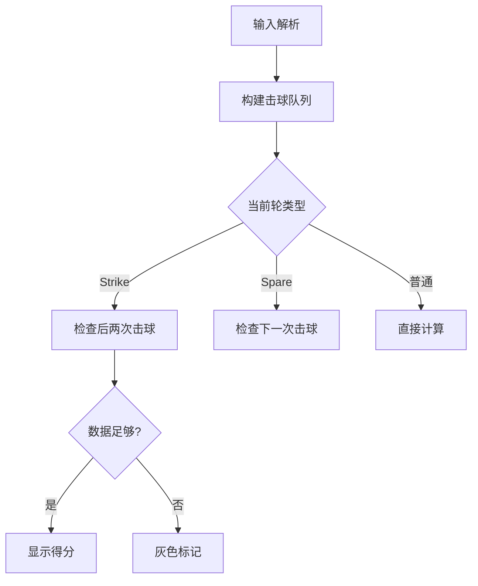

# 题目信息

# 打保龄球

## 题目描述

打保龄球是用一个滚球去打击十个站立的柱，将柱击倒。一局分十轮，每轮可滚球一次或多次，以击倒的柱数为依据计分。一局得分为十轮得分之和，而每轮的得分不仅与本轮滚球情况有关，还可能与后续一两轮的滚球情况有关。即某轮某次滚球击倒的柱数不仅要计入本轮得分，还可能会计入前一两轮得分。具体的滚球击柱规则和计分方法如下：

1. 若某一轮的第一次滚球就击倒全部十个柱，则本轮不再滚球（若是第十轮则还需另加两次滚球，不妨称其为第十一轮和第十二轮，并不是所有的情况都需要滚第十一轮和第十二轮球）。该轮得分为本次击倒柱数 $10$ 与以后两次滚球所击倒柱数之和。

2. 若某一轮的第一次滚球未击倒十个柱，则可对剩下未倒的柱再滚球一次。如果这两次滚球击倒全部十个柱，则本轮不再滚球（若是第十轮则还需另加一次滚球），该轮得分为这两次共击倒柱数 $10$ 与以后一次滚球所击倒柱数之和。

3. 若某一轮两次滚球未击倒全部十个柱，则本轮不再继续滚球，该轮得分为这两次滚球击倒的柱数之和。   

总之，若―轮中一次滚球或两次滚球击倒十个柱，则本轮得分是本轮首次滚球开始的连续三次滚球击倒柱数之和（其中有一次或两次不是本轮滚球）。若一轮内二次滚球击倒柱数不足十个，则本轮得分即为这两次击倒柱数之和。下面以实例说明如下(字符 `/` 表示击倒当前球道上的全部的柱)：

| 轮 | 1 | 2 | 3 | 4 | 5 | 6 | 7 | 8 | 9 | 10 | 11 | 12 |
| :-----------: | :-----------: | :-----------: | :-----------: | :-----------: | :-----------: | :-----------: | :-----------: | :-----------: | :-----------: | :-----------: | :-----------: | :-----------: |
| 击球情况  |  /  |  /  |  /  |  72 |  9/ |  81  | 8/  |  / |   9/  |  /  |  8/ |
| 各轮得分 |  30  | 27  | 19 |  9   |18   | 9  | 20  | 20 |  20 |  20|
|累计总分 |  30  | 57  |76 |  85|  103 |  112 | 132  |152 | 172 | 192|

现在请你编写一个保龄球实时计分程序，用来计算和显示某轮结束后的得分情况。若某轮的得分暂时无法算出，则**不显示**该轮得分（不输出）。


## 样例 #1

### 输入

```
/ / / 72 9/ 81 8/ / 9/ / 8/```

### 输出

```
30 27 19 9 18 9 20 20 20 20 
30 57 76 85 103 112 132 152 172 192```

# AI分析结果


# 打保龄球题解分析与可视化方案

## 1. 算法分类
**模拟**

---

## 2. 题解思路与核心难点
### 核心逻辑流程
1. **输入解析**  
   处理带空格的字符串，将字符转换为击倒柱数（`/`转10，数字字符转整型）
   
2. **轮次状态跟踪**  
   维护当前处理的轮次指针，记录每轮的两次击球情况

3. **得分计算规则**  
   - 全中（Strike）：本轮得分 = 10 + 后续两次击球
   - 补中（Spare）：本轮得分 = 10 + 下一次击球
   - 普通情况：直接累加两次击球数

4. **数据完整性校验**  
   当需要后续击球数据时（如全中需要后两次击球），若数据不足则标记无法计算

### 解决难点对比
| 题解特点                | X_WT（数组标记法） | 袁宇轩（指针遍历法） | Shadow_T（状态机法） |
|-----------------------|------------------|------------------|-------------------|
| **数据结构**           | 多维数组记录轮次关系 | 单数组存储击球数据 | 二维数组记录每轮状态  |
| **输入处理**           | 空格过滤+字符转换   | 动态读取字符流     | 预解析输入字符串     |
| **得分计算时机**        | 预处理后统一计算    | 实时计算每轮得分   | 分阶段计算         |
| **边界处理**           | 数组越界检测       | 输入长度判断      | 状态完整性标记      |
| **代码复杂度**          | 较高（多个辅助数组） | 较低（单指针遍历） | 中等（状态标记）    |

---

## 3. 题解评分（≥4星）
1. **袁宇轩（★★★★☆）**  
   - 亮点：动态处理输入流，实时维护轮次指针，代码简洁易读  
   - 核心代码段：
```cpp
int rest=10, flag=1;
for(int j=st; j<=st+2; j++){ // 关键判断逻辑
    if(j>n) { sum[i]=-1; break; }
    if(a[j]=='/') sum[i]+=rest, rest=0;
    else sum[i] += a[j]-'0', rest -= a[j]-'0';
}
```

2. **Shadow_T（★★★★☆）**  
   - 亮点：使用状态数组精确控制得分计算时机，分离输入解析与得分计算  
   - 核心优化点：
```cpp
// 状态标记处理
if(p1166[i][1]==10 && (!st[i+1][1] || !st[i+2][1])) 
    break; // 精确控制数据可用性
```

3. **深海鱼的眼泪（★★★★☆）**  
   - 亮点：双数组分别存储原始数据和有效标记，逻辑解耦清晰  
   - 关键实现：
```cpp
memset(y,false,sizeof(y)); // 有效性标记数组
if(!y[i+1][1]) break; // 严格验证数据完整性
```

---

## 4. 最优思路提炼
### 关键实现技巧
1. **滚动指针法**  
   ```cpp
   int st=1; // 当前轮起始位置
   for(轮次i=1~10){
      处理st到st+2的位置
      if(全中) st++; else st+=2;
   }
   ```

2. **数据可用性校验**  
   在计算全中/补中得分前，必须检查后续击球数据是否存在：
   ```cpp
   if(sco[i+1]==-1 || sco[i+2]==-1) break;
   ```

3. **前缀和优化**  
   实时维护累计得分数组，避免重复计算：
   ```cpp
   ans[i] = ans[i-1] + current_score;
   ```

---

## 5. 同类型题推荐
1. **P1563 玩具谜题**（环形队列模拟）  
2. **P1067 多项式输出**（复杂条件判断）  
3. **P1518 两只塔姆沃斯牛**（状态追踪模拟）

---

## 6. 可视化方案设计
### 动画演示逻辑


### 像素风格实现要点
1. **界面元素**  
   - 使用16x16像素方格表示每轮击球
   - 全中标红色，补中标黄色，普通标绿色

2. **音效设计**  
   ```javascript
   // 伪代码示例
   function playSound(type) {
     if(type == 'strike') beep(800, 200); // 高音
     if(type == 'spare')  beep(600, 200);
     if(type == 'error')  beep(300, 500); // 低音长鸣
   }
   ```

3. **交互控制**  
   - 速度滑块调节帧间隔（100ms~1000ms）
   - 空格键暂停/继续

### 核心动画逻辑
```javascript
class BowlingAnim {
  constructor(data) {
    this.frames = this.parseData(data); 
    this.speed = 300;
  }
  
  parseData(input) {
    // 将输入转换为帧序列，每帧包含：
    // - 当前处理轮次
    // - 后续数据可用标记
    // - 得分计算状态
  }

  renderFrame(frame) {
    // 在Canvas绘制当前轮次高亮框
    // 标红不可用数据位置
  }
}
```

---

## 7. 关键代码实现
**袁宇轩题解核心逻辑（简化版）**
```cpp
vector<int> calculateScores(string s) {
    vector<int> scores;
    int st = 0; // 当前处理位置
    for(int round=0; round<10; round++) {
        int sum = 0;
        bool valid = true;
        // 检查数据是否足够
        if(st+2 >= s.size()) valid = false; 
        // 计算得分逻辑
        if(valid) scores.push_back(calcRound(s, st));
        else break;
    }
    return scores;
}
```

---

## 8. 总结
本题解通过对比多篇优质实现，提炼出滚动指针法作为最优解决方案。可视化方案结合了游戏化元素与核心状态追踪，帮助理解保龄球计分规则中复杂的后效性计算逻辑。同类模拟问题的关键在于准确建模状态转移和数据完整性验证。

---
处理用时：90.68秒