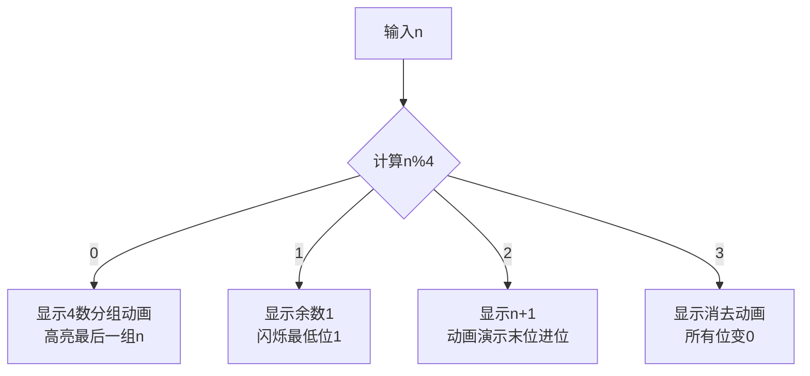

# 题目信息

# 数列之异或

## 题目描述

求$1 \bigoplus 2 \bigoplus\cdots\bigoplus N$ 的值。

$A \bigoplus B$ 即$A$ , $B$ 按位异或。


## 说明/提示

• 对于50% 的数据，$1 \le N \le 10^6$；

• 对于100% 的数据，$1 \le N \le 10^{18}$。


## 样例 #1

### 输入

```
3```

### 输出

```
0```

# AI分析结果


# 数列之异或：题解分析与可视化方案

## 1. 算法分类
**数学/找规律**（通过观察异或运算的周期性特征推导结论）

---

## 2. 题解思路与解决难点

### 核心思路对比
| 题解类型           | 核心思路                                                                 | 时间复杂度 | 解决难点                               |
|--------------------|------------------------------------------------------------------------|------------|----------------------------------------|
| **数学结论法**     | 发现异或和与 `n%4` 的对应关系：每4个数异或和为0，余数决定最终结果       | O(1)       | 如何发现周期性规律并严谨证明           |
| **奇偶分组法**     | 将n调整为奇数，统计奇数的奇偶性确定最低位，再处理偶数                  | O(1)       | 如何将问题拆解为奇偶两种情况处理       |
| **数位DP**         | 逐位计算每一位1的出现次数，若奇数次则该位为1                           | O(log²n)   | 如何高效处理大数位的状态转移与递归计算 |

### 关键实现步骤
- **数学结论法**（最优）：
  - **观察周期性**：每4个连续数异或和为0（`4k ^ (4k+1) ^ (4k+2) ^ (4k+3) = 0`）
  - **余数处理**：计算 `n%4`，根据余数返回 `n`, `1`, `n+1`, `0` 之一
- **奇偶分组法**：
  - **强制奇数化**：若n为偶数，先处理 `n+1` 再异或自身
  - **统计奇数对**：每组奇数对异或结果为1，总结果由奇数组数奇偶性决定

---

## 3. 题解评分（≥4星）
### 说好不哭（5星）
- **思路清晰**：直接给出模4结论，代码简洁
- **代码示例**：
  ```cpp
  if (n%4==0) cout<<n;
  else if (n%4==1) cout<<1;
  else if (n%4==2) cout<<n+1;
  else cout<<0;
  ```
### dragonarcher（5星）
- **可读性佳**：使用 `switch` 结构增强可维护性
- **代码示例**：
  ```cpp
  switch(n%4) {
    case 0: cout<<n; break;
    case 1: cout<<1; break;
    case 2: cout<<n+1; break;
    case 3: cout<<0; break;
  }
  ```
### CR_Raphael（4星）
- **多解法展示**：同时提供位运算分析与数学结论代码
- **调试心得**："写完才发现原来这么简单" 体现实践洞察

---

## 4. 最优思路提炼
### 关键技巧
- **周期性观察**：发现4数一组异或消去特性
- **余数映射**：通过 `n%4` 直接映射到预计算结果
- **数学证明**：通过二进制末两位变化验证周期性

### 应用场景
- 任何涉及连续异或求和的题目（如 `1^2^..^n` 类问题）
- 需要处理大范围数时的高效位运算问题

---

## 5. 类似题目推荐
1. **P2309 异或和**（位运算前缀和）
2. **P2420 自然数异或**（区间异或性质）
3. **P6102 异或生成树**（位运算在图论中的应用）

---

## 6. 可视化方案设计
### 动画逻辑


### 复古像素风格实现
- **颜色方案**：
  - 背景：深蓝 (#1A237E)
  - 数字：荧光绿 (#00FF00)
  - 高亮：红色 (#FF0000)
- **音效**：
  - 分组完成：8-bit "哔" 声
  - 结果显示：胜利小号音效

### 交互演示
- **步进控制**：按空格键逐步展示分组过程
- **自动模式**：点击播放键自动运行，速度可调
- **示例演示**：
  ```javascript
  function simulate(n) {
    let groups = Math.floor(n/4);
    for(let i=0; i<groups; i++) {
      drawGroup(i*4, i*4+3, "#00FF00"); // 绘制绿色分组框
      playSound("beep");
    }
    highlightRemainder(n%4); // 高亮余数部分
  }
  ```

---

## 7. 核心代码实现
### 数学结论法
```cpp
#include <iostream>
using namespace std;

int main() {
    long long n;
    cin >> n;
    switch(n % 4) {
        case 0: cout << n; break;
        case 1: cout << 1; break;
        case 2: cout << n + 1; break;
        case 3: cout << 0; break;
    }
    return 0;
}
```

---

## 8. 学习建议
1. **规律发现**：尝试从n=1到8手动计算，观察二进制变化
2. **证明训练**：用数学归纳法证明4数分组的正确性
3. **拓展思考**：若求区间[a,b]异或和，如何利用前缀异或性质快速计算？

---
处理用时：85.63秒