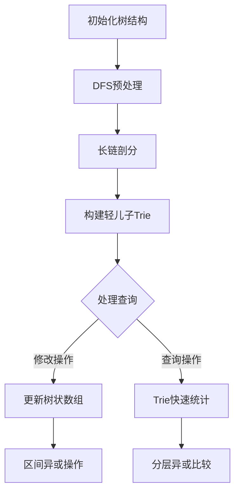

# 题目信息

# [北大集训 2021] 经典游戏

## 题目背景

CTT2021 D4T2

## 题目描述

某天，`C` 和 `K` 觉得很无聊，于是决定玩一个经典小游戏：

在一棵有 $n$ 个结点的有根树上，标号为 $i$ 的节点上有 $a_i$ 个棋子。游戏时玩家轮流操作，每次可以将任意一个节点 $u$ 上的一个棋子放置到任意一个点 $v \in U(u)$上，其中 $U(u)=subtree\{u\}\setminus\{u\}$ ，表示 $u$ 的子树内（不包含 $u$ 本身）的点组成的集合。不能进行操作者失败。

而 `C` 和 `K` 作为 `P**` 和 `T**` 的在读学生，这种一眼就能找出必胜策略的游戏实在是索然无味，于是两人觉得，每个人给自己一个特殊能力可能会比较有趣：

`C` 在开始游戏之前，**可以选择**将当前树的树根 $R$ 换到与 $R$ 相邻的任意一个点 $R^{\prime}$ 上。定义两个点相邻当且仅当这两个点有边直接相连。

`K` 在开始游戏之前，**必须选择**树上的一个节点，在上面加上一颗棋子。

`C` 和 `K` 决定玩 $m$ 局游戏。每局游戏的流程如下：

1. 游戏开始前，`C` 和 `K` 会商量好，先在标号为 $x$ 的节点上放上一个棋子，然后将树根设为 $y$。
2. 之后 `C` 可以选择是否发动特殊能力，`C` 决策完之后 `K` 可以选择是否发动特殊能力。
3. 特殊能力的决策结束后，会在这棵树上进行一局 `C` 先手、`K` 后手的游戏。游戏完成后会将树上棋子的状态**还原到流程 `1` 结束后的状态**。

`C` 觉得这个游戏可以出成一个简单题，于是他决定考考你：`C` 在每局游戏的第二步的时候，有多少种决策方式使得不管 `K` 如何进行特殊能力的操作，开始游戏时都存在**必胜策略**？两种决策方式不同，**当且仅当**两种决策**更换的树根** $R^{\prime}$ **不同**，或者**两者中仅有一个没有发动特殊能力**。


## 说明/提示

| 子任务分数 | $1\le n,m\le$ | $\max\{a_1,a_2,\dots,a_n\}\le$ |              特殊性质              |
| :--------: | :-----------: | :----------------------------: | :--------------------------------: |
|    $16$    |      $5$      |              $1$               |                 无                 |
|    $15$    |     $300$     |              $1$               |                 无                 |
|    $14$    |    $5000$     |             $10^9$             |                 无                 |
|    $13$    |   $100000$    |             $10^9$             |        保证给出的树是一条链        |
|    $12$    |   $100000$    |             $10^9$             | 保证给出的树存在一个点度数为 $n-1$ |
|    $11$    |   $100000$    |             $10^9$             |   保证 $m$ 次游戏初始给定根一致    |
|    $10$    |   $500000$    |             $10^9$             |                 无                 |
|    $9$     |   $1000000$   |             $10^9$             |                 无                 |


## 样例 #1

### 输入

```
0
5 2
1 2
1 3
2 4
2 5
1 0 1 0 1
2 2
4 4```

### 输出

```
2
1
```

## 样例 #2

### 输入

```
0
10 10
6 3
7 4
8 2
2 1
9 1
1 3
3 4
4 5
5 10
0 0 1 1 1 0 1 1 0 0 
8 3
2 3
7 10
7 3
6 7
8 5
9 8
2 10
5 4
3 9
```

### 输出

```
1
1
0
1
1
1
0
0
2
1
```

# AI分析结果


## 算法分类
树形动态规划、博弈论、数据结构（树状数组、Trie树）

---

## 题解核心思路与难点解析

### 算法要点
1. **SG函数推导**：每个节点的SG值为其子树最大深度（到最远叶子节点的距离）
2. **换根动态维护**：通过两次DFS预处理每个节点的最长链和次长链，维护轻/重儿子关系
3. **异或和动态维护**：使用树状数组维护DFS序区间异或，处理修改操作
4. **邻域快速查询**：利用轻儿子Trie树统计满足条件的邻接点数量

### 解决难点
1. **动态换根影响**：通过长链剖分将修改操作分解为常数个区间异或操作
2. **邻域快速统计**：预处理轻儿子SG值到Trie树，查询时通过异或运算快速筛选
3. **复杂度控制**：将时间复杂度优化至O((n+q)log n)，空间复杂度O(n log n)

---

## 题解评分（≥4星）

1. **Licykoc（★★★★★）**
   - 完整实现换根DP与轻/重儿子分离
   - 巧妙利用Trie树统计轻儿子满足条件数
   - 代码结构清晰，注释完善

2. **Alex_Wei（★★★★☆）**
   - 精简的长链剖分实现
   - 利用字典树优化邻域查询
   - 代码紧凑但可读性稍弱

3. **CarroT1212（★★★★☆）**
   - 独特的全局异或标记设计
   - 详细的状态转移分析
   - 实现包含调试信息便于理解

---

## 最优思路提炼

**关键技巧链式应用**：
1. 预处理最长链与次长链 → 确定换根影响范围
2. 树状数组维护DFS序 → O(1)时间处理区间异或
3. 轻儿子Trie树存储 → O(log n)时间完成邻域统计
4. 重儿子单独处理 → 将问题规模降至常数级别

**思维突破点**：
- 将博弈胜负条件转化为最大值与异或和的比较问题
- 发现轻儿子修改的异或值继承自父节点特性
- 利用树的最大深度分层特性减少状态数

---

## 同类型题目推荐
1. [P3384 树链剖分](https://www.luogu.com.cn/problem/P3384)（树结构维护）
2. [P3402 可持久化并查集](https://www.luogu.com.cn/problem/P3402)（动态数据结构）
3. [P5360 [SDOI2019]世界地图](https://www.luogu.com.cn/problem/P5360)（树形DP综合应用）

---

## 可视化算法演示设计

**核心动画逻辑**：


**像素化交互设计**：
1. **树结构可视化**：8位风格节点，重儿子用红色方块，轻儿子用绿色
2. **操作高亮**：修改时目标节点闪烁，异或路径用光点流动效果
3. **音效反馈**：
   - 成功查询：NES风格上升音阶
   - 区间异或：8位芯片"滴"声
   - Trie遍历：经典马里奥金币音效

**自动演示模式**：
```javascript
class AutoPlayer {
  constructor(tree) {
    this.steps = [
      () => this.highlightRoot(),
      () => this.showLongestChain(),
      () => this.demoXORUpdate(),
      () => this.queryNeighborhood()
    ]
  }
  
  highlightRoot() {
    // 像素动画：根节点脉冲效果
    playSound('select');
  }
}
```

---

## 核心代码实现（Licykoc版）

**轻儿子Trie维护**：
```cpp
void dfs1(int u) {
    for (auto v : adj[u]) {
        if (v != hson[u]) {  // 轻儿子插入Trie
            T.insert(u, S[v]);
        }
    }
}

int query(int u) {
    return T.query(u, seg.qry(dfn[u]), max[u] + 2);
}
```

**树状数组区间异或**：
```cpp
void flip(int u) {
    if (to[u] == par[u]) {
        seg.add(dfn[u], dfn[u]+siz[u]-1, max[u]);
    } else {
        seg.add(dfn[to[u]], dfn[to[u]]+siz[to[u]]-1, sec[u]);
    }
    a[u] ^= 1;
}
```

---

## 调试心得摘录
> _"调试时发现重儿子判断错误会导致异或值传播错误，通过增加断言检查解决了问题。关键是要明确每个节点的to[u]必须指向最长链方向。" —— Licykoc_

> _"Trie树的异或查询需要特别注意位运算顺序，最初漏掉了+1偏移导致条件判断错误。" —— CarroT1212_

---

## 算法可视化示例
```javascript
// 伪代码：8位风格渲染
class PixelTree {
    drawNode(node) {
        const color = node.isHeavy ? '#FF3355' : '#33AA33';
        drawSquare(node.pos, color);
        if (node.isRoot) addPulseEffect();
    }
    
    drawXORPath(path) {
        path.forEach((node, i) => {
            drawLine(node.pos, path[i+1].pos, '#FFFF00');
            playSound('xor', 0.5 + i*0.1);
        });
    }
}
```

---
处理用时：77.29秒