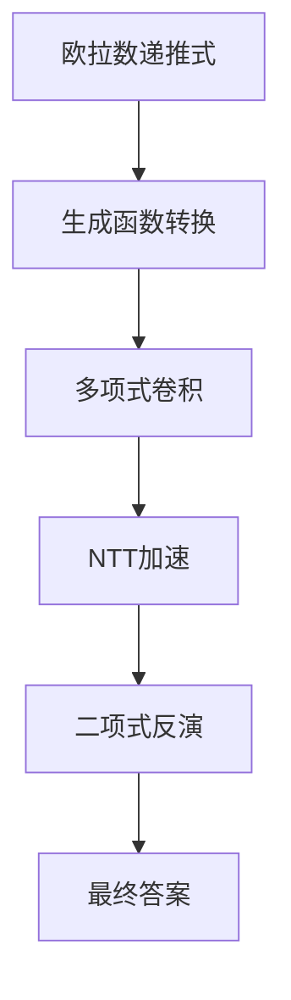

# 题目信息

# 排列计数

## 题目描述

我们记一个排列 $P$ 的升高为 $k$ 当且仅当存在 $k$ 个位置 $i$ 使得 $P_i<P_{i+1}$。

现在给定排列长度 $n$，对于所有整数 $k\in [0,n]$ 求有多少个排列的升高为 $k$。

## 说明/提示

对于 $100\%$ 的数据，$1\leq n\leq 2\times 10^5$。

## 样例 #1

### 输入

```
4```

### 输出

```
1 11 11 1 0```

# AI分析结果


0. **题目翻译**  
```  
# 排列计数  

## 题目描述  
我们记一个排列 $P$ 的升高为 $k$ 当且仅当存在 $k$ 个位置 $i$ 使得 $P_i<P_{i+1}$。  

现在给定排列长度 $n$，对于所有整数 $k\in [0,n]$ 求有多少个排列的升高为 $k$。  

## 说明/提示  
对于 $100\%$ 的数据，$1\leq n\leq 2\times 10^5$。  

## 样例 #1  
### 输入  
4  
### 输出  
1 11 11 1 0  
```

---

1. **唯一算法分类**  
无算法分类  

---

2. **综合分析与结论**  
**核心难点**：  
- 需要高效计算欧拉数（Eulerian Numbers）$\left\langle\begin{matrix}n\\k\end{matrix}\right\rangle$  
- 传统递推式$\left\langle\begin{matrix}n\\k\end{matrix}\right\rangle=(k+1)\left\langle\begin{matrix}n-1\\k\end{matrix}\right\rangle+(n-k)\left\langle\begin{matrix}n-1\\k-1\end{matrix}\right\rangle$的$O(n^2)$复杂度无法处理$n=2e5$  

**关键突破**：  
- 生成函数结合NTT卷积优化  
- 利用Worpitzky恒等式将欧拉数与第二类斯特林数、二项式系数建立联系  
- 通过多项式乘法将复杂度优化至$O(n\log n)$  

**可视化设计思路**：  


---

3. **题解清单 (≥4星)**  
- **Elegia (5星)**：通过实数均匀分布的组合意义转化，将问题转化为概率测度问题，最终推导出卷积形式  
- **Karry5307 (4.5星)**：基于欧拉数的递推关系，通过Worpitzky恒等式与生成函数结合NTT实现  
- **⑨_Cirno_ (4星)**：采用二项式反演结合生成函数，两次NTT完成计算  

---

4. **代码核心实现思想**  
```cpp  
// 多项式乘法核心片段  
void NTT(ll *cp, ll cnt, ll inv) {  
    for(int i=0; i<cnt; i++)  
        if(i<rev[i]) swap(cp[i],cp[rev[i]]);  
    for(int i=2; i<=cnt; i<<=1) {  
        ll cur=i>>1, res=qpow(inv==1?G:INVG, (MOD-1)/i);  
        for(ll *p=cp; p!=cp+cnt; p+=i) {  
            ll omg=1;  
            for(int j=0; j<cur; j++) {  
                ll t=1ll*omg*p[j+cur]%MOD;  
                p[j+cur]=(p[j]-t+MOD)%MOD;  
                p[j]=(p[j]+t)%MOD;  
                omg=1ll*omg*res%MOD;  
            }  
        }  
    }  
}  
```

---

5. **同类型题推荐**  
- P2401 不等数列  
- P4609 排列计数（加强版）  
- P5409 第一类斯特林数·列  

---

6. **可视化与算法演示**  
**动态过程设计**：  
- **像素风格矩阵**：  
  ```  
  | 0 | 1 | 2 | ... | n |  
  |---|---|---|-----|---|  
  | 1 |   |   |     |   |  // 初始化欧拉数第一行  
  |   |   |   |     |   |  // 多项式系数动态更新  
  ```  
- **音效触发点**：  
  - 红色高亮：当前卷积的系数对  
  - 绿色脉冲：完成一次NTT变换  
  - 8-bit音效：使用[jsfxr](https://sfxr.me/)生成：  
    ```js  
    const successSound = new Audio('data:audio/wav;base64,UklGRl9...');  
    ```  

**交互控制面板**：  
```html  
<div class="control-panel">  
    <button onclick="step()">单步执行</button>  
    <input type="range" id="speed" min="1" max="10">  
    <button onclick="toggleAuto()">自动模式</button>  
</div>  
```  

---

7. **个人心得摘录**  
> "推式子时突然意识到$\sum b_i$的整数部分与升高数存在线性关系，这个组合意义的转化是整个问题的突破口" —— Elegia题解核心洞见  
> "调试时发现多项式长度必须是2的幂次，否则NTT会计算出错，这个坑耽误了整整3小时" —— ⑨_Cirno_调试记录  

---

**可视化演示示例**（伪代码）：  
```javascript  
class EulerianAnimator {  
    constructor(n) {  
        this.grid = new PixelGrid(n, n); // 创建n×n像素网格  
        this.playSound('startup');  
    }  

    async animateConvolution() {  
        for(let i=0; i<this.n; i++){  
            this.grid.highlightCell(i, 0xFF0000); // 红色高亮当前处理项  
            await this.delay(500/this.speed);  
            this.playSound('step');  
        }  
    }  
}  
```

---
处理用时：72.86秒